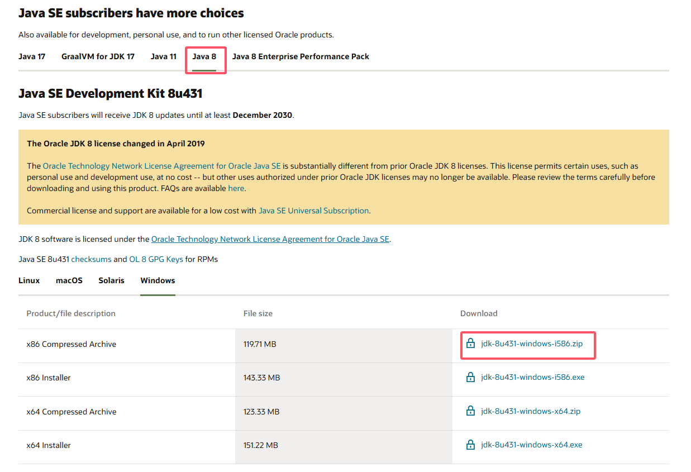
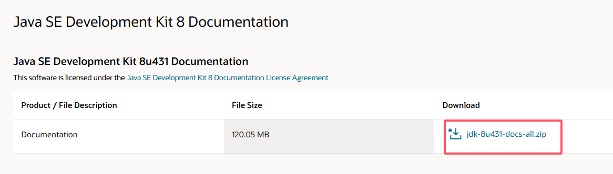
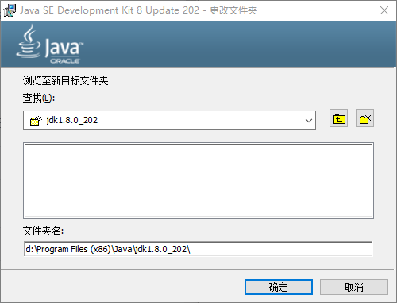
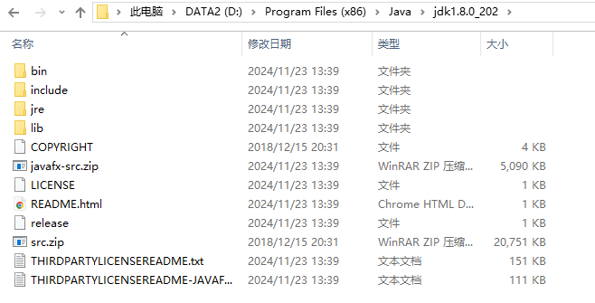
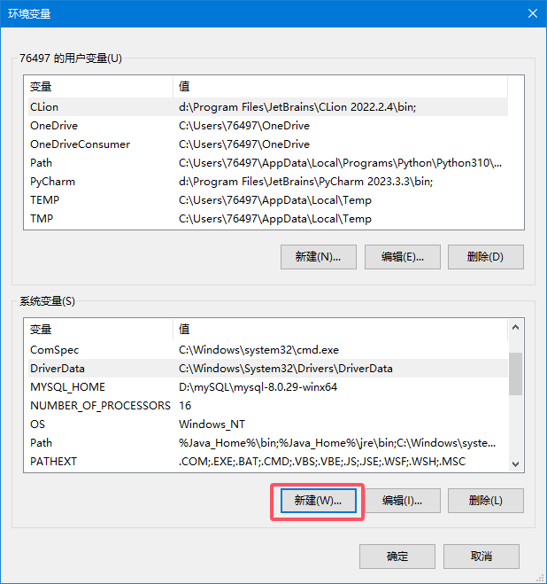
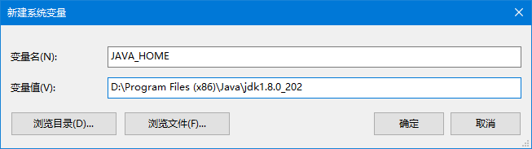
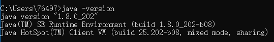

# 安装JDK

​	因为我们是使用Java的开发者，因此我们需要安装JDK。

# 1.下载JDK

​	最好的路径是登录[Oracle官网](https://www.oracle.com/java/technologies/downloads/)下载你所需要的稳定版本的JDK，因为我主要是面向工作，所以我就下载Java 8了。推荐使用压缩包而不是安装器。现在在Oracle官网下载大概率会要求注册之类的，随便搞搞就好了，除了下载JDK之外你暂时也用不上Oracle的其他东西（因为要付费，我们更倾向于开源免费的）



​	如果你的电脑连接官网会卡，我推荐你下载一份[文档](https://www.oracle.com/java/technologies/javase-jdk8-doc-downloads.html)，因为学习中还是会经常查询文档的



​	下载好之后我们安装JDK即可，不推荐装在C盘



​	安装好之后目录内容如下



# 2.环境变量

​	环境变量，这个东西其实很好理解，而且你理解了之后对于以后配环境就不会迷惑了。如果你用过Linux的话，上面的命令明明不在当前目录，但是你却可以调用，这就是环境变量的作用。说白了，就是告诉系统，我会执行这个路径下的程序，你给我记好了，省的我每次还得连路径都告诉才能执行。

```
右键此电脑-属性-关于-高级系统设置-环境变量
```

​	系统中提供的环境变量是Path，定义所有可执行程序的路径，它可以放很多个路径，然后用英文逗号隔开。

​	话虽如此，但是我们如果放很多个很长的路径，看着就让人迷惑，所以我们通常会将给长路径命个名再放进去，比如Java的路径叫`JAVA_HOME`，这样一看就知道这是Java的配置。以后你还会配置更多，现在学会了以后你自己配什么`MAVEN_HOME`、`TOMCAT_HOME`道理都是一样的。

​	点击新建



​	配置系统变量（安装约定俗成，配置我们都用大写和下划线）（这目录是我的，不一定和你一样）



​	随后我们再Path中添加上我们的`JAVA_HOME`，路径是`%JAVA_HOME%\bin`。%告诉系统要解析字段。bin一般是程序可以执行的部分，是binary（二进制）的缩写

​	

​	现在我们就可以在任意路径下都可以运行Java了，打开cmd，输入`java -version`查看你的版本，如果能显示出来就没问题了




简单说明可执行文件：

- java：这个可执行程序其实就是JVM，运行Java程序，就是启动JVM，然后让JVM执行指定的编译后的代码；
- javac：这是Java的编译器，它用于把Java源码文件（以`.java`后缀结尾）编译为Java字节码文件（以`.class`后缀结尾）；
- jar：用于把一组`.class`文件打包成一个`.jar`文件，便于发布；
- javadoc：用于从Java源码中自动提取注释并生成文档；
- jdb：Java调试器，用于开发阶段的运行调试。


