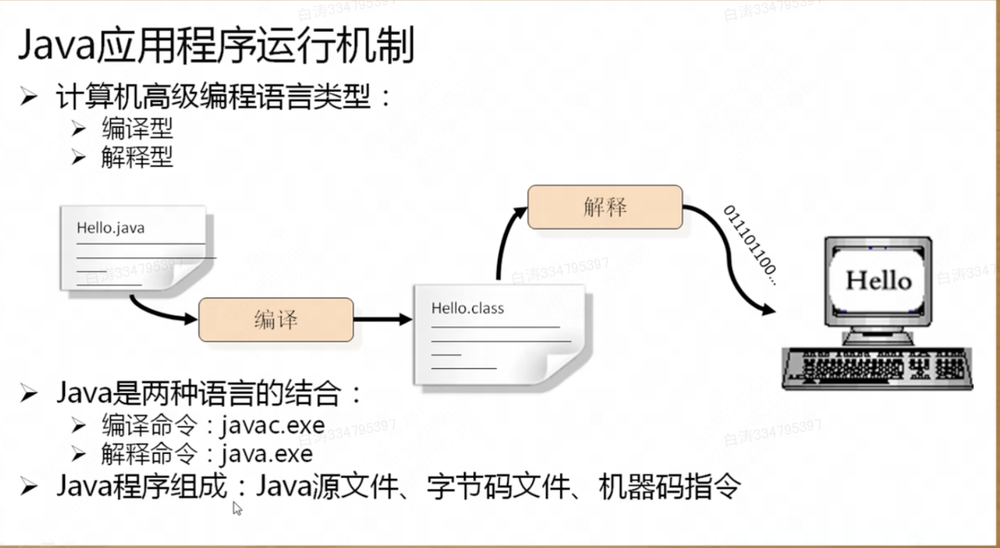
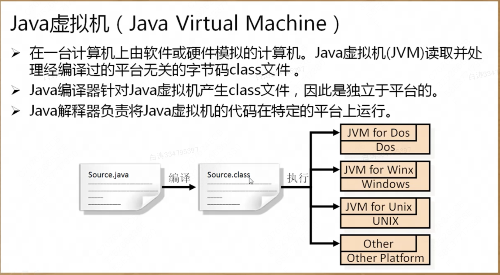

# Java语言特点

# 一、Java发展简介

​        Java是现在最流行的编程语言之一，并且自身拥有庞大且完善的生态系统，可以实现你的任何需求。在国内Java的发展很好，因为许多大户在使用Java实现其各自的核心业务。

​        Java是由SUN公司开发的一套编程语言，其前身并不是Java。

​        1991年，GREEN项目的核心功能是使用Email控制家电运行，最初SUN公司想要竞争这个项目，考虑到C++的复杂性，所以利用C++开发出了一套OAK（橡树）平台，并且利用此平台进行项目的竞标，遗憾的是并没有中标。但是，这个时候一个最早的很牛的软件公司诞生了：网景（第一家依靠技术上市的公司），受到了当时浏览器技术的启发，推出了一个HotJava的浏览器。后来在1995年5月23日时正式推出了Java的编程语言，同时推出了JDK1.0的开发包，到了1997年才传到了中国。

​        SUN（Stanford University NetWork）公司是一家从事于硬件开发的技术型公司，SUN最早的代表性产品：小型机（被广泛的应用在了amazon上），最初的电子商务是由IBM提出来的，后来由于网络经济的发展问题（任何的经济模式都会有瓶颈），但是对于90年代末的互联网低潮而言，这就是一个严重的伤害。而SUN公司经过这一段时间发展，没有恢复往日的经济实力，后来被Oracle收购。IBM当年软件产品线上的技术基础就是Java语言（SUN却没有通过Java语言赚到多少钱，IBM却赚到了很多）。

​        如今，已经形成了共识：Java依然是一个稳定的、可靠的编程语言，可以承担大型服务器的程序开发任务。

​        而从最初的时代到现在Java语言也出现了一些技术的不同发展：

- Java标准开发（J2SE、JAVA SE）：Standard Edition，提供的是底层的支持，实现了桌面程序的开发（单机）；
- Java嵌入式开发（J2ME、JAVA ME）：Micro Edition，SUN公司最早就是想做嵌入式开发的，但是发展被Nokia折腾了，后来被Android所替代了，但是由于Oracle和Google的大战，Google干脆推出了自己的专属编程语言（Kotlin）来进行Android开发。
- Java企业开发（J2EE、JAVA EE）：ENterprise Edition，主要是进行企业平台的搭建，现在主要的开发是互联网平台；

# 二、Java主要特点

​        Java之所以可以得到持续的发展力以及良好的生态系统，这完全取决于Java的自身的技术特征。

​        1.是一个行业内通用的技术实现标准；

- Java本身也算是一个半开源的产品，很多的厂商得以接触到Java的底层，这样使得Java开发的更加的透明

​        2.是一门面向对象的编程语言：使得Java的语言语法结构更加方便开发者理解，而且还在不断地扩充（不同的JDK版本）；

​        3.提供有方便的内存回收处理机制：像一些编程语言里面需要明确的手工进行对象的回收与释放，否则程序无法正常提供支持，但是Java可以提供有自动的内存回收操作，这样处理会更加方便（但是这里就牵扯到了优化问题）；

​        4.避免了复杂的指针问题，而使用更加简单的引用来代替指针，Java的设计考虑这一点，用引用代替了指针，但是引用还是很复杂；

​        5.Java是为数不多支持多线程编程的开发语言，这样就可以使得单位时间内，处理的性能得到提升（性能的提升不是绝对的），多线程也是Java开发之中最难以理解的部分，而正确的多线程处理才是提升处理性能的核心所在。

​        6.Java提供有高效的网络处理能力，可以基于NIO实现更加高效的数据传输处理；

​        7.Java具有良好的可移植性，这样可以提供一定的适用范围。

# 三、Java的可移植性

​        可移植性指的是**同一个程序可以在不同的操作系统中任意的部署**，这样就减少了开发的难度。在Java里面如果想要实现可移植性的控制，那么主要依靠的是JVM（Java Virtual Machine），虚拟机是一个由软件和硬件模拟出来的计算机，所有的程序只要有Java虚拟机的支持，那么就可以实现程序的执行。不同的系统上会有不同版本的JVM存在，这样就可以实现可移植性。

​        所有Java程序的解释需要放在虚拟机上，所有*.java的源代码程序最终都是需要经过编译后才可以使用的，但是编译完成的程序代码并不是一个绑定在某个具体操作系统 上的程序，而是一种通用性的程序，而这种通用性的程序就是JVM能够识别的代码。

​        在JVM执行，肯定要比直接运行在操作系统上慢，但是硬件技术的飞速发展，已经可以忽略这一部分问题，不过仍然有JVM调优问题。
