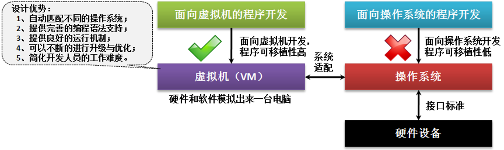
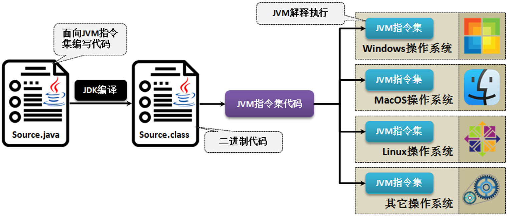

# Java虚拟机

​	传统的软件开发依赖平台支持，利用已有平台进行硬件设备操作（操作系统可以理解为平台）。

​	Java语言最早提出了可移植性，在平台上植入虚拟机（Virtual Machine），程序开发面向虚拟机，不再直接依赖平台。

​	Java源程序需要经过「编译」和「解释」两个步骤才能正确执行。

​	编译，会将源代码编译成「字节码」（*.class）文件，字节码文件需要再JVM上解释运行。JVM定义了一套通用的“指令集”，不同的操作系统上的JVM使用的是同一套指令集，这样Java程序开发者只需要针对JVM提供的指令集开发，而JVM去匹配不同操作系统的系统指令。

