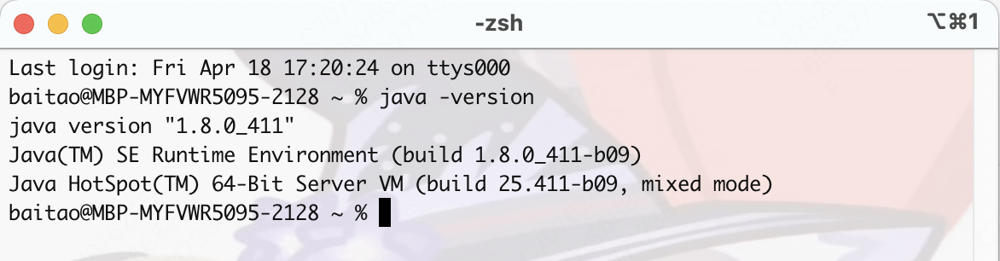

# JDK

​	Java的编译和解释都需要官方提供的工具包JDK（Java Development Kit）支持。JDK在Oracle官网是开源免费的。

​	安装JDK请见专门的文档。


​	打开终端可以看到自己安装的JDK版本

```shell
java -verison
```



​	


# 一、JDK简介

​        Java语言属于编译型与解释型的开发语言，对于Java语言，如果要想进行开发，则一定要进行JDK（Java Development Kit）的安装配置 ，而JDK要想获取则需要通过官网货的，也需要在本机上配置。

​        JDK也有自己的发展历史，主要有如下几个标志性的版本：

- 【1995.05.23】JDK1.0的开发包发布，同时来讲1996年的时候JDK正式提供下载，标志Java的诞生；
- 【1998.121.0】JDK1.2版本推出，而后Java正式更名为Java2（只是一个Java的升级版）；
- 【2005.05.23】Java十周年大会上，推出了JDK1.5版本，同时这个版本也是带新特性以及开发支持更多的标志性的历史版本，这一版本决定了后续十年的技术核心；
- 【2014】Java提供了JDK1.8版本，并且支持有Lambda表达式，可以使用函数式编程；
- 【2017】Java提供了JDK1.9版本，进一步提升了JDK1.8的稳定性；
- 【2018】Java提供了JDK1.10版本，是属于JDK1.9的稳定版。

特别说明：

- 如果要是进行实际的项目的生产环境的部署，现阶段还应该以JDK1.8为主；
- JDK1.9和JDK1.10的差别不大，二者用起来类似。


​        JRE也就是Java RunRuntime Edition，也就是提供了运行时环境，只有程序的解释功能，不提供有程序的开发功能，当本机上已经配置好了JDK之后自动会进行JRE的更新处理。