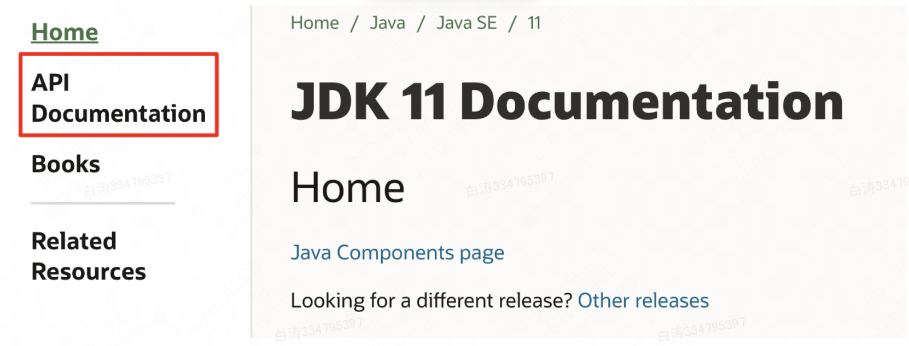
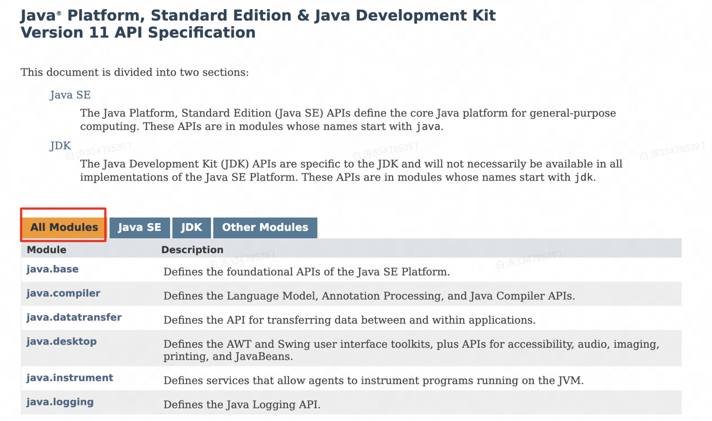
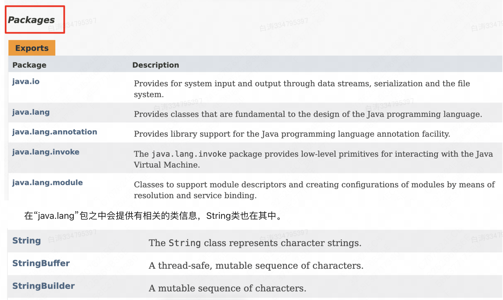

第0章 JavaDoc

​        一门语言除了自身的语法支持度高之外，剩下的就是需要有良好的平台支持，而在Java的行业里拥有大量的系统类库供用户使用，这些类库的信息可以登录oracle的官方网站进行在线浏览。

地址：https://docs.oracle.com/en/java/javase/11/docs/api/index.html

​        选择API Documentation就可以看到Doc文档里面

​        在JDK1.9以前，所有的文档上能显示出来的内容全部都是包的信息，但是从JDK1.9开始，由于引入了模块的概念，所以先看到的是模块。

​        要想找到String类的相关的文档定义，则可以进入到java.basea中，进入到模块之后就显示出各种包的名称，我们进入java.lang

​         在“java.lang”包之中会提供有相关的类信息，String类也在其中。

​        如果要想查看String文档，那么就直接点开String类即可。一般来说，完整的文档内容都由以下几个部分组成：

- 类的定义：包括类的所属模块、包以及类的相关定义、实现的相关接口等；
- 类的说明：对一个类之中定义的内容的信息的描述以及相关的内容的说明，包括使用的阳历；
- 成员（Fields）摘要：列举出此类之中所有非私有化的成员信息；
- 构造方法（Constructor）说明：列出所有构造方法的定义；
- 方法（Method）摘要：包括方法的名称、参数、返回值以及相关的方法作用的说明；
- 是所有成员、构造、方法的详细的解释

​        对于常用的类，方法，一定要做到烂熟于心。