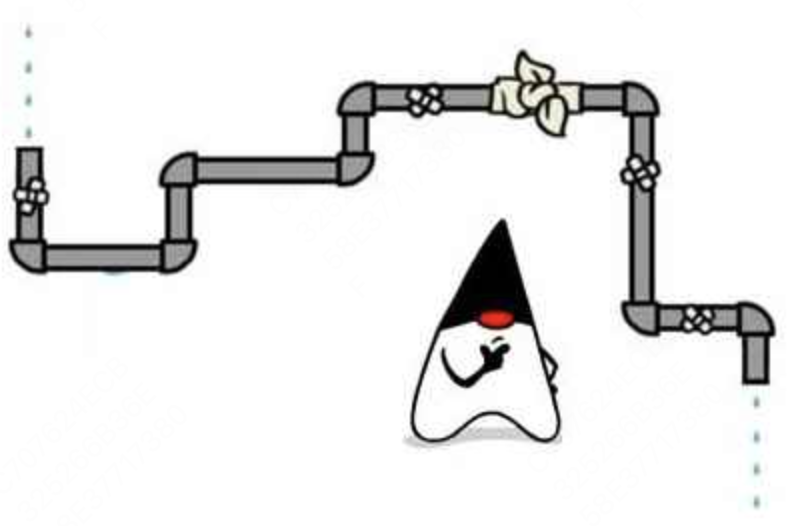

# IO

​	Java的I/O编程是一个很繁杂并且很基础的模块，因为很多的地方都离不开它。小到我们尝试自己用键盘输入，大到网络数据的输入输出，都和I/O编程有着千丝万缕的联系。

​        学过操作系统的我们知道，操作系统会将文件的写入读出等功能封装成系统调用，而Java在此基础上封装了文件类，来让程序员对计算机的文件进行控制。

​	注意我们这里学的只有**同步IO**，也就是`java.io`包下的内容。异步io之后再学。

---

​	IO指的是Input/Output，即输入和输出。以内存为中心：

- input指从外部读入数据到内存，例如，把文件从磁盘读取到内存，从网络读取数据到内存等等。
- Output指把数据从内存输出到外部，例如，把数据从内存写入到文件，把数据从内存输出到网络等等。


​	代码在内存中运行，所以数据也得读到内存里才能让程序处理。读到内存里的数据实际上就是一串字节，对于Java来说也就是`byte[]`数组。

​	**IO流**是一种顺序读写数据的模式，其特点为单向流动。一串字节像水一样从一头流到另一头，所以称之为IO流。




## 字节流

​	IO流以byte为最小单位，因此称为字节流。

​	如果是从**磁盘➡️内存**的，称之为**输入字节流**。在Java中，使用`InputStream`代表输入字节流

​	如果是从**内存➡️磁盘**的，称之为**输出字节流**。在Java中，使用`OutputStream`代表输出字节流。

```
╔═══════════╗						╔═══════════╗
║  Memory   ║						║  Memory   ║
╚═══════════╝						╚═══════════╝
      ▲            						│0x21
      │0x48     							│0x6f
      │0x65      							│0x6c
      │0x6c      							│0x6c
      │0x6c   								│0x65
      │0x6f       						│0x48
      │0x21 									▼
╔═══════════╗						╔═══════════╗
║ Hard Disk ║						║ Hard Disk ║
╚═══════════╝						╚═══════════╝
```


## 字符流

​	字符流，是Java对于字符不全部由单字节ASCII码表示的数据的一种简化读取。实际上现实中我们也更常用`char`而不是`byte`。

​	Java提供了`Reader`和`Writer`表示字符流，其最小数据单位为`char`。


## 同步和异步

​	同步IO是指，读写IO时代码必须等待数据返回后才继续执行后续代码，它的优点是diamanté编写简单，缺点时CPU执行效率低。

​	异步IO是指，读写IO时仅发出请求，然后立刻执行后续代码，它的优点是CPI执行效率高，缺点是代码编写复杂。

​	Java标准库的包java.io提供了同步IO，而java.nio则是异步IO。上面我们讨论的InputStream、OutputStream、Reader和、Writer都是同步IO的抽象类

​	这一章讨论的是同步IO，异步IO要到netty学习


