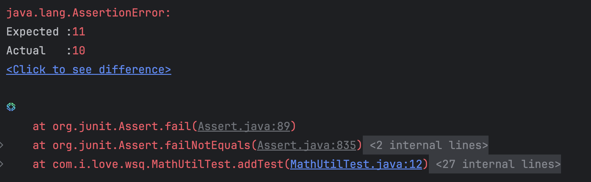

# JUnit测试

*项目地址：junit-test*

​	JUnit是一个开源的Java语言的单元测试框架，专门针对Java设计，使用也是最广泛的。JUnit是事实上的单元测试的标准框架，任何Java开发着都应当学习并使用JUnit编写单元测试。

​	JUnit不仅使用简单、运行方便，同时还能生成测试报告。测试报告中包含测试的成功率，测试的代码覆盖率。测试的代码覆盖率被认为是评价代码质量的重要指标，美团的流水线卡控标准是60%，实际开发者会更高要求，最好在80%以上。

​	JUnit4的官方文档：https://junit.org/junit4/javadoc/latest/index.html


## 1.含有测试的项目结构

​	含有测试的项目结构如下图所示


​	可以看到，测试和普通文件的内容基本一致，最好保持一样的包名，对于类的测试我们为对应的类后面补充一个Test字段。


## 2.示例

​	现在我们写了一个很简单的加法工具

```java
public class MathUtil {
	public static int add(int ... a) {
		int sum = 0;
		for (int b : a) {
			sum += b;
		}
		return sum;
	}
}
```

​	我们向验证这个加法对不对，于是我们为其设计单元测试

```java
public class MathUtilTest {
    @Test
    public void addTest() {
        Assert.assertEquals(10, MathUtil.add(1,2,3,4));
//        Assert.assertEquals(11, MathUtil.add(1,2,3,4));
    }
}
```

​	`@Test`注解帮助JUnit识别测试方法。

​	测试方法内我们使用Assert类的各种assert方法来判别结果是否正确。这里是用的是判别相等。assert方法实际上还有很多：

- `assertTrue()`: 期待结果为`true`
- `assertFalse()`: 期待结果为`false`
- `assertNotNull()`: 期待结果为非`null`
- `assertArrayEquals()`: 期待结果为数组并与期望数组每个元素的值均相等
- `assertEquals(double expected, double actual, double delta)`：由于浮点数无法精确地进行比较，指定一个误差值delta


​	运行测试方法，如果通过就是绿色。如果没有通过，就会出现红色的AssertionError，并且会的到具体的错误信息：




