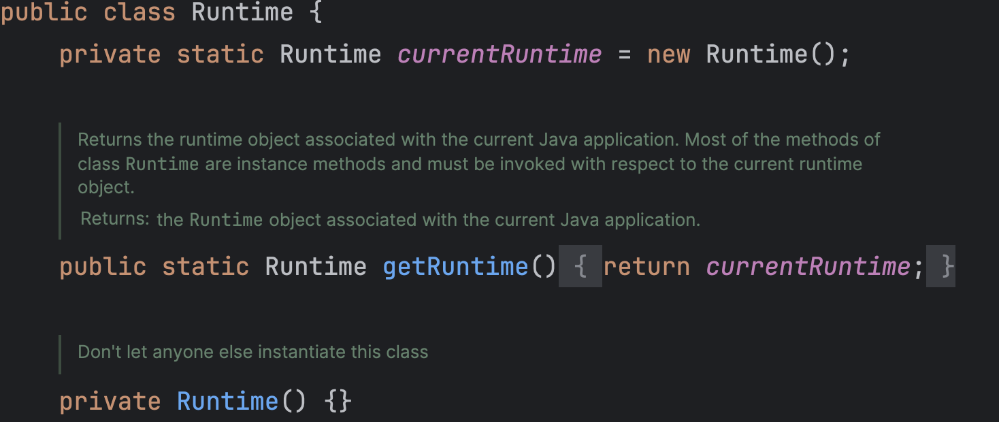

# Runtime类

​	Runtime描述的是运行时的概念，每一个JVM进程里面都会包含一个==**运行时**==的实例化对象，也就是Runtime类


## 1.定义

​	`java.lang.Runtime`类，在JDK 1.0时出现。

```java
public class Runtime
extends Object
```

​	Runtime描述的是运行时的概念，因此一个JVM进程中只需要一个。

​	Runtime类在Doc文档中没有构造方法，它的构造方法被私有化，也就是使用了==**单例设计模式**==，可以从源码中看到：




​	Runtime的获取需要通过内部的static方法

```java
public static Runtime getRuntime() {
    return currentRuntime;
}
```


## 2.Runtime开启新进程

获取到Runtime实例后，可以利用其开启新的进程

例如我们可以使用其打开日历软件（Mac端）

```java
public class Main {
    public static void main(String[] args) throws IOException {
        Runtime runtime = Runtime.getRuntime(); // 获取Runtime实例
        runtime.exec("open /System/Applications/Calendar.app");
    }
}
```

 	这个例子只是说明JVM与其他进程之间的关系，实际开发中我们不会这么写


## 3.Runtime的方法

​	Runtime类中与内存有关的方法为如下四个，在之后学习JVM的时候会常用

| **No.** | **方法**                  | **类型** | **描述**                  |
| ------- | ------------------------- | -------- | ------------------------- |
| 1       | public long maxMemory()   | 普通     | 当前JVM可以使用的最大内存 |
| 2       | public long totalMemory() | 普通     | 获取初始化内存大小        |
| 3       | public long freeMemory()  | 普通     | 空余内存                  |
| 4       | public void gc()          | 普通     | 手工执行GC操作            |


​	首先，我们看看默认内存分配

  ```java
  public class Main {
      public static void main(String[] args) throws IOException, InterruptedException {
          Runtime runtime = Runtime.getRuntime();
          System.out.println("最大内存: \t" + runtime.maxMemory() / 1024 / 1024);
          System.out.println("初始化内存: \t" + runtime.totalMemory() / 1024 / 1024);
          System.out.println("空余内存: \t" + runtime.freeMemory() / 1024 / 1024);
      }
  } 
  ```

```java
// 我的电脑内存是18GB
最大内存: 	4294967296 // 内存的1/4 这里是4GB
初始化内存: 	289406976 // 整体内存的1/64 这里是276MB
空余内存: 	284877080
```


​	Java中提供了垃圾收集机制，实际上这种收集机制需要考虑两种形式，自动垃圾回收和手工回收。

​	我们可以创建一些垃圾试试，并且手动清理一下

```java
package i.love.wsq;

import java.io.IOException;

/**
 * @author baitao05
 */
public class Main {
    public static void main(String[] args) throws IOException, InterruptedException {
        Runtime runtime = Runtime.getRuntime();
        System.out.println("最大内存: \t" + runtime.maxMemory());
        System.out.println("初始化内存: \t" + runtime.totalMemory());
        System.out.println("空余内存: \t" + runtime.freeMemory());

        String str = "垃圾";
        for (int i = 0; i < 5000; i ++ ) {
            str = str + i;
        }

        System.out.println("----产生垃圾前后----");

        System.out.println("最大内存: \t" + runtime.maxMemory());
        System.out.println("初始化内存: \t" + runtime.totalMemory());
        System.out.println("空余内存: \t" + runtime.freeMemory());

        runtime.gc();

        System.out.println("----手动GC后----");

        System.out.println("最大内存: \t" + runtime.maxMemory());
        System.out.println("初始化内存: \t" + runtime.totalMemory());
        System.out.println("空余内存: \t" + runtime.freeMemory());
    }
}

```

```java
最大内存: 	4294967296
初始化内存: 	289406976
空余内存: 	284877080
----产生垃圾前后----
最大内存: 	4294967296
初始化内存: 	364904448
空余内存: 	294883232
----手动GC后----
最大内存: 	4294967296
初始化内存: 	515899392
空余内存: 	509439768
```

​	执行GC之后一定会释放可用的内存空间的资源，但是随着版本的不同，GC处理后的内存也有所不同。不过都需要手工调整。


