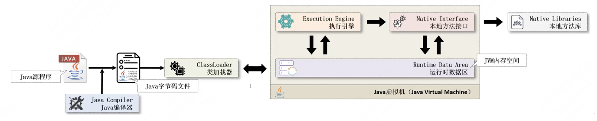
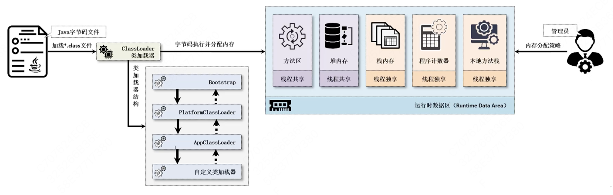

# JVM内存模型

程序优化已经属于常用技术了，所以JVM也属于Java工程书必须掌握的内容了

当前使用的是HotSpot虚拟机（开源的虚拟机技术）

Java执行：

- 写*.java文件（源代码）
- 编译成*.class文件（源代码 -> 虚拟机代码）
- ClassLoader加载字节码文件
- 虚拟机加载后分配数据区
- 执行引擎执行
- 执行时需要调用本地函数库（native方法）

JVM的体系结构实际上最重要的部分是运行时数据区，包含以下部分：

运行时数据区，需要进行线程共享以及线程独享分析，运行时数据区分为：

- 线程共享区域：方法区、堆内存
- 线程独享：栈内存、程序计数器、本地方法栈

1.程序计数器（Program Counter Register）

指向下一条命令的计数器

线程私有，占有内存小到可以忽略

2.Java栈

每个线程都会存在私有的栈内存空间

每次方法调用都会产生一个栈帧

- 局部变量表

是一组变量值存储的空间，用于存放方法参数和方法内部定义的所有局部变量，并且在其编译时就已经为其**分配局部变量表的最大容量**，局部变量表的容量以变量槽（Slot）为最小的存储单位，每个变量槽都可以存储32位长度的内存空间，例如：int、byte、boolean等类型，而对于64位的数据类型，例如：long或double，则Java虚拟机会将其写入两个连续的变量槽以实现数据存储

> JUC的原子操作类就是因为内存fen

- 操作数栈

- 常量池引用

- 方法返回地址

- 动态连接

