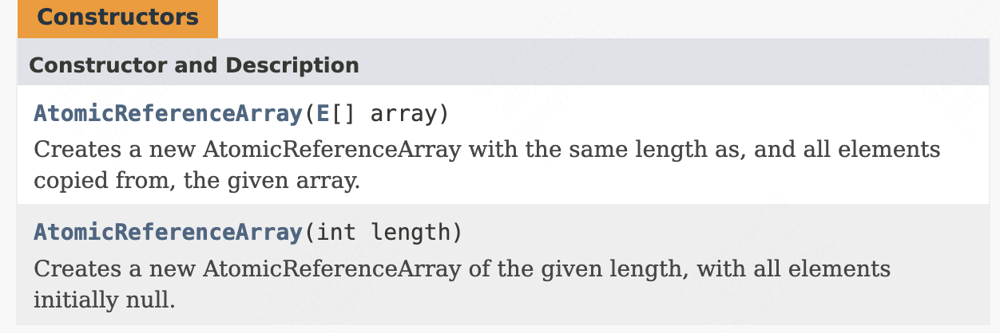

# 数组原子操作类

​	数组是Java提供的原生数据类型，在进行多线程并发处理操作中为了保证数组元素内容的正确性，J.U.C也提供了三个数组操作的原子类：`AtomicIntegerArray`、`AtomicLongArray`、`AtomicReferenceArray`（对象数组），这三个原子类的操作形式类似，所以本次将直接通过AtomicReferenceArray类进行讲解

## 构造方法

​	可以直接放对象数组，或者定义数组长度




## 方法

| **No.** | **方法**                                                     | **类型** | **描述**                         |
| ------- | ------------------------------------------------------------ | -------- | -------------------------------- |
| 3       | public final int length()                                    | 普通     | 获取保存数组长度                 |
| 4       | public final E get(int i)                                    | 普通     | 获取指定索引数据                 |
| 5       | public final void set(int i, E  newValue)                    | 普通     | 修改指定索引数组内容             |
| 6       | public final boolean compareAndSet(int  i, E expectedValue, E newValue) | 普通     | 判断（==判断）并修改指定索引数据 |
| 7       | public final E getAndSet(int i, E  newValue)                 | 普通     | 获取并修改指定索引数据           |

实现数组的操作

```java
public class Demo {
    public static void main(String[] args) throws InterruptedException {
        String[] data = new String[] {"123","456","789"};
        // 获取原子类
        AtomicReferenceArray<String> array = new AtomicReferenceArray<>(data);
        System.out.println("结果：" + array.compareAndSet(1, "456", "654"));
        System.out.println(array.get(1));
    }
}
```


## 分析源代码

1.基本结构定义

```java
package java.util.concurrent.atomic;

public class AtomicReferenceArray<E> implements java.io.Serializable {
    private static final long serialVersionUID = -6209656149925076980L;

    private static final Unsafe unsafe;
    private static final int base;
    private static final int shift;
    private static final long arrayFieldOffset;
    private final Object[] array; // must have exact type Object[]
}
```

2.原子数组操作类中提供的CAS方法

```java
public final boolean compareAndSet(int i, E expect, E update) {
    return compareAndSetRaw(checkedByteOffset(i), expect, update);
}

private boolean compareAndSetRaw(long offset, E expect, E update) {
    return unsafe.compareAndSwapObject(array, offset, expect, update);
}
```

​	