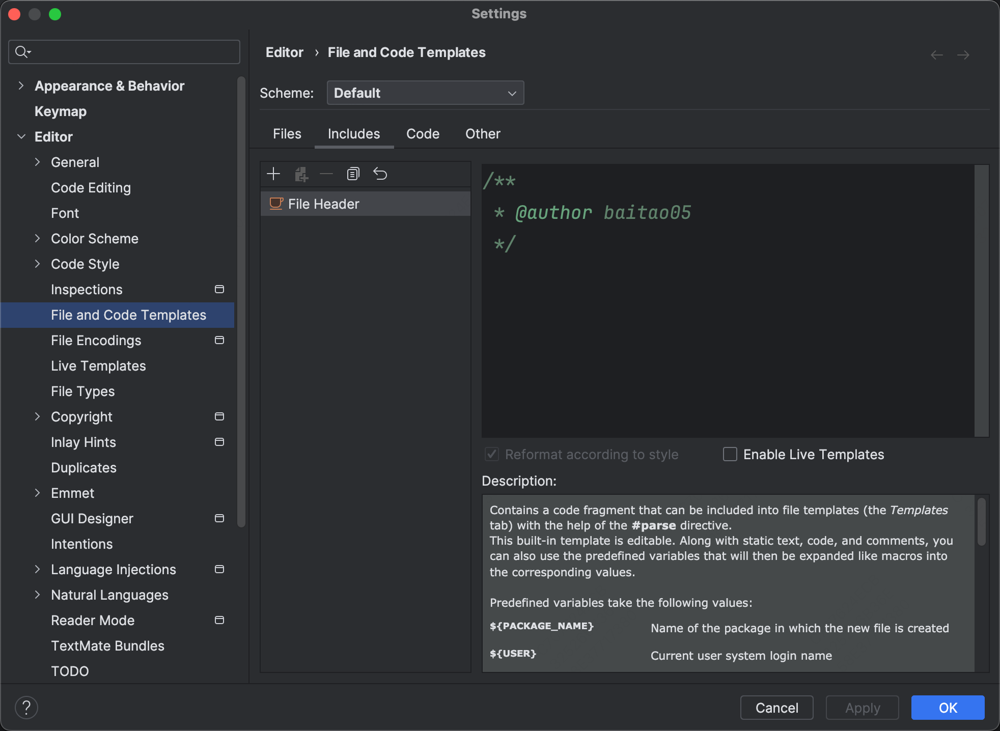
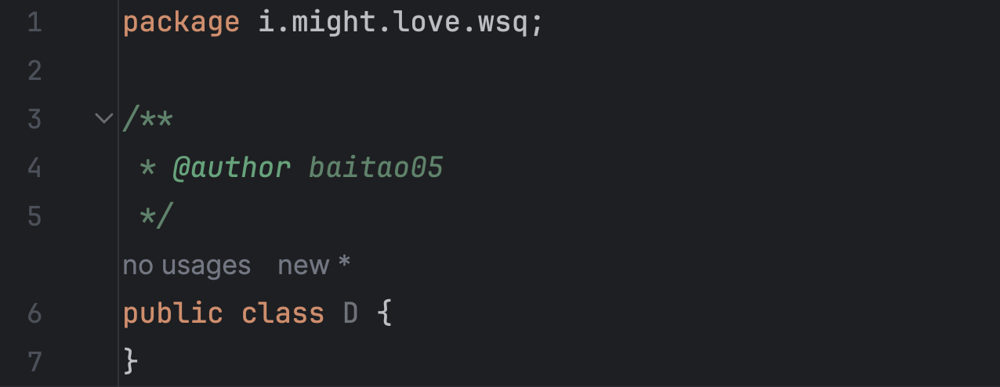

# 注释

## 一、Java的注释

​	完整的程序中包含大量的逻辑，如果一套代码需要长期维护，在代码中维护详细的注释就很有必要了。

​	一方面，开发者回顾程序时更加方便；另一方面，继任者也能更容易理解代码，尤其是代码的逻辑和实际含义不直观时。


​	Java的注释包含三种：单行注释、多行注释、文档注释

### 1.单行注释

**使用方法：**用`//`来表示。

```java
public static void Integer MAX_COUNT = 10; // 最大值

// 最小值
public static void Integer MIN_COUNT = 2;
```

​	单行注释主要用在某个字段前面说明一下功能，或者在某个逻辑前标注一下。

​	注意：行尾注释不要使用，在很多的Java规范里行尾注释都属于禁忌行列了。


**调试场景：**单行注释现在最大的用处就是用来**调试**。

​	当你写了一段代码觉得有问题需要调试，经常可能会需要删去某些行执行一遍看看区别，这个时候单行注释就很方便，不用真的删去代码。

​	一般来说点击快捷键（Mac： `command` + `/`）（Windows：`ctrl` + `/`）就可以注释掉单行代码。

​	鼠标选中多行可以将多行以单行注释的方式注释掉。


### 2.多行注释

​	用`/*`和`*/`表示。

```java
/* 用于打印的方法 */
public void print();
```

​	多行注释一般用在需要说明的的字段和方法前面。

​	多行注释的定位很尴尬，如果说明的内容不多大家更倾向于单行，太多的话又会用文档注释了，所以很尴尬。


**快捷键**：

​	输入`/*`之后回车即可生成。


### 3.文档注释

​	以`/**`开头，`*/`结尾，中间的每行都有`*`为开头

```java
/**
 * 分页查询
 */
public PageContentVo<RiskLabelRule> pageList(Integer pageNo, Integer pageSize);
```

​	对程序结构进行说明，一般详细的说明才会用这个，在Java类库中或者开发出来给别人调用的基础类常用。


**快捷键**

​	输入`/**`之后回车即可生成。


## 二、IDEA中的注释

​	IDEA设置中的 `Editor`--`File and Code Templates`--`Includes`可以为文件设置表开头，比较常用的场景是在这里写代码作者的名字，例如我们可以写下

```java
/**
 * @author baitao
 */
```




​	之后你生成类的时候就会自动加上作者信息啦

