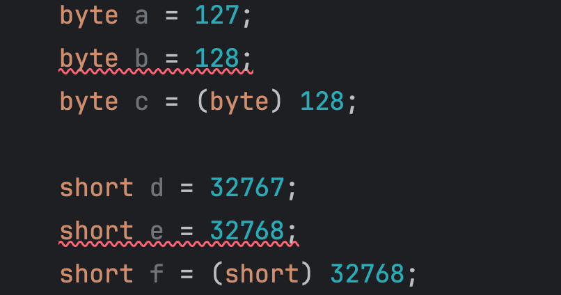

# Java数据类型

​	Java的数据类型分为**基本数据类型**和**引用数据类型**两种，两者的根本区别在于**是否涉及到内存分配**。（通俗易懂的来说，需不需要`new`的区别）

​	引用数据类型很多，所有的类的对象都是引用数据类型，因此类的部分再讨论。

​	本章主要讨论基本数据类型

## 1.基本数据类型

| **No.** | **数据类型**     | **大小****/****位** | **可表示的数据范围**                         | **默认值** |
| ------- | ---------------- | ------------------- | -------------------------------------------- | ---------- |
| 1       | byte（字节）     | 8                   | -128 ~ 127                                   | 0          |
| 2       | short（短整型）  | 16                  | -32768~32767                                 | 0          |
| 3       | int（整型）      | 32                  | -2147483648 ~ 2147483647                     | 0          |
| 4       | long（长整型）   | 64                  | -9223372036854775808 ~  9223372036854775807  | 0          |
| 5       | float（单精度）  | 32                  | -3.4E38（-3.4´1038） ~ 3.4E38（3.4´1038）    | 0.0        |
| 6       | double（双精度） | 64                  | -1.7E308（-1.7´10308）~ 1.7E308（1.7´10308） | 0.0        |
| 7       | char（字符）     | 16                  | 0（'\u0000'） ~ 65,535（'\uffff'）           | '\u0000'   |
| 8       | boolean（布尔）  | -                   | true或false                                  | false      |


​	基本数据类型现在用的很少，由于Java包装万物的思想已经null的存在，大部分情况下大家都会使用包装类型代替基本数据类型。


​	基本数据类型在栈中定义，变量就是一个指向栈中值的标识符。

​	变量可以修改，也就是指向不同的栈中值。栈中值不能修改，也就是所谓的常量。

```java
public static void main() {
  int age = 16;
  age = 10;
}
```

​	`16`和`10`就是常量，`age`是一个变量。


​	早期版本变量必须指向一个栈中的值，JDK 1.5 之后不再有这个限制。


## 2.整型

​	byte，short，int，long是整型，它们只能表示整数。

​	整型数据类型根据位数拥有数据范围，超过范围会溢出（补码的溢出）


​	小范围可以直接转化为大范围，反过来则不行

```java
byte a = 1;
short b = a;
int c = b;
long d = c;
```

​	大范围转化成小范围需要强制类型转换，且结果会按截取低位数的方式

​	`00001001`  -> `1001`

```java
short g = 129;
byte h = (byte) g;
System.out.println(g);
System.out.println(h);

//129
//-127
```


​	Java中实际上对于常量也有数据类型的区分，平常情况下定义数字默认是int，加上`L`之后是long

​	为了方便，Java针对与short和byte做了优化，当赋的值在其范围内是不需要加上强制类型转换的，但是超过了就必须得加了




## 3.浮点型

​	整型和浮点型一起计算会转为浮点型（浮点型更大）


## 4.字符型


## 5.布尔型

​	需要注意的是，早期的语言用0和非0表示假和真（比如C语言），这会有一些问题。Java为了避免这种错误，禁止使用0和1来给boolean赋值


## 6.字符串型

​	String是一个字符串，它虽然是引用数据类型，但是由于不可修改，使用的实际体验和普通数据类型差不多。

​	String可以使用“+”进行连接操作，“+”在字符串连接和计算间是按优先级执行的，需要格外注意

```java
System.out.println("a" + 1 + 2);
System.out.println(1 + 2 + "a");

// a12
// 3a
```


​	String中特殊字符需要使用转义字符，例如双引号、单引号、换行符、制表符、反斜线本身


