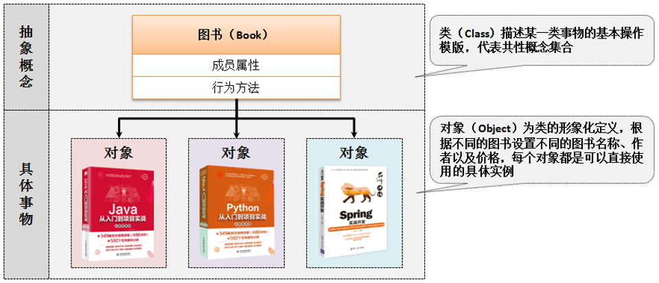

# 类和对象

​	面向对象编程的核心就是通过对象的方式把现实世界映射到计算机模型。

​	其实我个人感觉`对象`这个词很有误导性，这一小节的标题如果是英文的话应该是Class & Instance，实际上是`类`和`实例`。在国内将对象和实例这两个词经常混用，导致容易觉得晕晕的。所以这小节我们统一使用`类`和`实例`这两个词。

---

​	简单来说，类就是抽象概念，比如人。实例就是抽象概念的具体内容，比如我是一个具体的人。面向对象就是我们要找到一个具体的实例进行设计

​	class实际上就是对象模版，它定义了这一系列的对象是怎么定义的；

​	instance实际上是对象实例，它就是根据class创建出来的一个对象本身。




## 4.2.1 类与对象定义


## 4.2.2 对象内存分析 75


## 4.2.3 对象引用传递分析 78


## 4.2.4 垃圾产生分析 80


​	


## 匿名对象

```java
public class Main {
    public static void main(String args[]) {
        new Person("张三", 18).tell();
    }
}
```

