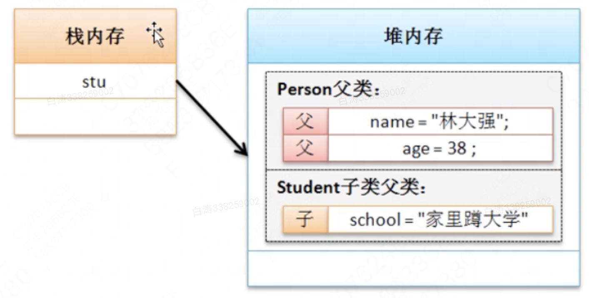

# 继承性

​	继承是面向对象的方法中的重要概念，是提高软件开发效率的重要手段。

​	首先继承拥有反映事物一般特性的类；其次在其基础上派生出反映特殊事物的类。如已有汽车的类，该类中描述了汽车的普遍属性和行为，进一步再产生轿车的类，轿车的类是继承于汽车的类，轿车的类不仅拥有汽车的类的全部属性和行为，还增加轿车特有的属性和行为。

​	在Java程序设计中，对于继承实现前一定要有一些已经存在的类（可以是自定义的类或者由类库所提供的类）。用户开发的程序类需要继承这些已有的类。这样，新定义的类结构可以继承已有类的结构（属性或方法）。被继承的类称为父类或超类，而经继承产生的类称为子类或派生类。根据继承机制，派生类继承了超类的所有内容，并相应地增加了自己的一些新的成员。

​	面向对象程序设计中的继承机制，大大增强了程序代码的可重复使用性，提高了软件的开发效率，降低了程序产生错误的可能性，也为程序的修改扩充提供了便利。

​	若一个子类只允许继承一个父类，称为单继承；若允许继承多个父类，则称为多继承。目前Java程序设计语言不支持多继承。而Java语言通过接口（interface）的方式来弥补由于Java不支持多继承而带来的子类不能享用多个父类的成员的缺憾。


## 1.Java中的继承

​	Java中的继承主要通过关键字`extends`实现，具体结构如下：

```java
class subclass extends superclass {}
```

> 一个有趣的事是：英语中，super作为前缀的时候表示的是更高的等级而不是原本超级的意思，尽管如此中文还是把这个词在计算机领域翻译成了“超类”，为了避免混淆，我还是倾向于使用“子类和父类”这种说法


​	todo：继承的内存结构，这部分内容仍需要补充，目前还没有自己确认的确凿证据



​	简单可以认为，子类和父类的属性在堆中是分开定义的的。也就是说父类的部分依然可以单独进行


https://www.cnblogs.com/huozhonghun/p/17119446.html