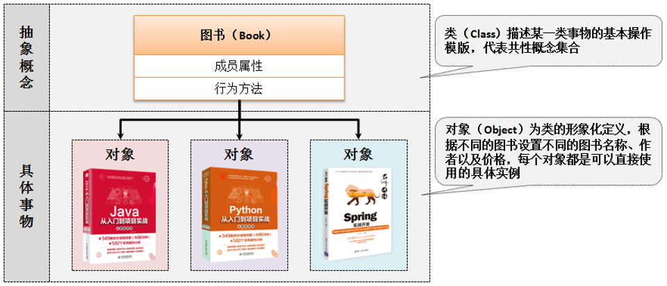

# 类和对象

​	面向对象编程的核心就是通过对象的方式把现实世界映射到计算机模型。

​	其实我个人感觉`对象`这个词很有误导性，这一小节的标题如果是英文的话应该是Class & Instance，实际上是`类`和`实例`。在国内将对象和实例这两个词经常混用，导致容易觉得晕晕的。所以这小节我们统一使用`类`和`实例`这两个词。

---

​	简单来说，类就是抽象概念，比如人。实例就是抽象概念的具体内容，比如我是一个具体的人。面向对象就是我们要找到一个具体的实例进行设计

​	class实际上就是对象模版，它定义了这一系列的对象是怎么定义的；

​	instance实际上是对象实例，它就是根据class创建出来的一个对象本身。




## 4.2.1 类与对象定义


## 4.2.2 对象内存分析 75


## 4.2.3 对象引用传递分析 78


## 4.2.4 垃圾产生分析 80


​	


## 匿名对象

```java
public class Main {
    public static void main(String args[]) {
        new Person("张三", 18).tell();
    }
}
```


# 4.2 类与对象

## 4.2.1 类与对象的定义

​        在Java中类是一个独立的结构体，所以需要使用class来进行定义，而在类之中主要由属性和方法组成。属性就是一个个具体的变量，方法就是可以重复执行的代码。

​        范例：定义一个类

```
class Person {	//定义一个类
	String name;	//定义名字
  int age;			//定义年龄
  public void tell() {
  	System.out.println("姓名:" + name + "、年龄：" + age);
  }
}
```

​        在这个类之中定义有两个属性（name、age）和一个方法（tell()），在有了类之后，使用类通过对象完成。产生对象需要一下语法格式：

- 声明并实例化对象：**类名称 对象名称 = new 类名称()**;
- 分步骤完成：
  - 声明对象：类名称 对象名称 = null;
  - 实例化对象：对象名称  = new 类名称();

```
public class Main {
    public static void main(String args[]) {
        Person per = new Person();	//声明并实例化对象
    }
}
```

​        当获取了实例化对象之后，就需要通过对象进行类中的操作调用，此时有两种调用方式。

- 调用类中的属性：**实例化对象.成员属性**
- 调用类中的方法：**实例化对象.方法名称()**

```
public class Main {
    public static void main(String args[]) {
        Person per = new Person();	//声明并实例化对象
      	per.name = "张三";
      	per.age = 18;
      	per.tell();
    }
}
```

​        如果没有设置属性值，则为其默认值，即null或者0。


# 四、对象内存分析

​        Java之中类属于引用数据类型，引用数据类型最大的困难之处在于要进行内存的管理，同时在进行操作的时候也会发生有内存关系的变化，所以本次针对于之前的程序的内存关系进行一个简单分析。

范例：以下面的程序为主进行分析

```
class Person {
    String name;
    int age;

    public void tell() {
        System.out.println("姓名:" + name + "、年龄：" + age);
    }
}

public class Main {
    public static void main(String args[]) {
        Person per = new Person();
        per.name = "张三";
        per.age = 18;
        per.tell();
    }
}
```

​        如果要进行内存分析，那么首先给出两块最为常用的内存空间：

- 堆内存：保存的是对象的具体信息，在程序之中堆内存空间的开辟是通过new 完成的
- 栈内存：保存的是一块堆内存的地址，即：通过地址找到堆内存，进而找到对象内容，为了分析简单理解为，对象的名称存放在栈内存中


​        接下来我们做具体的内存分析：

​        1.new关键字开辟新的堆内存，Person()决定了数据类型是什么，per则是那个对象的名称。


​        2.两个赋值语句，将堆中的属性修改

        


​        上面的情况是声明并实例化，接下来我们分析分步的情况下的内存变化：

```
Person per = null;
per = new Person();
```

​        继续内存分析：

​        1.Person per = null;在这里，显然我们只在栈上开辟了空间，并未在堆上有操作。  

​        2.per = new Person();这里看见有new，显然在堆内存上开辟了空间


​        需要引起注意的是，所有的对象在调用类中的属性或方法的时候必须要实例化完成后才能进行，例如下面的代码就是错误的

```
Person per = null;
per.name = "张三";
per.age = 18;
per.tell();
```

错误信息

Exception in thread "main" java.lang.NullPointerException

​	at Main.main(Main.java:15)

​        代码之中只是声明了对象，但是并没有为对象进行实例化，所以此时无法调用。而此时NullPointerException（空指向异常）就是**没有在堆内存开辟后时所产生的问题**，并且只有引用数据类型存在有此问题。


# 五、对象引用分析

​        类本身属于**引用数据类型**，既然是引用数据类型，那么就牵扯到内存的引用传递，所谓的引用传递的本质，同一块堆内存的空间，可以被不同的栈内存所指向，也可以更换指向。

范例：定义一个引用传递的分析程序

```
public class Main {
  public static void main(String args[]) {
    Person per1 = new Person();
    per1.name = "张三";
    per1.age = 18;
    Person per2 = per1;		//引用传递
    per2.age = 80;
    per2.tell();
  }
}
```

​         内存分析：

​        1.Person per2 = per1;重点在引用传递这里，per1是一个地址，而per2是在栈上新开辟出的区域，但是它存放的内容和per1是一样的。因此，当你根据per2修改时，实际上修改的还是原本的那块堆内存。


​        这个引用传递是在主方法中定义的，我们也可以通过方法实现引用传递处理。

范例：利用方法实现引用传递处理

```
public class Main {
  public static void main(String args[]) {
    Person per = new Person();
    per.name = "张三";
    per.age = 18;
    change(per);
    per.tell();
  }
  
  public static void change(Person temp) {
  	temp.age = 80;
  }
}
```

​        与之前差别最大的地方在于，此时的程序是将Person类的实例化对象（内存地址、数值）传递到了change()方法之中，由于传递的是一个Person类型，那么change()接收的也是一个Person类型。

指针去哪了

Java对于实例化对象直接定义为了引用数据类型，而在C++中实例化对象就是对象本身。C++的实例化实际上是很原始的，因为C++可以在栈上存放实例的内容，这点和Java很不一样。Java的实例化方式实际上和C++中利用构造函数特化的实例化方式一样，这也就是之前所说的Java优化的地方，起码帮助新手省下了一大段分析对象是存在栈还是存在堆上的时间。

C++其实在实例化会经常用到在堆上申请空间然后用一个指针指向的方式，也就是Java现行的方式。


# 六、引用与垃圾产生分析

​        所有的引用传递的本质就是一场堆内存不断易主的过程，当使用不当时，也会造成垃圾的产生。

范例：定义一个垃圾产生的程序

```
public class Main {
  public static void main(String args[]) {
    Person per1 = new Person() ;
    Person per2 = new Person() ;
    per1.name = "张三" ;
    per1.age = 18 ;
    per2.name = "李四" ;
    per2.age = 19 ;
    per2 = per1 ;
    per2.age = 80 ;
    per1.tell();
  }
}
```

​        这个过程中，per2抛弃了自己指向的区域，那个对象的堆空间无法再被释放，就变成了一个垃圾空间。所谓的垃圾空间，就是没有任何栈内存指向的堆内存空间，所有的垃圾将被GC（Garbage Collector）不定期回收并且释放无用内存空间，如果垃圾太多，一定影响到GC的处理性能，从而影响程序的性能，实际的开发之中，一定要尽可能避免垃圾产生


