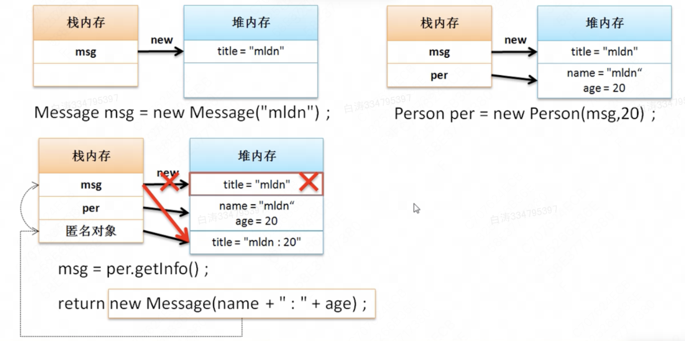

4.5 匿名对象

​        对象的产生格式通常为：

- 定义对象的名称：类名称 对象名称 = null;
- 实例化对象：对象名称 = new 类名称();  

​        如果**只是通过实例化对象来进行类的操作**也是可以的，而这种形式的对象称为**匿名对象**。

```
public class Main {
    public static void main(String args[]) {
        new Person("张三", 18).tell();
    }
}
```

​        此时代码正常运行，进行了tell()的调用，但是由于此对象没有引用，它自然就成为了垃圾。


​        分析有构造方法的程序：

```
class Message {
    private String title ;

    public Message(String t) {
        title = t ;
    }

    public void setTitle(String title) {
        this.title = title ;
    }

    public String getTitle() {
        return title ;
    }
}

class Person {
    private String name;
    private int age;

    public Person(Message msg, int a) {
        name = msg.getTitle();
        age = a;
    }

    public Message getInfo() {
        return new Message(name + ":" + age) ;
    }
}

public class Main {
    public static void main(String args[]) {
        Message msg = new Message("mldn") ;
        Person per = new Person(msg, 18) ;
        msg = per.getInfo() ;
        System.out.println(msg.getTitle());
    }
}
```

