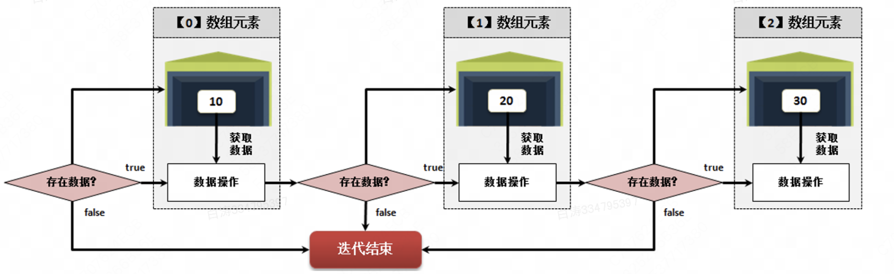

5.1 数组定义与基本使用

​        数组在Java里面属于一种**引用数据类型**概念，但是如果从实际的开发的角度来讲，数组更多的时候是应用其概念（保存多个数据），但是由于静态数组有长度限制，所以实际上我们不太会在工程中使用，这里更多的是**学习一种概念**。


1.数组定义

​        学习技术前先要清楚技术解决了什么问题？它本身又存在什么问题？

​        如果需要定义成百上千的变量，写一千个定义肯定是不好的。因此数组就是用来解决这个问题的。

​        此外，如果这些变量具有相关性，那么如何统一进行这100个变量的调用管理呢？

# 1.数组的定义方式

## **1.1** 声明并开辟数组空间

```
数据类型 [] 数组名称 = new 数据类型 [数组长度] ; // “[]”放在数据类型后
数据类型 数组名称 [] = new 数据类型 [数组长度] ; // “[]”放在变量名称后

//例子
int[] array = new int[100];
```

## 1.2 先声明，后开辟数组空间

```
//声明数组：
数据类型 [] 数组名称 = null ; // “[]”放在数据类型后，默认值为null
数据类型 数组名称 [] = null ; // “[]”放在变量名称后，默认值为null

//开辟数组空间：
数组名称 = new 数据类型 [数组长度] ; // 通过关键字new开辟数组内存空间

//例子
int[] array;
array = new int[100];
```

PS：备注一点，按照Java的规范，最好选择“数据类型 [] 数组名称”的声明格式，为了和传统C语言区分。


# 2.动态初始化

​        是用了new肯定是动态初始化，这意味着我们已经规定了数组的最大长度。一旦越界就会出现**越界异常**。


# 3.引用数据类型

​        Java中的数组比较特殊，为了避免C语言中复杂的内存分配机制问题，Java直接将数组归纳为引用数据类型。

​        这其实就是说数组这种数据类型实际上在Java中是一个对象。


2.数组静态初始化

​        数组采用了动态初始化之后其保存数据为对应数据类型默认值，而如果希望在数组定义时就可以明确的设置数组中的元素内容，则可以采用**静态初始化语法**，可以采用如下两类语法形式进行定义。

## 第一类：简化结构数组静态初始化定义格式

```
数据类型 [] 数组名称 = {数值, 数值, ... 数值} ; // “[]”放在数据类型后
数据类型 数组名称 [] = {数值, 数值, ... 数值} ; // “[]”放在数组名称后

//例子
int[] array = {1, 2, 3};
```


## 第二类：完整结构数组静态初始化定义格式

```
数据类型 [] 数组名称 = new 数据类型 [] {数值, 数值, ... 数值} // “[]”放在数据类型后
数据类型 数组名称 [] = new 数据类型 [] {数值, 数值, ... 数值}// “[]”放在数组名称后

//例子
int[] array = new int[]{1, 2, 3};
```


PS：前者实际上是众多编程语言统一的一个初始化规范。如果非要使用最好使用后者啦。


3.数组的遍历

# 1.获取数组的长度

​        数组对象中有一个length系统属性，我们可以直接获得这个系统属性。

​        由于数组是不可变的，所以length的值从初始化之后就是固定的（final）


# 2.for循环遍历

```
public class Example {
    public static void main(String[] args) {
        int[] array = new int[]{1, 2, 3};
        for (int i = 0; i < array.length; i ++) {
            System.out.println(array[i]);
        }
    }
}
```


# 3.foreach遍历

​        foreach可以不用考虑索引，直接遍历输出。

​        传统编程中由于数组属于线性结构，所以只需要利用for循环实现下表索引的控制就可以方便的实现数组的输出，但是从**JDK-1.5**之后的版本中提供有一种更加方便的foreach结构（由“.NET”语法结构衍生而来），这种结构属于增强型for循环，利用这种结构可以帮助开发者回避数组的索引操作，该结构的语法如下所示



```
public class Example {
    public static void main(String[] args) {
        int[] array = new int[]{1, 2, 3};
        for (int temp: array) {
            System.out.println(temp);
        }
    }
}
```