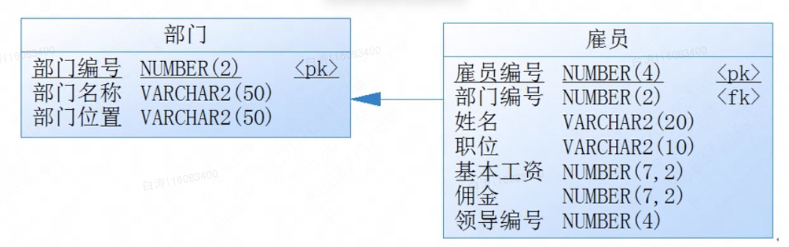
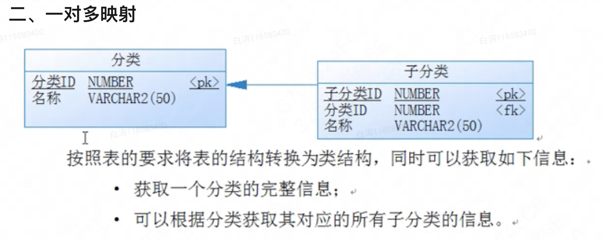
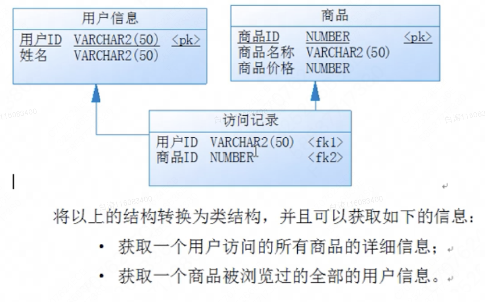
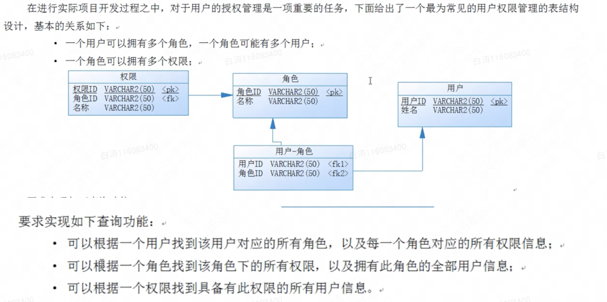

第9章 数据表与简单Java类映射转换

# 一、数据表与简单Java类映射转换

​        简单Java类是现在面向对象设计的主要分析基础，但是对于实际的开发之中简单Java类的定义来源是有依据的，往往都是根据数据表的结构来实现简单Java类。

​        数据库提供若干数据表，每一张实体数据表实际上都可以描述出一些具体的事物概念。

​        程序类的定义形式往往和实体表的差别并不大，所以在实际的开发之中，数据表与简单Java类之间的基本映射关系如下：

- 数据实体表设计 = 类的定义；
- 表中的字段 = 类的成员属性；
- 表的外键关联 = 引用关联；
- 表的一行记录 = 类的一个实例化对象；
- 表的多行记录 = 对象数组。



​        上表就是数据表，我们可以从中发现以下的关联：

- 一个部门有多个雇员；
- 一个雇员属于一个部门；
- 一个雇员有一个领导。

​        下面把数据表转为简单java类的定义形式，在整体的程序代码之中要求可以获得如下信息：

- 根据部门信息获得：
  - 一个部门的完整信息
  - 一个部门之中所有雇员的完整信息
  - 一个雇员对应的领导信息；
- 根据雇员信息获得：
  - 一个雇员所在部门信息
  - 一个雇员对应领导信息


​        对于数据表和简单Java类之间映射最好的解决步骤：先抛开所有的关联字段不看，写出类的基本组成，而后再通过引用配置关联字段的关系
​        **第一步：分别定义Emp和Dept两个实体类**

```
class Dept {
    private long deptno;
    private String dname;
    private String loc;

    public Dept(long deptno, String dname, String loc) {
        this.deptno = deptno;
        this.dname = dname;
        this.loc = loc;
    }

    public String getInfo() {
        return "部门编号：" + deptno + 
               "、部门名称：" + dname + 
               "、部门位置：" + loc;
    }

    //setter,getter,无参构造略
}

class Emp {
    private long empno;
    private String ename;
    private String job;
    private double sal;
    private double comm;

    public Emp(long empno, String ename, String job, double sal, double comm) {
        this.empno = empno;
        this.ename = ename;
        this.job = job;
        this.sal = sal;
        this.comm = comm;
    }
  
    public String getInfo() {
        return "雇员编号：" + empno +
                "、姓名：" + ename +
                "、职位：" + job +
                "、基本工资：" + sal +
                "、佣金：" + comm;
    }

    //setter,getter,无参构造略
}

public class Main {
    public static void main(String args[]) {
    }
}
```

​        第二步：配置所有的关联字段，部门是部门，领导也是雇员，一个部门有多个雇员  

```
class Dept {
    private long deptno;
    private String dname;
    private String loc;
    private Emp emps[];


    public Dept(long deptno, String dname, String loc) {
        this.deptno = deptno;
        this.dname = dname;
        this.loc = loc;
    }

    public String getInfo() {
        return "部门编号：" + deptno +
                "、部门名称：" + dname +
                "、部门位置：" + loc;
    }

    public void setEmps(Emp emps[]) {
        this.emps = emps;
    }

    public Emp[] getEmps() {
        return emps;
    }

    //setter,getter,无参构造略
}

class Emp {
    private long empno;
    private String ename;
    private String job;
    private double sal;
    private double comm;

    private Dept dept;  //所属部门
    private Emp mgr;    //所属领导

    public Emp(long empno, String ename, String job, double sal, double comm) {
        this.empno = empno;
        this.ename = ename;
        this.job = job;
        this.sal = sal;
        this.comm = comm;
    }

    public String getInfo() {
        return "雇员编号：" + empno +
                "、姓名：" + ename +
                "、职位：" + job +
                "、基本工资：" + sal +
                "、佣金：" + comm;
    }

    public void setDept(Dept dept) {
        this.dept = dept;
    }

    public void setMgr(Emp mgr) {
        this.mgr = mgr;
    }

    public Dept getDept() {
        return this.dept;
    }

    public Emp getMgr() {
        return this.mgr;
    }

    //setter,getter,无参构造略
}
```

 


​       在实际项目开发过程之中一定是分两个步骤实现的：

- 第一步：根据表的结构关系进行对象的配置；
- 第二步：根据要求通过结构获取数据。

范例：实现项目开发要求 

```
public class Main {
    public static void main(String args[]) {
        //第一步 根据关系进行类的定义
        Dept dept = new Dept(10, "财务部", "北京");
        Emp empA = new Emp(7369L, "SMITH", "CLERK", 800.00, 0.0);
        Emp empB = new Emp(7566L, "FORD", "MANAGER", 2450.00, 0.0);
        Emp empC = new Emp(7839L, "KING"    , "PRESIDENT", 5000.00, 0.0);
        //为对象进行关联设置
        empA.setDept(dept); //设置雇员与部门的关系
        empB.setDept(dept);
        empC.setDept(dept);
        empA.setMgr(empB);  //设置雇员与领导的关系
        empB.setMgr(empC);
        dept.setEmps(new Emp[] {empA, empB, empC}); //部门与雇员

        //第二步：根据关系获取数据
        System.out.println(dept.getInfo()); //部门信息
        for (int i = 0; i < dept.getEmps().length; i ++) {
            System.out.println("\t|-" + dept.getEmps()[i].getInfo());    //部门的雇员信息
            if (dept.getEmps()[i].getMgr() != null)
                System.out.println("\t\t|-" +dept.getEmps()[i].getMgr().getInfo());   //雇员的领导信息
        }

        System.out.println("----------------------");
        System.out.println(empB.getDept().getInfo());
        System.out.println("\t|-" + empB.getMgr().getInfo());
    }
```

运行结果

部门编号：10、部门名称：财务部、部门位置：北京

​	|-雇员编号：7369、姓名：SMITH、职位：CLERK、基本工资：800.0、佣金：0.0

​		|-雇员编号：7566、姓名：FORD、职位：MANAGER、基本工资：2450.0、佣金：0.0

​	|-雇员编号：7566、姓名：FORD、职位：MANAGER、基本工资：2450.0、佣金：0.0

​		|-雇员编号：7839、姓名：KING、职位：PRESIDENT、基本工资：5000.0、佣金：0.0

​	|-雇员编号：7839、姓名：KING、职位：PRESIDENT、基本工资：5000.0、佣金：0.0

\----------------------

部门编号：10、部门名称：财务部、部门位置：北京

​	|-雇员编号：7839、姓名：KING、职位：PRESIDENT、基本工资：5000.0、佣金：0.0


# 二、一对多映射




# 三、多对多映射



# 四、复杂多对多映射



```
 class Member {
    private String mid;
    private String name;
    private Role roles[];

    public void setRoles(Role[] roles) {
        this.roles = roles;
    }

    public Role[] getRoles() {
        return this.roles;
    }

    public Member(String mid, String name) {
        this.mid = mid;
        this.name = name;
    }

    public String getInfo() {
        return "【用户信息】用户id：" + mid + "、姓名：" + name;
    }
}

class Role {
    private long rid;
    private String title;
    private Member[] members;
    private Privilege[] privileges;

    public Role(long rid, String title) {
        this.rid = rid;
        this.title = title;
    }

    public void setMembers(Member[] members) {
        this.members = members;
    }

    public void setPrivileges(Privilege[] privileges) {
        this.privileges = privileges;
    }

    public Member[] getMembers() {
        return this.members;
    }

    public Privilege[] getPrivileges() {
        return this.privileges;
    }

    public String getInfo() {
        return "【角色信息】角色id：" + rid + "、名称：" + title;
    }
}

class Privilege {
    private long pid;
    private String title;
    private Role role;

    public Privilege(long pid, String title) {
        this.pid = pid;
        this.title = title;
    }

    public void setRole(Role roles) {
        this.role = roles;
    }

    public Role getRole() {
        return this.role;
    }

    public String getInfo() {
        return "【权限信息】权限id：" + pid + "、名称：" + title;
    }

    //setter、getter、无参构造函数略
}

public class Main {
    public static void main(String args[]) {
        Member memA = new Member("mldn-a", "张三");
        Member memB = new Member("mldn-b", "李四");
        Role roleA = new Role(1L, "系统配置");
        Role roleB = new Role(2L, "备份服务");
        Role roleC = new Role(3L, "人事管理");
        Privilege priA = new Privilege(1000L, "系统初始化");
        Privilege priB = new Privilege(1001L, "系统还原");
        Privilege priC = new Privilege(1002L, "系统环境修改");
        Privilege priD = new Privilege(2000L, "备份员工数据");
        Privilege priE = new Privilege(2001L, "备份部门数据");
        Privilege priF = new Privilege(2002L, "备份公文数据");
        Privilege priG = new Privilege(3000L, "增加员工");
        Privilege priH = new Privilege(3001L, "编辑员工");
        Privilege priI = new Privilege(3002L, "浏览员工");
        Privilege priJ = new Privilege(3003L, "员工离职");

        //增加角色与权限的关系
        roleA.setPrivileges(new Privilege[]{priA, priB, priC});
        roleB.setPrivileges(new Privilege[]{priD, priE, priF});
        roleC.setPrivileges(new Privilege[]{priG, priH, priI, priJ});

        //增加权限与角色的关系
        priA.setRole(roleA);
        priB.setRole(roleA);
        priC.setRole(roleA);
        priD.setRole(roleB);
        priE.setRole(roleB);
        priF.setRole(roleB);
        priG.setRole(roleC);
        priH.setRole(roleC);
        priI.setRole(roleC);
        priJ.setRole(roleC);

        //增加用户与角色的关系
        memA.setRoles(new Role[]{roleA, roleB});
        memB.setRoles(new Role[]{roleA, roleB, roleC});

        //增加角色与用户的关系
        roleA.setMembers(new Member[]{memA, memB});
        roleB.setMembers(new Member[]{memA, memB});
        roleC.setMembers(new Member[]{memB});

        //第二步：实现查询功能
        System.out.println(memA.getInfo());
        for (int i = 0; i < memA.getRoles().length; i ++) {
            System.out.println("\t|-" + memA.getRoles()[i].getInfo());
            for (int j = 0; j < memA.getRoles()[i].getPrivileges().length; j ++) {
                System.out.println("\t\t|-" + memA.getRoles()[i].getPrivileges()[j].getInfo());
            }
        }

        System.out.println("---------------------------");

        System.out.println(roleB.getInfo());
        for (int i = 0; i < roleB.getPrivileges().length; i ++) {
            System.out.println("\t|-" + roleB.getPrivileges()[i].getInfo());
        }
        for (int i = 0; i < roleB.getMembers().length; i ++) {
            System.out.println("\t|-" + roleB.getMembers()[i].getInfo());
        }

        System.out.println("---------------------------");

        System.out.println(priH.getInfo());
        for (int i = 0; i < priH.getRole().getMembers().length; i ++) {
            System.out.println("\t|-" + priH.getRole().getMembers()[i].getInfo());
        }
    }
}
```


第24章 *UML图形

​        UML是统一的建模语言，本质就是图形化的形式描述程序类关系的描述。最早最广泛的设计工具时Rational Rose，而后出现了更多的工具如PowerDesigner也可以实现这些类图的定义。现如今类图一般都是用来报告使用，很少先设计类图再写程序。

# 一、类图

​        一般情况下，类结构描述往往包含三层：


​        如果要是一个普通类的名称，直接写即可，如果是抽象类，往往使用斜体描述，同时加一个“abstract”。

​        对于类中的属性可以使用“访问权限 属性名称 ： 属性类型”的格式来进行定义，而对于访问权限基本上只考虑三个：public（+）、protected（#）、private（-）。 

​        类中的方法采用的格式“访问权限 方法名称(): 返回值”结构来描述，一般的方法都是public声明。

​     

​        开发者可以随意找到一些小的免费的开发工具。

​        类中可以设置Attributes属性，Operations方法


​        子类实现接口使用三角和虚线；实现类的继承是三角和实现。

 

​        实际的开发中，更多把代码转换成类图。

# 二、时序图


# 三、用例图