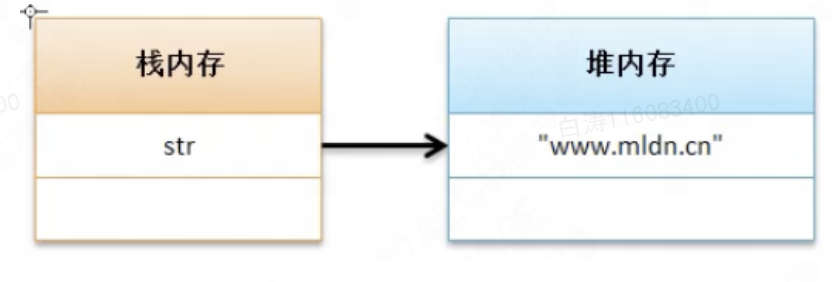
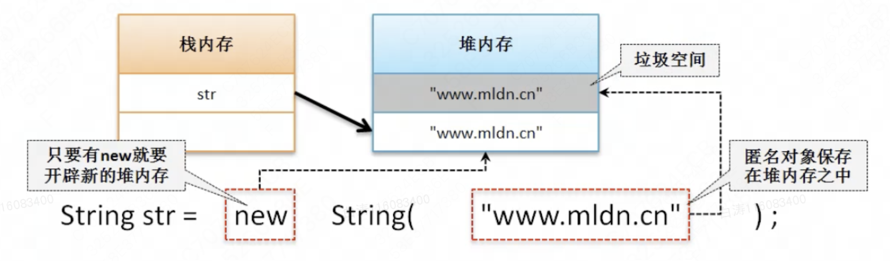

6.4 String对象实例化方式比较

​        String类的两种实例化操作的区别需要我们对内存做出分析。

# 一、直接赋值分析

​        直接赋值实际上就是在堆上开辟内存空间，然后将引用地址放到str上。

```
String str = "hello";
```

  

 

​       直接赋值实例化String类对象，除了上图的特点之外，还拥有一种**对象池**的处理功能。

```
public class Main {
    public static void main(String[] args) {
        String strA = "hello";
        String strB = "hello";
        System.out.println(strA == strB);
        System.out.println("hello".equals(strA));
    }
}

//结果
//true
//true
```

​        两个直接赋值，strA和strB的内存地址是相同的。也就是说，针对同一段字符串，字符串对象池中只会保留一段，并不会额外重复创建相同内容的对象，避免了内存空间的浪费。 


# 二、分析构造方法实例化

```
String str = new String("hello");
```

- 1、"hello"是一个匿名对象，保存到堆内存中；
- 2、new关键字开辟新的堆内存，内容和"hello"相同；
- 3、str只想new开辟的堆内存，匿名对象空间称为垃圾空间。



​         除了产生了匿名对象的垃圾空间，**构造方法实例化的对象不会实现对象池**。

```
public class Main {
    public static void main(String[] args) {
        String strA = new String("hello");
        String strB = "hello";
        System.out.println(strA == strB);
        System.out.println("hello" == strA);
    }
}

//结果
//false
//false
```


​        虽然构造方法没发自动进行对象池操作，但是我们可以手动入池：

- 手动入池：public String intern();

```
public class Main {
    public static void main(String[] args) {
        String strA = new String("hello").intern();
        String strB = "hello";
        System.out.println(strA == strB);
        System.out.println("hello" == strA);
    }
}

//结果
//true
//true
```


**面试题：请解释String类对象两种实例化方式的区别？**

- 直接赋值，利用“=”将一个字符串常量赋予一个对象，这样就可以实现字符串的入池保存，以供下次使用；
- 构造方法实例化：利用new关键字调用String构造方法，这种操作会开辟两块堆内存空间，并且不会自动入池，但是可以使用intern()方法手动入池