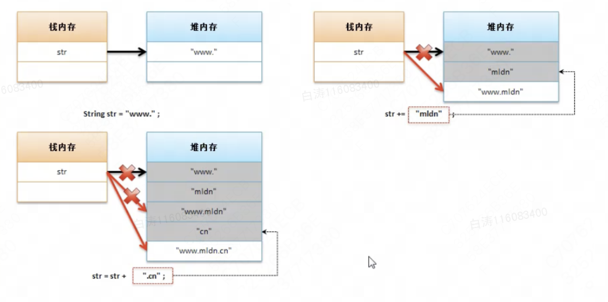

6.6 字符串修改分析

​        使用双引号定义的**字符串常量**，**一旦声明是没有办法修改**的。

```
public class Main {
    public static void main(String[] args) {
        String str =  "www.";
        str += "mldn";
        str += ".cn";
        System.out.println(str);
    }
}

//结果
//www.mldn.cn
```

​        此时我们看上去修改了str的内容，实际上我们只是将str从指向“www.”变成了指向“www.mldn”再到“www.mldn.cn”，而这三者在内存中不在同一个位置。这样的做法不仅意义不大，还造成了大量浪费的内存空间。




```
public class Main {
    public static void main(String[] args) {
        String str =  "";
        for (int i = 0; i < 1000; i ++ ) {
            str += i;
        }
        System.out.println(str);
    }
}
```

​        造成了大量的垃圾数据。