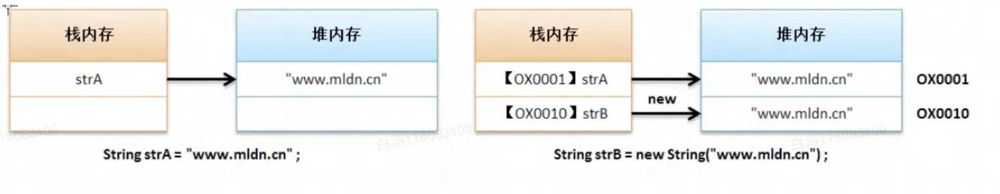

6.2 字符串比较

# 一、使用“==”比较

​        在Java的内部本身直接提供有一个“==”运算符，该运算符的主要功能是进行两个变量内容的判断，但是它不能用于字符串的比较。

​        原因：别忘了Java中的String是一种引用数据类型，也就是说**使用“==”的时候比较的是地址而不是内容**，地址自然没有比较的意义。

```
public class Main {
    public static void main(String[] args) {
        String strA = "哗啦啦啦";
        String strB = new String("哗啦啦啦");
        System.out.println(strA == strB);
    }
}

//结果
//false
```




# 二、使用equals()方法

​        针对于依靠内容比较，Java中String实现有方法equals()：

- 对象比较（适当有缩变形）：public boolean equals(String str);

```
public class Main {
    public static void main(String[] args) {
        String strA = "哗啦啦啦";
        String strB = new String("哗啦啦啦");
        System.out.println(strA.equals(strB));
    }
}

//结果
//true
```

面试题：解释字符串比较中，“==”和“equals()”的区别

- “==”：比较的是两个字符串的堆内存地址的数值，属于数值比较；
- “equals()”：是String类中提供的比较字符串内容的方法；


# 三、补充其他的比较

## equalsIgnoreCase()

比较两个字符串，比较时忽略大小写。