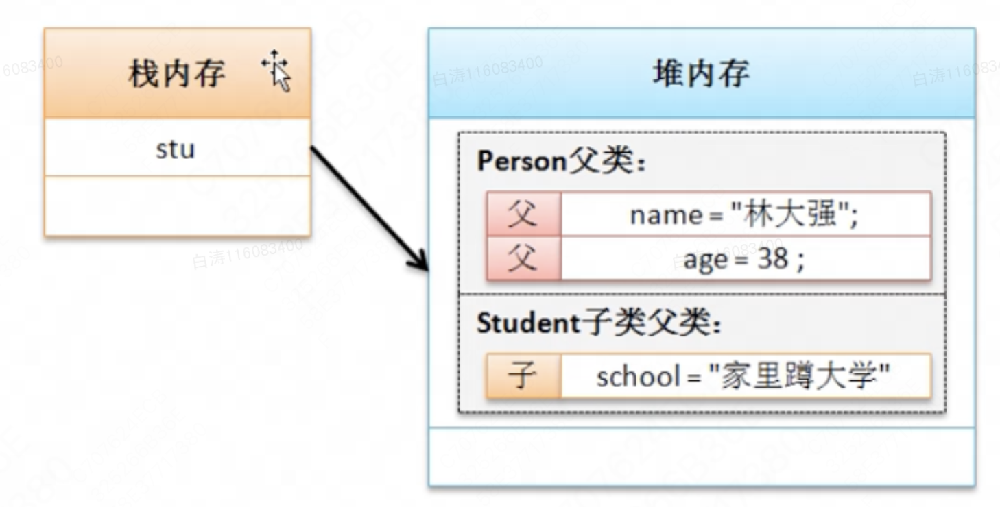

7.1 面向对象继承性

​        面向对象的第二大特征就是继承性，特点：可以扩充已有类的功能

# 一、继承问题引出

​        良好的代码，指的是结构合理、适合维护、可重用性很高。

​        按照简单的概念定义的话，不可避免会出现重复，例如人和学生，学生是人，但是会具备人所拥有的意外的其他属性。

​        人类是一个更加广泛的范畴，学生是一个更狭小的范畴。学生应当包含所有人具有的属性，这就是继承的概念。

​         继承：在已有类的功能上，继续进行功能的扩充

# 二、继承的实现

​        Java中继承的实现依靠extends关键字：

- class 子类 extends 父类 {}

​        需要特别注意的是，很多情况下**子类称为****派生类**，父类称为**超类（SuperClass）**。

范例：观察继承实现

```
class Person {
    private String name;
    private int age;

    public void setName(String name) {
        this.name = name;
    }

    public void setAge(int age) {
        this.age = age;
    }

    public String getName() {
        return this.name;
    }

    public int getAge() {
        return this.age;
    }
}

class Student extends Person {
    private String school;

    public void setSchool(String school) {
        this.school = school;
    }

    public String getSchool() {
        return this.school;
    }
}
```



​        **继承的目标是子类复用父类中的结构**。在堆中子类独有的属性和父类的属性还是分开定义的。

​        

# 三、子类对象实例化流程

​        当程序之中提供了继承逻辑，则对子类的实例化定义有一定的要求。

​        从逻辑上讲：在进行子类实例化时，一定要先默认实例化好了父类对象

```
class Person {
    public Person() {
        System.out.println("实例化Person对象");
    }
}

class Student extends Person {
    public Student() {
        System.out.println("实例化Student对象");
    }
}

public class Main {
    public static void main(String args[]) {
        Student student = new Student();
    }
}
```

运行结果

实例化Person对象

实例化Student对象

​        代码中即使没有父类的对象实例化，也会自动调用父类的构造方法。也就是说默认情况下的子类对象实例化流程里面会自动实例化父类对象。实际上这个时候就相当于子类的构造方法里面隐含了一个“super（）”

```
class Person {
    public Person() {
        System.out.println("实例化Person对象");
    }
}

class Student extends Person {
    public Student() {
        System.out.println("实例化Student对象");
    }
}
```

​        super()表示的是，子类构造调用父类构造的语句，该语句只允许放在子类构造方法的第一行。在默认情况下，子类只会调用无参构造。

​        注意：当父类没有提供无参构造时，则必须使用super()调用有参构造

```
class Person {
    private String name;
    private int age;
    public Person(String name, int age) {
        this.name = name;
        this.age = age;
        System.out.println("实例化Person对象");
    }
}

class Student extends Person {
    public String school;
    public Student(String name, int age, String school) {
        super(name, age);	//必须用super()明确调用父类构造
        this.school = school;
        System.out.println("实例化Student对象");
    }
}
```

​        结论：实例化子类对象的同时，一定会实例化父类对象，目的是对所有属性进行空间分配。


一个错误案例

```
class Student extends Person {
    public String school;
    public Student(String name, int age, String school) {
        this(name, age);
        this.school = school;
    }
    
    public Student(String name, int age) {
        //super();	实际上这里还是会调用super()
        this.name = name;
        this.age = age;
    }
}
```

主方法中实例化对象 new Student("张三", 18, "北京小学");

表面上看，没有用到super()，实际上，在注释的位置还是用到了super()，如果父类没有无参构造，这个结构是无法编译通过的

# 四、继承定义限制

继承实际上有一些要求

- 1.Java中不允许多重继承，只允许多层继承（注意别的语音是允许多重继承的，Java确实不允许）
  - 每个人只有一个父亲，程序也是如此

```
class A {}
class B extends A {}
class C extends B {}

//不允许的写法，多重继承
//class A {}
//class B {}
//class C extends A,B {}
```

​        尽管允许多层继承，但是理论上层次不应该超过三层。

- 2.进行继承关系定义的时候，实际上子类可以继承父类中所有的操作结构。但是对于私有操作属于隐式继承，公有操作属于显式继承。

```
class Person {
    private String name;

    public String getName() {
        return name;
    }
}

class Student extends Person {
    public void printMessage() {
        //System.out.println(this.name);		//不允许，name是私有属性
        System.out.println(this.getName());	//正确的代码
    }
}
```

​        继承一旦发生了，所有的操作都可以被子类使用了。子类一直会维持父类的现有功能。