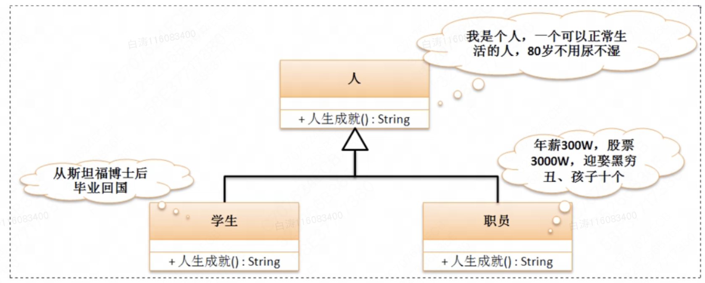

7.2 覆写

​        子类继承了父类的全部定义，但可能出现不合适的方法。当父类中涉及不足且需要保留有父类中的方法或属性名称的情况下就会发生覆写。

# 一、方法覆写

​        当子类定义了与父类方法名称相同，参数类型及个数完全相同（和父类一模一样）的时候，就称为方法覆写。

```
class Channel {
    public void connect() {
        System.out.println("【Channel父类】进行资源的连接。");
    }
}

class DatabaseChannel extends Channel {
    public void connect() {
        System.out.println("【DatabaseChannel子类】进行数据库资源的连接。");
    }
}

public class Main {
    public static void main(String args[]) {
        Channel channel = new Channel();
        channel.connect();

        DatabaseChannel databaseChannel = new DatabaseChannel();
        databaseChannel.connect();
    }
}
```

运行结果

【Channel父类】进行资源的连接。

【DatabaseChannel子类】进行数据库资源的连接。

​        由于现在实例化的是子类对象，所以调用的方法一定是子类的方法。如果子类没有覆写，则调用父类的方法。覆写就是为了扩充优化父类的方法。



 

​       在子类进行方法覆写之后，要想继续调用父类中的方法，那么就需要使用“**super.方法()**”

```
class Channel {
    public void connect() {
        System.out.println("【Channel父类】进行资源的连接。");
    }
}

class DatabaseChannel extends Channel {
    public void connect() {
        super.connect();
        System.out.println("【DatabaseChannel子类】进行资源的连接。");
    }
}

public class Main {
    public static void main(String args[]) {
        DatabaseChannel databaseChannel = new DatabaseChannel();
        databaseChannel.connect();
    }
}
```

运行结果

【Channel父类】进行资源的连接。

【DatabaseChannel子类】进行资源的连接


# 二、方法覆写限制

​        覆写要求：被覆写的方法不能够拥有比父类方法更为严格的访问控制权限。

​        访问控制限制：public > default > private。简单来说，父类方法是default，则覆写后的子类方法只能是default或者public；父类方法是public，覆写后的子类方法只能是public

```
class Channel {
    public void connect() {
    }
}

class DatabaseChannel extends Channel {
    void connect() {
    }
}
```

错误信息

java: DatabaseChannel中的connect()无法覆盖Channel中的connect()

  正在尝试分配更低的访问权限; 以前为public


​        private可以用在方法上，但是要注意，private方法对子类是不可见的。也就是说，如果父类中的一个方法是private，子类定义了同名方法，此时是**不发生覆写**的，相当于只是在子类中定义了一个新的方法。

```
class Channel {
    private void connect() {
        System.out.println("【Channel父类】进行资源的连接。");
    }

    public void fun() {
        this.connect();
    }
}

class DatabaseChannel extends Channel {
    void connect() {
        System.out.println("【DatabaseChannel子类】进行资源的连接。");
    }
}

public class Main {
    public static void main(String args[]) {
        DatabaseChannel databaseChannel = new DatabaseChannel();
        databaseChannel.fun();
    }
}
```

执行结果

【Channel父类】进行资源的连接。

​         根据结果可知，没有发生覆写。只要把private去了，就会发生覆写。

​        在实际开发之中，只要是定义方法，95%的情况下都使用public，所以覆写时也用public就好了。

Override和Overloading的区别

覆写和重载的区别：

|      | Override                               | Overloading                        |
| ---- | -------------------------------------- | ---------------------------------- |
| 中文 | 覆写                                   | 重载                               |
| 参数 | 方法名称、参数类型及个数、返回值均相同 | 方法名称相同，参数的类型及个数不同 |
| 权限 | 覆写后不能更严格                       | 没有权限限制                       |
| 范围 | 发生在继承关系中                       | 发生在一个类中                     |

​        在进行方法重载时没有对返回类型做限制，但是好习惯应保持返回类型一致


# 三、属性覆盖

​        当子类定义了与父类相同名称的成员时，称为属性覆盖。属性覆盖使用和方法覆盖基本一致。

​        考虑到多数情况下属性一般都被封装，所以属性的覆盖其实没太多实际意义

super与this的区别？

- 在程序类中使用this表示先从本类查找所需要的属性或方法，如果本类不存在则查找父类定义，如果使用super则表示不查找子类直接查找父类
- this()调用本类构造，super()调用父类构造，两者都要求在构造的第一行出现，因此不能同时出现。
- this可以表示当前对象。