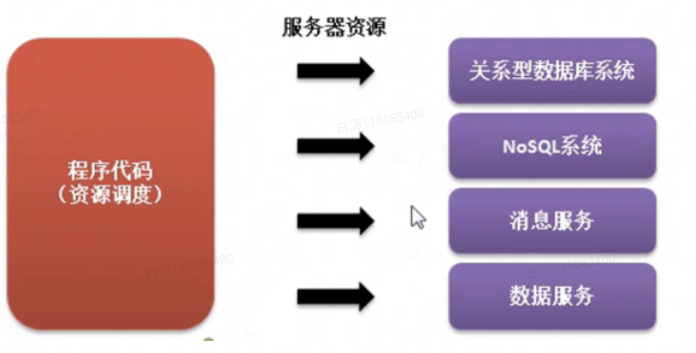
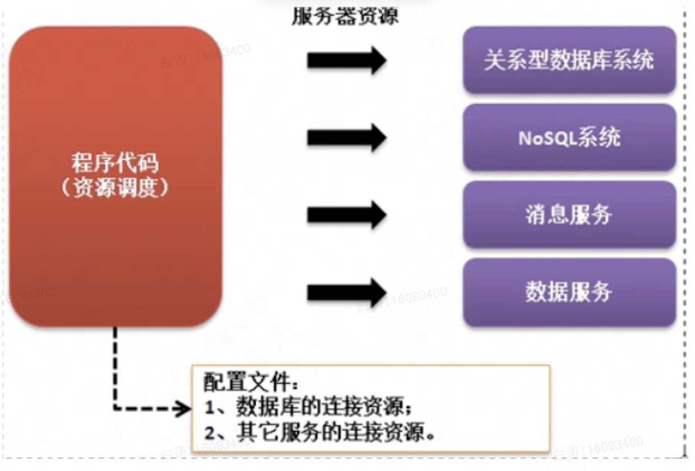

7.4 Annotation注解

# 一、Annotation注解

​        Annotation是从JDK1.5之后提出的一个新的开发技术结果，利用Annotation可以有效地减少程序配置的代码，并且可以利用Annotation进行一些结构化的定义。Annotation是以一种注解的形式实现的程序开发。

​         程序开发结构历史：

- 过程一：在程序定义的时候将所有可能使用到的资源全部定义在程序代码之中；
  - 如果服务器的地址改变，那么程序就需要修改源代码，维护需要由开发人员完成，这样的做法明显是不方便的




- 过程二：引入配置文件 ，在配置文件之中定义全部要使用的服务器资源
  - 在配置项不多时，此类配置非常好用，并且十分简单。但是如果资源太多，配置文件暴多，就会非常痛苦
  - 所有操作都需要通过配置文件完成，这样对于开发的难度提升了；




- 过程三：将配置信息重新写回到程序里面，利用一些特殊的标记与程序代码进行分离，这就是注解的作用，也就是说Annotation提出的基本依据
  -  配置文件有好处也有缺点，所以现在人们的开发基本围绕着 配置文件+注解 的形式完成的


​          这里学习的注解只是Java中提供的几个基本注解：@Override、@Deprecated、@SuppressWarnings 


# 二、准确覆写：@Override 

​         子类继承父类时往往采用覆写进行方法扩充。

​         开发之中常见的两个问题：

- 在继承父类的时候忘记在子类写extends
- 进行覆写时单词写错了，单词也错了编译也不会报错，会以为是新的方法。

​        为了解决上面的问题，我们可以在明确覆写的方法上追加有一个注解

```
class Channel {
    public void connect() {
        System.out.println("父类");
    }
}

class DatabaseChannel extends Channel{
    @Override
    public void connec() {	//单词拼错了
        System.out.println("子类");
    }
}
```

错误信息

java: 方法不会覆盖或实现超类型的方法

​        该注解主要是帮助开发者在开发的过程中及时排错，节省排错的时间。


# 三、过期声明：@Deprecated 

​        所谓的过期操作，指的是一个软件项目的迭代开发过程之中，可能有某一个方法或某个类，由于最初设计的时候考虑不周，导致新版本的应用会有不适应的地方（老版本不影响），这个时候不能直接删除，于是就可以采用过期的生命，目的是告诉新的用户这些操作不要再用了，老用户你用就用了。这样的方法就必须用@Deprecated 注解

```
class Person {
    private String name;
    private int age;

    @Deprecated
    public void printMessage() {
        System.out.println("姓名：" + name + "、年龄：" + age);
    }
}

public class Hello {
    public static void main(String args[]) {
        Person per = new Person();
        per.printMessage();
    }
}
```

警告信息

注: Hello.java使用或覆盖了已过时的 API。

注: 有关详细信息, 请使用 -Xlint:deprecation 重新编译。

​        开源项目中，非常讨厌那些直接变化方法内容的操作。


# 四、压制警告

​        以之前的过期程序为例，使用了过期声明会出现警告，但是如果我也知晓，怎么让这些警告不要再出现。

```
public class Hello {
    @SuppressWarnings({"deprecation"})
    public static void main(String args[]) {
        Person per = new Person();
        per.printMessage();
    }
}
```

​        此时编译不会再弹出警告信息。