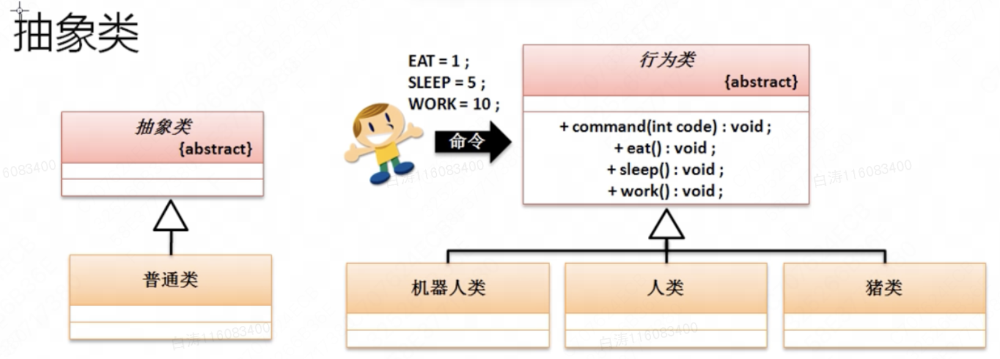

8.1 抽象类

​        之前的继承中，子类可以根据自己的选择决定是否覆写父类的方法。父类无法强制子类对某些方法进行覆写，这种情况下其实在实际开发中不会常用，因为没有必要继承一个已经开发完善的类（可以直接使用的类）。真正的开发中，更多的是考虑继承**抽象类**。


8.1.1 抽象类基本定义

​        抽象类的主要作用在于对子类中覆写方法进行约定，在抽象类里面可以去定义一些抽象方法以实现这样的约定，抽象方法指的是使用了abstract关键字定义的并且没有提供方法体的方法，而抽象方法所在的类必须是抽象类。

```
 abstract class Message {  //定义抽象类
    private String type;
    public abstract String getConnectInfo();
    public void setType(String type) {
        this.type = type;
    }

    public String getType() {
        return this.type;
    }
}
```


​        抽象类是没办法实例化的，抽象类定义之后，并不是一个完整的类。

​        使用抽象类必须遵循以下规则：

- 抽象类必须提供有子类，子类使用extends继承一个抽象类；
- 抽象类的子类（不是抽象类）一定要覆写抽象类中的全部抽象方法；
- 抽象类的对象实例化可以利用对象多态性通过子类向上转型的方式完成。

```
class DatabaseMessage extends Message {
    @Override
    public String getConnectInfo() {
        return "Oracle数据库连接信息";
    }
}

public class Main {
    public static void main(String args[]) {
        Message message = new DatabaseMessage();
        message.setType("客户信息");
        System.out.println(message.getConnectInfo());
        System.out.println(message.getType());
    }
}
```

​        抽象类的子类可以向上转型，也就是说抽象类的使用相较于普通类只是多了抽象方法和要求子类强制覆写，其他使用上是相同的。


​        对抽象类使用的几点意见：

- 抽象类使用很大程度上有一个核心的问题：**抽象类无法自己直接实例化**；
- 抽象类之中主要的目的是进行过渡操作使用，所以当你使用抽象类进行开发的时候，往往都是你设计中需要解决类继承问题时所带来的代码重复处理


8.1.2 抽象类相关说明

​        抽象类是一个重要的面向对象设计的结构，使用时需要注意以下几点：

- 1.定义抽象类时绝对不能用final关键字来进行定义；**abstract 和 final 绝对不能一起写；**
- 2.抽象类作为一个普通类的加强版出现的（只是追加了抽象方法）。也就是说，它也可以普通定义属性和方法，也因此**它可以提供构造方法**，并且子类也会按照子类对象实例化原则进行父类构造调用；
- 3.**抽象类中允许没有抽象方法**。但即便没有抽象方法，也没法对其直接实例化；
- 4.抽象类可以提供有static方法，而且该方法不受到抽象类对象的局限。**static方法永远不受到实例化对象的限制**，永远可以直接通过类名称进行调用。


8.1.3 模版设计模式

​        抽象类的设计是比类更高一层的设计。接下来研究抽象类的实际应用。

​        假如现在有三类：

- 机器人：不需要休息，需要工作，需要补充能量；
- 人：需要休息，需要工作，需要吃饭；
- 猪：需要休息，不需要工作，需要吃饭；

​        我们现在有三种描述，我们可以根据这三种描述来区分不同的类，也就是用抽象类作为公共的结合点。抽象类把三种行为抽象出来，所以它是一个结合点。



```
abstract class Action {
    public static final int EAT = 1;
    public static final int SLEEP = 5;
    public static final int WORK = 10;

    public void command(int code) {
        switch(code) {
            case EAT: {
                this.eat();
                break;
            }
            case SLEEP: {
                this.sleep();
                break;
            }
            case WORK: {
                this.work();
                break;
            }
            case EAT + SLEEP + WORK: {
                this.eat();
                this.sleep();
                this.work();
                break;
            }
        }
    }

    public abstract void eat();
    public abstract void sleep();
    public abstract void work();
}

class Robot extends Action {
    public void eat() {
        System.out.println("机器人充电补充能量");
    }
    public void sleep() {}
    public void work() {
        System.out.println("机器人工作");
    }
}

class Person extends Action {
    public void eat() {
        System.out.println("人吃饭");
    }
    public void sleep() {
        System.out.println("人睡觉");
    }
    public void work() {
        System.out.println("人工作");
    }
}

class Pig extends Action {
    public void eat() {
        System.out.println("猪吃饲料");

    }
    public void sleep() {
        System.out.println("猪睡大觉");
    }
    public void work() {}
}

public class Main {
    public static void main(String args[]) {
        Action RobotAction = new Robot();
        Action PersonAction = new Person();
        Action PigAction = new Pig();

        System.out.println("---------------机器人行为");
            RobotAction.command(Action.EAT);
            RobotAction.command(Action.SLEEP);
            RobotAction.command(Action.WORK);

        System.out.println("---------------人行为");
            PersonAction.command(Action.EAT);
            PersonAction.command(Action.SLEEP);
            PersonAction.command(Action.WORK);
        System.out.println("---------------猪行为");
            PigAction.command(Action.EAT);
            PigAction.command(Action.SLEEP);
            PigAction.command(Action.WORK);
    }
}
```

​        进一步思考，现在定义的Action父类的主要目的：对所有的行为规范进行统一处理。如果不按照父类的要求进行方法的添加，那么父类是不认的，也就是说父类实际上提供了一个模版给你。（只有吃饭睡觉工作，你自己添加什么游泳，在父类也不看不到）

​        这种利用抽象类按照模版进行设计，这就是模版设计模式