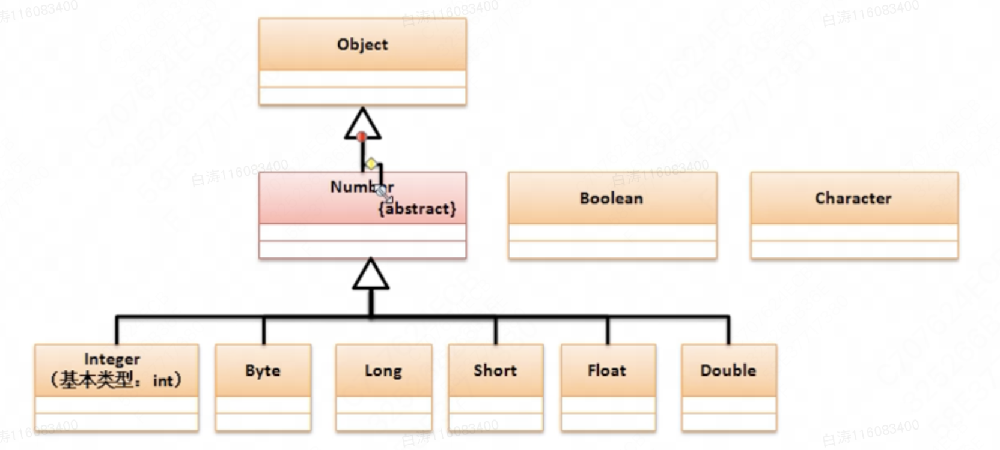

8.2 包装类

​        包装类的主要功能是针对于基本数据类型的对象转换而实现的，并且随着JDK的更新，包装类的功能也在发生着改变，有着更多的支持。

# 一、包装类实现原理分析

​        Object类是所有类的父类，可以接收所有的数据类型。但是，基本数据类型不是类，如果想要将基本数据类型以类的形式进行处理，那么就需要对其进行包装处理。

```
class Int {
    private int data;
    public Int(int data) {
        this.data = data;
    }

    public int intValue() {
        return this.data;
    }
}

public class Main {
    public static void main(String args[]) {
        Object object = new Int(10);//装箱：将基本数据类型保存在包装类中
        int x = ((Int)object).intValue();//拆箱：从包装类中获取基本数据类型
    }
}
```

​        基本数据类型处理后可以像对象一样进行引用传递，同时也可以使用Object进行接收。JDK也发现了这一点，于是就有了对应的**包装类**。

​        基本数据类型一共有八种，包装类也有对应的八种



​        Java中包装类主要有两种：

- 对象型包装类（Object直接子类）：见上图
- 数值型包装类（Number直接子类）： 见上图

​        Number是一个抽象类，以后只要看见了Number都应明确的表示它是一个数字的概念，它定义了如下方法：

| No.  | 方法名称                             | 类型 |                           |
| ---- | ------------------------------------ | ---- | ------------------------- |
| 1    | public byte byteValue()              | 普通 | 从包装类中获取byte数据    |
| 2    | public short shortValue()            | 普通 | 从包装类中获取short数据   |
| 3    | public abstract int intValue()       | 抽象 | 从包装类中获取int数据     |
| 4    | public abstract long longValue()     | 抽象 | 从包装类中获取long数据    |
| 5    | public abstract float floatValue()   | 抽象 | 从包装类中获取float数据   |
| 6    | public abstract double doubleValue() | 抽象 | 从包装类中获取doouble数据 |


#  二、装箱与拆箱

​        基本数据类型的包装类都是为了基本数据类型转换为对象提供的，这样对于基本类型与包装类之间就有了如下的操作关系：

- 数据装箱：将基本数据类型保存到包装类之中，一般可以利用构造方法完成
  - Integer类：
  - Double类：
  - Boolean类：
- 数据拆箱：从包装类中获取基本数据类型
  - 数值型包装里已经由Number类定义拆箱的方法
  - Boolean型：public boolean booleanValue();

```
 public class Main {
    public static void main(String args[]) {
        Integer obj = new Integer(10);
        int num = obj.intValue();
        System.out.println(num);
    }
}
public class Main {
    public static void main(String args[]) {
        Double obj = new Double(3.14);
        double num = obj.doubleValue();
        System.out.println(num);
    }
}
```

​         从JDK1.9之后，对于所有包装类之中提供的构造方法就变为了过期处理，不建议用户再继续使用了，这是因为从JDK1.5之后为了方便处理提供了自动的装箱和拆箱操作，所以这种手工的模式基本上没人用了。

```
public class Main {
    public static void main(String args[]) {
        Integer obj = 10;//自动装箱
        int num = obj;//自动拆箱
        obj ++;//包装类可以直接计算
        System.out.println(obj * num);//直接参与数学运算
    }
}
```

​        除了数学运算支持，使用自动装箱的最大好处是可以实现Object接收基本数据类型的操作

```
public class Main {
    public static void main(String args[]) {
        Object obj = 3.14;  //double自动装箱为Double，向上转型为Object
        double num = (Double) obj;//Object不支持运算，要先向下转型为Double，然后自动拆箱
        System.out.println(num);
    }
}
```

​        JDK1.5之后提供的自动支持功能，到了JDK1.9后为了巩固此概念，所以将包装类的构造方法设置为过期定义。


​        对于包装类的需要注意，关于相等判断上：

​        包装类相等判断一定要使用equals()完成。严格来说，包装类本身也需要考虑占位长度，如果超过1byte，那么就需要equals()比较，1byte之内可以用==比较。