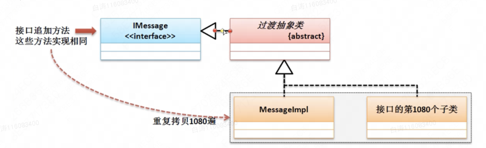

8.3 接口的定义与使用

​        当可以灵活的使用抽象类和接口进行设计的时候，那么基本上面向对象的概念就理解了。需要大量的代码累积。

# 一、接口基本定义

​        抽象类与普通类相比的最大优势：可以对子类的覆写方法控制。但是在抽象类里面依然有一些普通方法，普通方法中会涉及到安全和隐私问题。如果在开发之中需要完全隐藏开发细节，则可以通过接口来进行描述。

​        接口可以理解为一个纯粹的抽象类（最原始的定义接口之中是只包含有抽象方法与全局常量的），但是从JDK1.8开始，由于引入了Lambda表达式的概念，所以接口的定义也得到了加强，除了抽象方法和全局常量之外，还可以定义普通方法和静态方法。从设计本身的角度来讲，还是以抽象方法和全局常量为主。

​        在Java中接口主要食用interface关键字来进行定义。

```
//为了区分接口和类，在接口命名前一般加一个I
interface IMessage { //定义一个接口
    public static final String INFO = "www.mldn.cn";//全局常量
    public abstract String getInfo();//抽象方法
}
```

​        接口肯定没有办法直接产生实例化对象，对于接口的使用要求：

- 接口需要被子类实现（implements），一个子类可以实现多个父接口；
- 子类（如果不是抽象类）那么一定要覆写接口之中的全部抽象方法；
- 接口对象可以利用子类对象的向上转型进行实例化。

```
//为了区分接口和类，在接口命名前一般加一个I
interface IMessage { //定义一个接口
    public static final String INFO = "www.mldn.cn";//全局常量
    public abstract String getInfo();//抽象方法
}

class MessageImpl implements IMessage {
    @Override
    public String getInfo() {
        return "得到一个秘密的消息";
    }
}

public class Main {
    public static void main(String args[]) {
        IMessage msg = new MessageImpl();
        System.out.println(msg.getInfo());
        System.out.println(IMessage.INFO);//输出全局常量
    }
}
```

​        以上是接口的基本使用。在Java之中之所以使用接口，目的是一个子类可以实现多个接口，利用接口可以实现多继承的概念。

```
//为了区分接口和类，在接口命名前一般加一个I
interface IMessage { //定义一个接口
    public static final String INFO = "www.mldn.cn";//全局常量
    public abstract String getInfo();//抽象方法
}

interface IChannel {
    public abstract boolean connect();
}

class MessageImpl implements IMessage, IChannel {
    @Override
    public String getInfo() {
        if (this.connect())
            return "得到一个秘密的消息";
        return "通道建立失败";
    }

    @Override
    public boolean connect() {
        System.out.println("消息发送通道已经成功建立");
        return true;
    }
}

public class Main {
    public static void main(String args[]) {
        IMessage msg = new MessageImpl();
        System.out.println(msg.getInfo());
    }
}
```

​        Java的单继承利用接口进行了一定的弥补。

​        继承多个接口涉及到了转型的问题


​        此时MessageImpl子类的对象可以任意的实现父接口的转换。

```
public class Main {
    public static void main(String args[]) {
        IMessage msg = new MessageImpl();
        IChannel chl = (IChannel) msg;
        System.out.println(chl.connect());
    }
}
```

​        理论上，IMessage和IChannel没有关系，但是由于MessageImpl同时实现了这两个接口，导致了这种情况下两者的转型。

​        Java中不允许接口去继承父类，所以接口绝对不会是Object的子类，但是根据之前的分析可以发现，MessageImpl是Object子类，所以接口一定可以通过Object接收（Object类可以接收接口对象）

​        由于接口描述的是一个公共的定义标准，所以在接口之中所有的抽象方法的访问权限都为public，写不写都一样。下面的两种写法完全等价。（只有接口才可以这么写，抽象类中写抽象方法abstract必须要写）

```
interface IMessage {
    String INFO = "www.mldn.cn";
    String getInfo();
}

interface IMessage {
    public static final String INFO = "www.mldn.cn";
    public abstract String getInfo();
}
```


​        接口可以是抽象类实现的。一个普通类只能继承一个抽象类并且实现多个父接口，但是要求先继承，后实现

```
//为了区分接口和类，在接口命名前一般加一个I
interface IMessage { //定义一个接口
    public static final String INFO = "www.mldn.cn";//全局常量
    public abstract String getInfo();//抽象方法
}

interface IChannel {
    public abstract boolean connect();
}

abstract class DatabaseAbstract {
    public abstract boolean getDatabaseConnection();
}

class MessageImpl extends DatabaseAbstract implements IMessage, IChannel {
    @Override
    public String getInfo() {
        if (this.getDatabaseConnection())
            return "数据库得到一个秘密的消息";
        else {
            return "数据库消息无法访问";
        }
    }

    @Override
    public boolean connect() {
        System.out.println("消息发送通道已经成功建立");
        return true;
    }

    @Override
    public boolean getDatabaseConnection() {
        return true;
    }
}

public class Main {
    public static void main(String args[]) {
        IMessage msg = new MessageImpl();
        System.out.println(msg.getInfo());
    }
}
```


​        虽然接口无法去继承一个父类，但是一个接口却可以通过extends继承实现若干个父接口，此时成为接口的多继承。

```
interface IMessage {
    public abstract String getInfo();
}

interface IChannel {
    public boolean connect();
}

interface IService extends IMessage, IChannel { //接口多继承
    public abstract String service();
}
```


​        实际的开发之中，接口有三种形式：

- 进行标准设置；
- 表示一种操作的能力；
- 暴露远程方法视图，这个一般都在RPC分布式开发中使用。


# 三、使用接口定义标准

​        对于接口而言，开发之中最为重要的应用就是进行标准的制定。实际上日常中，我们也经常听到接口，USB接口，PCI接口之类的，这些实际上都是属于标准的应用。

​        以USB的程序为例，电脑可以插入各种USB设备，电脑只认USB标准，而不关心这个标准的具体实现类。

      在程序中接口也是如此，需要先定义好标准。

```
interface IUSB  {   //定义USB标准
    public boolean check(); //检查通过，可以工作
    public void work();
}

class Computer {
    public void plugin(IUSB usb) {
        if (usb.check()) {
            usb.work();
        }
    }
}

class Keyboard implements IUSB {
    @Override
    public boolean check() {
        return true;
    }

    @Override
    public void work() {
        System.out.println("开始进行码字任务");
    }
}

class Print implements IUSB {
    @Override
    public boolean check() {
        return true;
    }

    @Override
    public void work() {
        System.out.println("开始进行照片打印");
    }
}


public class Main {
    public static void main(String args[]) {
        Computer computer = new Computer();
        computer.plugin(new Keyboard());
        computer.plugin(new Print());
    }
}
```

​        现实的开发之中，对于标准的概念无处不在。


# 六、抽象类与接口区别

​        这是一道面试题，不过也是一个重要的总结。

​        从JDK1.8开始，抽象类和接口定义形式已经非常相似了。但是两者在定义和使用上依然是有明显区别的：

| 区别     | 抽象类                                                       | 接口                                         |
| -------- | ------------------------------------------------------------ | -------------------------------------------- |
| 定义     | abstract class 抽象类名称 {}                                 | interface 接口名称 {}                        |
| 组成     | 构造、普通方法、静态方法、全局常量、成员                     | 抽象方法、全局常量、普通方法、static方法     |
| 权限     | 随便                                                         | 只能用public                                 |
| 子类使用 | extends关键字可以继承一个抽象类                              | implements关键词可以继承多个接口             |
| 两者关系 | 抽象类可以实现若干个接口                                     | 接口不允许继承抽象类，但是允许继承多个父接口 |
| 使用     | 1、抽象类或接口必须定义子类；2、子类一定要覆写抽象方法；3、通过子类的向上转型实现抽象类或接口对象实例化 |                                              |

​        接口优先使用，因为接口可以避免子类的单继承局限。

​        从一个正常的设计角度而言，也需要先从接口开始项目的设计。


​         类的设计是最底层的设计，接口和抽象类才是最初的设计。


8.3.3 工厂设计模式      

​        对于接口而言，已经可以明确的清楚，必须有子类，并且子类可以通过对象的向上转型来获取接口的实例化对象。但是在进行对象实例化的过程之中也可能存在有设计问题。

```
interface IFood {
    public void eat();
}

class Bread implements IFood {
    public void eat() {
        System.out.println("吃面包");
    }
}
public class Main {
    public static void main(String[] args) {
        IFood food = new Bread();
        food.eat();
    }
}
```

​        在本程序中根据接口进行子类的定义，并且利用对象的向上转型进行接口对象实例化处理。


​        客户端需要明确的知道具体哪一个子类，如果说现在有别的子类，就需要修改客户端

```
interface IFood {
    public void eat();
}

class Bread implements IFood {
    public void eat() {
        System.out.println("吃面包");
    }
}

class Milk implements IFood {
    public void eat() {
        System.out.println("喝牛奶");
    }
}

public class Main {
    public static void main(String[] args) {
        IFood food = new Milk();//换个食物就需要修改主类
        food.eat();
    }
}
```


​        显然改个食物就需要修改主类，出现了耦合的问题，问题的元凶是“new关键字”。以JVM为例子，Java实现可移植性的关键就在于：使用虚拟机运行Java程序，所有的程序不与具体的操作系统有任何的关联，而是由JVM来进行匹配。

​        结论：良好的设计应该避免耦合。接下俩，学习工厂设计模式。

```
interface IFood {
    public void eat();
}

class Bread implements IFood {
    public void eat() {
        System.out.println("吃面包");
    }
}

class Milk implements IFood {
    public void eat() {
        System.out.println("喝牛奶");
    }
}

class Factory {
    public static IFood getInstance(String className) {
        if ("bread".equals(className)) {
            return new Bread();
        } else if ("milk".equals(className)) {
            return new Milk();
        } else {
            return null;
        }
    }
}

public class Main {
    public static void main(String[] args) {
        IFood food = Factory.getInstance(args[0]);
        food.eat();
    }
}
```

​         在本程序之中，客户端程序类与IFood接口的子类没有任何的关联，所有的关联都是通过Factory类完成的，而在程序运行的时候可以通过**初始化参数**进行要使用的子类定义

运行时对应结果

baitao@MBP-MYFVWR5095-2128 src % java Main bread

吃面包

baitao@MBP-MYFVWR5095-2128 src % java Main milk 

喝牛奶

如果在日后进行子类扩充的时候，只需要修改Factory程序类即可实现。这就是所谓的工厂设计模式。

​        工厂模式最大特点就是隐藏了设计子类。


8.3.4 代理设计模式

​        代理设计模式：可以帮助用户将所有的开发注意力只集中在核心业务功能的处理上，例如：肚子饿了，如何可以吃到东西。


```
interface IEat {
    public void get();
}

class EatReal implements IEat {
    public void get() {
        System.out.println("【真实主题】吃东西");
    }
}

class EatProxy implements IEat {    //服务代理
    private IEat eat;//为吃而服务

    public EatProxy(IEat eat) {
        this.eat = eat;
    }

    public void get() {
        this.Prepare();
        this.eat.get();
        this.clear();
    }

    public void Prepare() {
        System.out.println("【代理主题】1、购买食材");
        System.out.println("【代理主题】2、处理食材");
    }

    public void clear() {
        System.out.println("【代理主题】3、收拾碗筷");
    }
}

public class Main {
    public static void main(String[] args) {
        IEat eat = new EatProxy(new EatReal());
        eat.get();
    }
}
【代理主题】1、购买食材
【代理主题】2、处理食材
【真实主题】吃东西
【代理主题】3、收拾碗筷
```

​        对于一个接口，同时有真实的业务类和代理的业务类，对于客户端来说只有一个接口。客户端只通过代理的接口去执行业务，而真实的业务类也能够把注意力集中到核心内容，其余的内容交由代理类处理。


8.3.6 接口定义加强

​        接口最早全部由抽象方法和全局变量组成，但是接口的不当设计可能会出现大问题。

​        假如一个接口使用了很多年，然后有了五千个子类。现在要给接口追加方法，这意味着它的五千个子类全都要覆写一次，这显然很不合理的。


​        这样的操作是结构设计不当的结果，任何人都没法保证接口设计的完善。为了方便子类的修改，往往不会让子类直接继承接口，而是用一个抽象类过渡。（抽象类不能被直接实例化，但是它有普通方法）

       但是在JDK1.8之后开始，为了解决接口设计的缺陷，所以在接口之中允许开发者定义普通的方法（当然也是有要求和限制的，也就是加一个**default**)

```
interface IMessage {
    public abstract String message();
    public default boolean connect() {  //方法是一个公共方法
        System.out.println("建立消息的发送通道");
        return true;
    }
}

class MessageImpl implements IMessage {
    public String message() {
        return "123";
    }
}


public class Main {
    public static void main(String args[]) {
        IMessage msg = new MessageImpl();
        if (msg.connect()) {
            System.out.println(msg.message());
        }
    }
}
```

​        这是一个补救方案，如果在设计之初的话就没必要用default补救了，不要用它作为设计的首选。

​        除了可以追加普通方法之外，接口里面也可以定义static方法，而static方法就可以通过接口直接调用了。

```
interface IMessage {
    public abstract String message();
    public default boolean connect() {  //方法是一个公共方法
        System.out.println("建立消息的发送通道");
        return true;
    }

    public static IMessage getInstance() {
        return new MessageImpl();//获得子类对象
    }
}

class MessageImpl implements IMessage {
    public String message() {
        if (this.connect()) {
            return "123";
        }
        return "没有消息发送";
    }
}


public class Main {
    public static void main(String args[]) {
        IMessage msg = IMessage.getInstance();
        System.out.println(msg.message());
    }
}
```

​        同样的，这个方法也是补救方案。尽管现在这两个方案已经强于使用抽象类过渡，但是我们在设计之初依然奉行原本的设计方法。


