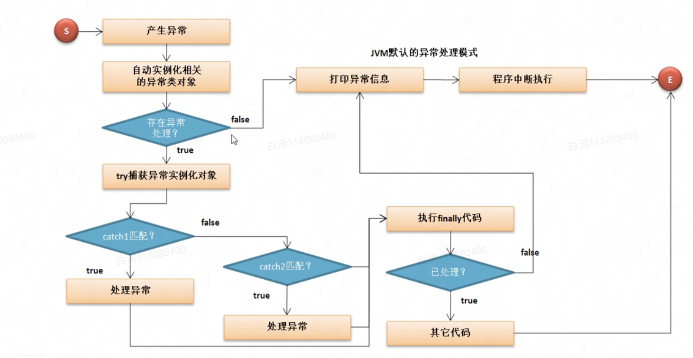

第27章 异常的捕获及处理

​        Java语言提供的最为强大的支持就在于异常的处理。

# 一、认识异常对程序的影响

​        异常：指的是导致程序中断执行的一种指令流。那么下面首先来观察没有异常产生的程序执行结果

```
public class Main {
    public static void main(String[] args) {
        System.out.println("程序开始执行");
        System.out.println("开始计算 1 + 1 = " + (1 + 1));
        System.out.println("程序结束执行");
    }
}
```

​        除以0是典型的异常：

> Exception in thread "main" java.lang.ArithmeticException: / by zero
>
> ​	at Main.main(Main.java:4)

​        出现错误之后，整个程序不会按照原本的方式继续执行，中断了执行。为了保证程序出现了非致命错误时依然可以完成执行，就需要一个完善的异常处理机制

# 二、处理异常

​        在Java中进行异常处理可以使用：try、catch、finally关键字完成，其基本的处理结构如下：

```
try {
  //可能出现异常的语句
} [catch (异常类型 异常对象) {
  //异常处理
} catch (异常类型 异常对象) {
  //异常处理
} catch (异常类型 异常对象) {
  //异常处理
} ... ][finally {
  //不管异常是否处理都执行
}]
```

​        在此格式之中可以使用的组合为：try...catch、try...catch...finally、try...finally

```
public class Main {
    public static void main(String[] args) {
        System.out.println("程序开始执行");
        try {
            System.out.println("开始计算 1 / 0 = " + (1 / 0));
        } catch (ArithmeticException e) {
            System.out.println(e);
        }
        System.out.println("程序结束执行");
    }
}
```

> 程序开始执行
>
> java.lang.ArithmeticException: / by zero
>
> 程序结束执行

​        此时可以发现，现在即便出现了异常，程序也可以正常执行完毕，所以此时的设计属于一个合理设计，但是有一个问题出现了。

​        此时在进行异常处理时输出的是一个异常类的对象 ，对于此对象直接打印（toString()）方法所得异常信息并不完整。如果想要获取完整的异常信息，则可以使用异常类中提供的printStackTrace()方法。

```
public class Main {
    public static void main(String[] args) {
        System.out.println("程序开始执行");
        try {
            System.out.println("开始计算 1 / 0 = " + (1 / 0));
        } catch (ArithmeticException e) {
            e.printStackTrace();
        }
        System.out.println("程序结束执行");
    }
}
```

> 程序开始执行
>
> java.lang.ArithmeticException: / by zero
>
> ​	at Main.main(Main.java:5)
>
> 程序结束执行

​        对于异常的处理个事可以在最后追加一个Finally，表示异常处理后的出口，不管异常是否处理都会执行

```
public class Main {
    public static void main(String[] args) {
        System.out.println("程序开始执行");
        try {
            System.out.println("开始计算 1 / 0 = " + (1 / 0));
        } catch (ArithmeticException e) {
            e.printStackTrace();
        } finally {
            System.out.println("不管是否异常，都会执行");
        }
        System.out.println("程序结束执行");
    }
}
```


> 程序开始执行
>
> java.lang.ArithmeticException: / by zero
>
> ​	at Main.main(Main.java:5)
>
> 不管是否异常，都会执行
>
> 程序结束执行


# 三、处理多个异常

​        很多时候在程序执行的过程之中可能会产生若干个异常，那么这种情况下也可以使用多个catch进行异常的捕获。现在假设通过初始化参数进行两个数学计算数字的设置

```
public class Main {
    public static void main(String[] args) {
        System.out.println("【1】程序开始执行");
        try {
            int x = Integer.parseInt(args[0]);
            int y = Integer.parseInt(args[1]);
            System.out.println("【2】开始计算 1 / 0 = " + (1 / 0));
        } catch (ArithmeticException e) {
            e.printStackTrace();
        } finally {
            System.out.println("【f】不管是否异常，都会执行");
        }
        System.out.println("【3】程序结束执行");
    }
}
```

 序可能有是三种异常：

- 【未处理】程序执行的时候没有输入初始化参数（Java JavaDemo ）：java.lang.ArrayIndexOutOfBoundsException

> 【1】程序开始执行
>
> 【f】不管是否异常，都会执行
>
> Exception in thread "main" java.lang.ArrayIndexOutOfBoundsException: 0
>
> ​        at Main.main(Main.java:5)

-  【未处理】输入时的数据不是数字（java Main hello world）：java.lang.NumberFormatException

> 【1】程序开始执行
>
> 【f】不管是否异常，都会执行
>
> Exception in thread "main" java.lang.NumberFormatException: For input string: "hello"
>
> ​	at java.lang.NumberFormatException.forInputString(NumberFormatException.java:65)
>
> ​	at java.lang.Integer.parseInt(Integer.java:580)
>
> ​	at java.lang.Integer.parseInt(Integer.java:615)
>
> ​	at Main.main(Main.java:5)

- 【已处理】除数是0（java Main 5 0）：java.lang.ArithmeticException

> 【1】程序开始执行
>
> java.lang.ArithmeticException: / by zero
>
> ​	at Main.main(Main.java:7)
>
> 【f】不管是否异常，都会执行
>
> 【3】程序结束执行

​        现在即便有了异常处理语句，但是如果没有进行正确的异常捕获，那么程序也会中断（finally的代码依然执行），所以在这样的情况下就必须进行多个异常的捕获

```
public class Main {
    public static void main(String[] args) {
        System.out.println("【1】程序开始执行");
        try {
            int x = Integer.parseInt(args[0]);
            int y = Integer.parseInt(args[1]);
            System.out.println("【2】开始计算 x / y = " + (x / y));
        } catch (ArithmeticException e) {
            e.printStackTrace();
        } catch (NumberFormatException e) {
            e.printStackTrace();
        } catch (ArrayIndexOutOfBoundsException e) {
            e.printStackTrace();
        } finally {
            System.out.println("【f】不管是否异常，都会执行");
        }
        System.out.println("【3】程序结束执行");
    }
}
```

​        如果明确了什么异常，那么异常的意义是啥呢？正常开发中，真正精髓的操作是如何异常处理，异常一定是记不完的，怎么样处理才是关键。

# 四、异常处理流程

​        在进行异常处理的时候，如果将所有可能已经明确知道的异常进行了捕获，虽然你可以得到非常良好的代码结构，但是这种编写是非常麻烦的。所以想要进行合理异常就必须清楚异常产生之后程序到底做了哪些处理。



1.程序运行才会产生异常，一旦产生了异常将自动进行制定类型的异常类对象实例化处理；

2.如果没有异常处理，则会采用JVM默认异常处理：打印异常信息，而后中断执行；

3.若有异常出了，则会被try捕获；

4.try捕获后与其匹配的catch中的异常类型依次比对，如果匹配成功则使用该catch中的语句进行处理，如果没有任何catch匹配，那么就表示该异常无法进行处理；

5.不管异常是否处理都执行finally语句，之后程序根据是否异常处理进行后续中断执行或是继续执行

​        可以发现，其实异常类的实例化对象才是异常处理的核心，在之前接触过了两种异常：

| ArithmeticException                                          | ArrayIndexOutOfBoundsException                               |
| ------------------------------------------------------------ | ------------------------------------------------------------ |
| [java.lang.Object](https://docs.oracle.com/javase/8/docs/api/java/lang/Object.html)[java.lang.Throwable](https://docs.oracle.com/javase/8/docs/api/java/lang/Throwable.html)[java.lang.Exception](https://docs.oracle.com/javase/8/docs/api/java/lang/Exception.html)[java.lang.RuntimeException](https://docs.oracle.com/javase/8/docs/api/java/lang/RuntimeException.html)java.lang.ArithmeticException | [java.lang.Object](https://docs.oracle.com/javase/8/docs/api/java/lang/Object.html)[java.lang.Throwable](https://docs.oracle.com/javase/8/docs/api/java/lang/Throwable.html)[java.lang.Exception](https://docs.oracle.com/javase/8/docs/api/java/lang/Exception.html)[java.lang.RuntimeException](https://docs.oracle.com/javase/8/docs/api/java/lang/RuntimeException.html)[java.lang.IndexOutOfBoundsException](https://docs.oracle.com/javase/8/docs/api/java/lang/IndexOutOfBoundsException.html)java.lang.ArrayIndexOutOfBoundsException |

​        可以看到，可以处理的异常的最大类型就是Throwable，Throwable有两个子类：

- Error：此时程序还未执行出现的错误，开发者无法处理；
- Excepetion：程序中出现的异常，开发者可以处理，需要开发者关注。

​        通过分析发现，异常产生的时候产生异常的实例化对象，按照对象的引用原则，可以自动向父类转型，按照这样的逻辑，所有异常都可以用Exception处理。

```
public class Main {
    public static void main(String[] args) {
        System.out.println("【1】程序开始执行");
        try {
            int x = Integer.parseInt(args[0]);
            int y = Integer.parseInt(args[1]);
            System.out.println("【2】开始计算 x / y = " + (x / y));
        } catch (Exception e) {
            e.printStackTrace();
        } finally {
            System.out.println("【f】不管是否异常，都会执行");
        }
        System.out.println("【3】程序结束执行");
    }
}
```

​        这样的处理方式看上去方便多了。但是其实在大项目中可能会因为错误信息不够清楚而导致难以排查。

​        注意：捕获范围大的放在捕获异常小的后面

# 五、throws关键字

​        定义的方法应当明确告诉使用者，该方法可能会产生何种异常，那么此时就可以在方法的生命上使用throws关键字进行异常类型的标注。

​        用throws关键标注的方法在使用时必须进行异常处理

```
class MyMath {
    //该方法可能会出现异常，如果产生异常调用处处理
    public static int div(int x, int y) throws Exception {
        return x / y;
    }
}

public class Main {
    public static void main(String[] args) {
        try {
            System.out.println(MyMath.div(10, 2));
        } catch (Exception e) {
            e.printStackTrace();
        }
    }
}
```

​        主方法本身也是方法，主方法也可以向上抛出。

```
class MyMath {
    //该方法可能会出现异常，如果产生异常调用处处理
    public static int div(int x, int y) throws Exception {
        return x / y;
    }
}

public class Main {
    public static void main(String[] args) throws Exception {
        System.out.println(MyMath.div(10, 2));
    }
}
```

​        主方法向上抛出则交由jvm处理，就和默尔情况下出现异常处理流程一样


# 六、throw关键字

​        与throws对应的另一个关键字throw，表示手工进行异常的抛出，即：此时将手工产生一个异常类的实例化对象，并且进行异常的抛出处理。

```
public class Main {
    public static void main(String[] args) {
        try {   //异常对象不再是有系统生成的，而是由手工定义的
            throw new Exception("自己抛着玩的对象");
        } catch (Exception e) {
            e.printStackTrace();
        }
    }
}
```

 

throw和throws的区别

throw是在代码块中使用的，主要是手工进行异常对象的抛出，向上抛出；

throws是在方法定义上使用的，表示将此方法中可能产生的异常明确告诉给调用处，由调用处进行处理


# 七、异常处理模型

​        异常处理的标准格式，我们已经学了所有的关键字：try 、catch 、finally 、 throw 、throws。现在我们要一起进行使用。

​        现在要求定义一个可以实现除法计算的方法，在这个方法之中开发要求如下：

- 在进行数学计算开始与结束的时候进行信息提示；
- 如果在进行计算的过程之中产生了异常，则要交给调用处来处理。 

```
class MyMath {
    //异常交给被调用处处理则一定要在方法上使用throws
    public static int div(int x, int y) throws Exception {
        int temp = 0;
        System.out.println("【START】除法计算开始");
        try {
            temp = x / y;
        } /*catch (Exception e) {
            throw e;    //向上抛出异常
        } */finally {
            System.out.println("【END】除法计算结束");
        }
        return temp;
    }
}

public class Main {
    public static void main(String[] args) {
        try {
            System.out.println(MyMath.div(10, 0));
        } catch (Exception e) {
            e.printStackTrace();
        }
    }
}
```

​        这个就是一个完整的异常结构化处理。

​        MyMath中的catch throw可以省略掉，因为没有catch的话就不会捕获异常，自然异常就留给了调用方法的地方处理，和加上实际上是一样的。

​        这个结构化的异常处理在资源访问的操作中经常会用到，例如网络连接就经常会出现异常，就需要异常处。

# 八、RuntimeException

​        通过之前的分析可以发现只要方法后面带有throws往往都是告诉用户本方法可能产生的异常是什么。

​        接下来我们观察一段代码：

```
public class Main {
    public static void main(String[] args) {
        int num = Integer.parseInt("123");
        System.out.println(num);
    }
}
```

​        parseInt()方法的定义：public static int parseInt(String s) throws NumberFormatException

​        这个方法抛出了一个异常，但是在处理的时候并没有强制性要求处理，观察一下这个NumberFormatException

| ArithmeticException                                          | NumberFormatException                                        |
| ------------------------------------------------------------ | ------------------------------------------------------------ |
| [java.lang.Object](https://docs.oracle.com/javase/8/docs/api/java/lang/Object.html)[java.lang.Throwable](https://docs.oracle.com/javase/8/docs/api/java/lang/Throwable.html)[java.lang.Exception](https://docs.oracle.com/javase/8/docs/api/java/lang/Exception.html)[java.lang.RuntimeException](https://docs.oracle.com/javase/8/docs/api/java/lang/RuntimeException.html)java.lang.ArithmeticException | [java.lang.Object](https://docs.oracle.com/javase/8/docs/api/java/lang/Object.html)[java.lang.Throwable](https://docs.oracle.com/javase/8/docs/api/java/lang/Throwable.html)[java.lang.Exception](https://docs.oracle.com/javase/8/docs/api/java/lang/Exception.html)[java.lang.RuntimeException](https://docs.oracle.com/javase/8/docs/api/java/lang/RuntimeException.html)[java.lang.IllegalArgumentException](https://docs.oracle.com/javase/8/docs/api/java/lang/IllegalArgumentException.html)java.lang.NumberFormatException |

​        如果现在所有的程序执行上只要使用了throws定义的方法都必须要求开发者进行手工处理，那么这个代码的编写就太麻烦了，所以在设计过程中，提供了一个灵活的可选异常处理父类“RuntimeException”，这个类的子类可以不需要强制性处理。

RuntimeException与Exception的区别

- RuntimeException是Exception的子类；
- RuntimeException标注的异常可以不需要进行强制性处理，而Exception异常必须强制性处理；
- 常见的RuntimeException有ArithmeticException，NumberFormatException，NullPointerException

# 九、自定义异常类

​        在JDK之中提供有大量的异常类型，但是在实际的开发之中可能这些异常类型未必够你所使用，你不可能所有的设计里面都只是抛出Exception，所以这个时候就需要考虑进行自定义异常类。

​        对于自定义异常也有两种方案：继承Exception或者继承RuntimeException

```
class BombException extends RuntimeException {
    public BombException(String msg) {
        super(msg); //Exception的有参构造
    }
}

class Food {
    public static void eat(int num) throws BombException {
        if (num > 10) {
            throw new BombException("吃爆了");
        } else {
            System.out.println("正常吃饭");
        }
    }
}

public class Main {
    public static void main(String[] args) {
        Food.eat(11);
    }
}
```

​        项目开发中会有大量的自定义异常。碰见不认识的直接百度就完事了。

# 十、assert断言

​        从JDK1.4开始追加了有一个断言的功能，确定代码执行到某行之后一定是所期待的结果。在实际的开发之中，断言不一定是准确的，可能会出现偏差，但是这种偏差不应该影响程序的正常进行。

```
public class Main {
    public static void main(String[] args) throws Exception {
        int x = 10;
        //中间经历许多x的变量操作
        assert x == 100 : "x的内容不是100";
        System.out.println(x);
    }
}
```

​        如果想要启用断言，需要执行时添加参数 -ea

​        Java并没有将断言设置为必须执行，在特定环境下才使用。