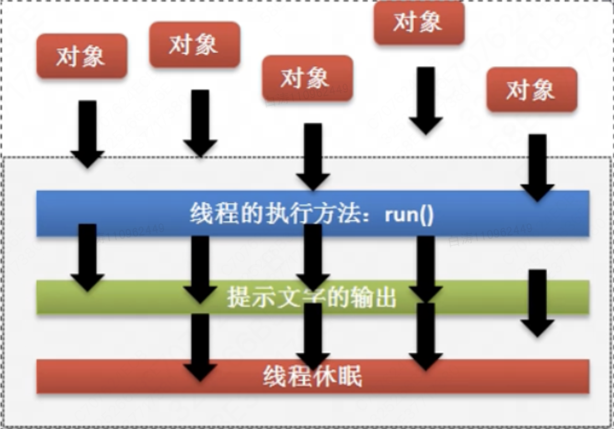
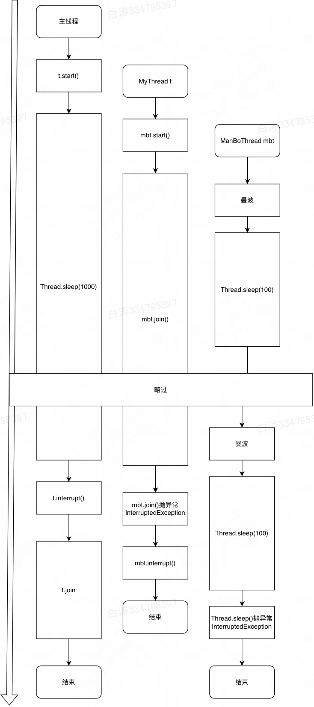

# 多线程的常用操作

*项目：thread-method*

​	通过Thread类实现的各种方法，我们也可以学习到多线程本身是如何使用的。

## 1.创建多线程

​	参照[多线程编程](./1.多线程编程.md)

​	Thread构造方法：

- 无参构造：`Thread()`
- 指定`run()`方法：`Thread(Runnable target)`
- 指定`run()`方法和线程名：`Thread(Runnable target, String name)`
- 指定线程名：`Thread(String name)`


## 2.线程的名字与获取

​	多线程的运行状态是不确定的，为了获取到一些需要使用的线程，就需要依靠线程的名字来进行操作。所以线程的名字是一个至关重要的概念，这样在Thread类中就提供有线程名称：

- 构造方法：`public Thread(Runnable target, String name)`
- 设置名字：`public final void setName(String name)`
- 取得名字：`public final String getName()`


​	对于线程对象的获得是不可能只是依靠一个`this`来完成的，因为线程的状态不可控。但有一点是明确的，所有的线程一定要执行`run()`方法，那么这个时候可以考虑获取当前线程，在`Thread`类里面提供有获取当前线程的方法：

- `public static Thread currentThread()`。


范例：观察线程的命名操作

```java
public class ThreadName {
    public static void main(String[] args) {
        MyRunnable myRunnable = new MyRunnable();
        new Thread(myRunnable, "线程1号").start();
        new Thread(myRunnable).start();
        new Thread(myRunnable, "线程3号").start();
    }
}

class MyRunnable implements Runnable {
    @Override
    public void run() {
        System.out.println(Thread.currentThread().getName());
    }
}
```

```
线程1号
Thread-0
线程3号
```


​	可以看到如果没有命名的话，Thread也会自动有一个编号，这是Thread类中给的自动命名：

```java
//没有命名构造方法
public Thread(Runnable target) {
        init(null, target, "Thread-" + nextThreadNum(), 0);
}

//staitc属性 和 提供命名的方法
private static int threadInitNumber;
private static synchronized int nextThreadNum() {
        return threadInitNumber++;
}
```


## 3.线程休眠

​	如果说现在希望某一个线程可以暂缓执行一次，那么可以使用休眠的处理，在Thread类之中定义的休眠方法如下：

- 休眠：`public static void sleep(long millis) throws InterruptedException`

- 休眠：`public static void sleep(long millis, int nanos) throws InterruptedException`

​        在进行休眠的时候有可能会产生中断异常`InterruptedException`，中断异常属于`Exception`异常，意味着必须处理。

```java
public class ThreadSleep {
    public static void main(String[] args) {
        for (int i = 0; i < 5; i ++ ) {
            new Thread(() -> {
                for (int j = 0; j < 10; j ++) {
                    System.out.println(Thread.currentThread().getName() + "-" + j);
                    try {
                        Thread.sleep(0, 1);
                    } catch (InterruptedException e) {
                        throw new RuntimeException(e);
                    }
                }

            }, "线程" + i).start();
        }
    }
}
```

​	虽然看起来像是若干个程序一起休眠一起唤醒，但是其实不是。实际上休眠也是有前有后的，只不过执行一个打印的时间远小于打印一个符号，所以导致没有乱序出来。



## 4.线程等待

​	<u>一个线程可以等待另一个线程直到其运行结束</u>。例如，`main`线程在启动`t`线程后，可以通过`t.join()`等待`t`线程结束后再继续运行：

```java
// 多线程
public class Main {
    public static void main(String[] args) throws InterruptedException {
        Thread t = new Thread(() -> {
            System.out.println("hello");
        });
        System.out.println("start");
        t.start(); // 启动t线程
        t.join(); // 此处main线程会等待t结束
        System.out.println("end");
    }
}
```

​	当`main`线程对线程对象`t`调用`join()`方法时，主线程将等待变量`t`表示的线程运行结束，即`join`就是指等待该线程结束，然后才继续往下执行自身线程。所以，上述代码打印顺序可以肯定是`main`线程先打印`start`，`t`线程再打印`hello`，`main`线程最后再打印`end`。

​	如果`t`线程已经结束，对实例`t`调用`join()`会立刻返回。此外，`join(long)`的重载方法也可以指定一个等待时间，超过等待时间后就不再继续等待。

​	该方法不一定是主线程等待子线程，可以是子线程等待子线程


## 5.线程中断

​	线程可以被打断，就像我们可以下载到一半停止下载一样。Thread类中提供了中断执行的方法：

- 判断线程是否被中断：`public boolean isInterrupted()`
- 中断线程执行：`public void interrupt()`


​	需要注意的是中断A线程的行为一定是另一个线程B发起的。线程被打断了并不是直接让线程停止运行，而是向线程发送了中断的请求。只有线程中对于中断请求有响应时，中断才能发挥作用。我们可以用主线程打断子线程的运行：

```java
public class ThreadInterrupt {
    public static void main(String[] args) throws InterruptedException {
        Thread t = new MyThread("曼波线程");
        t.start();
        Thread.sleep(10);
        t.interrupt();
        System.out.println("曼波被打断了");
    }
}

class MyThread extends Thread {
    public MyThread(String name) {
        super(name);
    }

    @Override
    public void run() {
        int n = 0;
        while (! isInterrupted()) {
            n ++;
            System.out.printf("第%d次哦耶%n", n);
        }
    }
}
```


​	出于等待状态的线程，在接收到打断请求时，会抛出`InterruptedException`，因此目标线程只要捕获到join()方法抛出的`InterruptedException`，就知道线程被打断了，应当立刻结束运行

*注意：`join()`放在`interrupt()`后面，不然永远也打断不了了*

​	像`join()`和`sleep()`这些方法会让当前进程陷入阻塞态，当阻塞态的线程发现被打断的时候，会抛出`InterruptedException`异常，但**不会修改中断标记**。这很关键，这表示打断的线程是没法通过`isInterrupted`来进行中断相应的。

```java
public class ThreadInterrupt {
    public static void main(String[] args) throws InterruptedException {
        Thread t = new MyThread();
        t.start();
        Thread.sleep(1000);
        t.interrupt();
        t.join();
        System.out.println("【主线程】结束");
    }
}

class MyThread extends Thread {
    @Override
    public void run() {
        Thread mbt = new ManBoThread();
        mbt.start();
        try {
            mbt.join();
        } catch (InterruptedException e) {
            System.out.println("【MyThread线程】MyThread被打断了");
        }
        mbt.interrupt();
    }
}

class ManBoThread extends Thread {
    @Override
    public void run() {
        while (! isInterrupted()) {
            System.out.println("曼波");
            try {
                Thread.sleep(100);
            } catch (InterruptedException e) {
                System.out.println("【曼波线程】曼波线程被打断了");
                break;
            }
        }
    }
}
```





### 5.3 设置标志位

​	我们可以自己设定一个`running`标志位来标识线程是否应该继续运行，在外部线程中，通过把`HelloThread.running`置为`false`，就可以让线程结束：

```java
public class ThreadInterrupt2 {
    public static void main(String[] args) throws InterruptedException {
        HelloThread t = new HelloThread();
        t.start();
        Thread.sleep(1);
        t.running = false;
    }
}

class HelloThread extends Thread {
    public volatile boolean running = true;
    @Override
    public void run() {
        int n = 0;
        while (running) {
            n++;
            System.out.println(n + " hello");
        }
        System.out.println("end");
    }
}
```

​	


#### `volatile`关键字

​	`volatile`关键字主要是在多线程属性定义上使用的，表示此属性为直接数据操作，而不进行副本的拷贝处理。

​	理解这个关键字需要我们了解线程访问变量的过程。Java虚拟机中，变量的值保存在主内存中。当线程访问变量时，正常变量处理会经历如下步骤：

1. 线程获取变量原有的数据内容副本，保存在自己的工作内存；
2. 线程利用副本为变量进行数学计算，修改变量值；
3. jvm在某个时刻将计算后的变量，保存到原始空间之中；


​	关键在于第三步，这个回写的时刻实际上是不确定的。因此就会出现已经修改了变量，但是别的线程从内存读取的还是原本的数据，导致多线程之间共享的变量不一致。

​	volatile关键字可以让虚拟机变成：

1. 访问变量时，获取主内存的最新值；
2. 修改变量后，立刻回写到主内存。


```
┌ ─ ─ ─ ─ ─ ─ ─ ─ ─ ─ ─ ─ ─ ─ ─ ┐
           Main Memory
│                               │
   ┌───────┐┌───────┐┌───────┐
│  │ var A ││ var B ││ var C │  │
   └───────┘└───────┘└───────┘
│     │ ▲               │ ▲     │
 ─ ─ ─│─│─ ─ ─ ─ ─ ─ ─ ─│─│─ ─ ─
      │ │               │ │
┌ ─ ─ ┼ ┼ ─ ─ ┐   ┌ ─ ─ ┼ ┼ ─ ─ ┐
      ▼ │               ▼ │
│  ┌───────┐  │   │  ┌───────┐  │
   │ var A │         │ var C │
│  └───────┘  │   │  └───────┘  │
   Thread 1          Thread 2
└ ─ ─ ─ ─ ─ ─ ┘   └ ─ ─ ─ ─ ─ ─ ┘
```


## 6.守护线程

​	JVM会在所有线程退出后自动退出，进程结束。但是如果有任意一个线程没有退出，JVM进程就不会退出。因此，需要保证所有线程都能及时结束。

​	但是，有些线程的目的就是无限循环，最典型的就是JVM中的GC线程。它会在别的线程运行时一直运行，同步清理垃圾数据。这样的线程是不可能有结束的逻辑的，于是，Java给出了守护线程的概念。

​	守护线程，是为其他线程服务的线程。在JVM中，所有非守护线程都执行完毕后，无论有没有守护线程，JVM都会自动退出。换句话说，JVM不关心守护线程的死活。

- 设置为守护线程：`public final void setDaemon(boolean on)`
- 判断是否为守护线程：`public final boolean isDaemon()`


​	一个简单的例子，我们做一个可以不停显示当前时间的线程

```java
public class ThreadDaemon {
    public static void main(String[] args) {
        Thread userThread = new Thread(() -> {
            try {
                Thread.sleep(10000);
            } catch (InterruptedException e) {
                System.out.println("用户线程异常");
            }
            System.out.println("用户线程结束");
        });

        Thread daemonThread = new Thread(() -> {
            while(true) {
                System.out.println(LocalDateTime.now());
                try {
                    Thread.sleep(1000);
                } catch (InterruptedException e) {
                    e.printStackTrace();
                }
            }
        });
        daemonThread.setDaemon(true);
        userThread.start();
        daemonThread.start();
    }
}
```


# 四、线程强制运行

​        当满足于某些条件之后，某一个线程兑现可以一直独占资源，一直到该线程的程序执行结束。

```
package cn.mldn.demo;

public class ThreadDemo {
    public static void main(String[] args) throws Exception {
        Thread thread = new Thread(()->{
            for (int i = 0; i < 20; i ++) {
              	
                System.out.println("一个普通的子线程 - " + i);
                try {
                    Thread.sleep(100);
                } catch (InterruptedException e) {
                    ;
                }
            }
            
        });
        thread.start();

        for (int i = 0; i < 20; i ++ ) {
            Thread.sleep(100);
            System.out.println("【霸道的main线程】 - " + i);
        }
    }
}
```

​        主线程和子线程在交替执行。

​        如果现在希望主线程独占执行，那么可以使用join()方法

- public final void join() throws [InterruptedException](https://docs.oracle.com/javase/8/docs/api/java/lang/InterruptedException.html)

```
package cn.mldn.demo;

public class ThreadDemo {
    public static void main(String[] args) throws Exception {
        Thread mainThread = Thread.currentThread();
        Thread thread = new Thread(()->{
            for (int i = 0; i < 20; i ++) {
                if (i == 3) { //主线程抢占了执行
                    try {
                        mainThread.join();
                    } catch (InterruptedException e) {
                        e.printStackTrace();
                    }
                }
                System.out.println("一个普通的子线程 - " + i);
                try {
                    Thread.sleep(100);
                } catch (InterruptedException e) {
                    e.printStackTrace();
                }
            }

        });
        thread.start();

        for (int i = 0; i < 20; i ++ ) {
            Thread.sleep(100);
            System.out.println("【霸道的main线程】 - " + i);
        }
    }
}
```

​         在进行线程强制执行的时候，一定要获取强制执行的对象之后，才能让其强制执行。


# 五、线程礼让

​        线程的礼让：指的是将资源让出去，让别的线程先执行。线程的礼让可以使用Thread类中的方法

- 礼让：public static void yield()

```
package cn.mldn.demo;

public class ThreadDemo {
    public static void main(String[] args) throws Exception {
        Thread thread = new Thread(()->{
            for (int i = 0; i < 20; i ++) {
                if (i % 3 == 0) {
                    Thread.yield();
                    System.out.println("###礼让###");
                }
                try {
                    Thread.sleep(100);
                } catch (InterruptedException e) {
                    e.printStackTrace();
                }
                System.out.println("一个普通的子线程 - " + i);
            }

        });
        thread.start();

        for (int i = 0; i < 20; i ++ ) {
            Thread.sleep(100);
            System.out.println("【霸道的main线程】 - " + i);
        }
    }
}
```

​        每次礼让都只会礼让一次当前资源


# 六、线程优先级

​        理论上说，线程优先级越高，越有可能先执行（越有可能先抢占到资源）。在Thread类里面针对于优先级的操作提供有如下的两个处理方法：

- 设置优先级：public final void setPriority(int newPriority)
- 获取优先级：public final int getPriority()

​        在进行优先级的定义的时候都是通过int型的数字来完成的，而对于次数字的选择在Thread里main就定义有三个常量

- 最高优先级：MAX_PRIORITY、10
- 中等优先级：NORM_PRIORITY、5
- 最低优先级：MIN_PRIORITY、1

```
package cn.mldn.demo;

public class ThreadDemo {
    public static void main(String[] args) throws Exception {
        Runnable run = ()->{
            for (int i = 0; i < 10; i ++ ) {
                try {
                    Thread.sleep(1000);
                } catch (InterruptedException e) {
                    e.printStackTrace();
                }
                System.out.println(Thread.currentThread().getName() + "执行");
            }
        };
        Thread threadA = new Thread(run, "线程对象A");
        Thread threadB = new Thread(run, "线程对象B");
        Thread threadC = new Thread(run, "线程对象C");
        threadA.setPriority(Thread.MIN_PRIORITY);
        threadB.setPriority(Thread.MIN_PRIORITY);
        threadA.start();
        threadB.start();
        threadC.start();
    }
}
```

​        主方法是主线程，它是中等优先级，其他的线程默认也是中等优先级。

​        主线程通常会和其他线程并发执行。


# 一、优雅地停止线程

​        在多线程的操作之中，如果要启动多线程肯定使用的是Thread类中的start()方法，而如果对于多线程需要进行停职处理，Thread类原本提供有stop()方法，但是这些方法从JDK1.2开始就已经将其废除了，而且一直到现在也不在建议出现在你的代码之中，而除了stop()之外还有几个方法也被禁用了：

- 停止多线程：public final void stop()
- 销毁多线程：public void destroy()
- 挂起线程：public final void suspend()
- 恢复挂起的线程执行：public final void resume()

​        之所以废除掉这些方法，主要的原因是因为这些方法有可能导致线程的死锁，所以从JDK1.2开始就都不建议使用了。如果这个时候要想实现线程的停止，需要通过一种柔和的方式来进行。

```
package cn.mldn.demo;

public class ThreadDemo {
    public static boolean flag = true;
    public static void main(String[] args) throws Exception {
        new Thread(()->{
            long num = 0;
            while (flag) {
                try {
                    Thread.sleep(50);
                } catch (InterruptedException e) {
                    throw new RuntimeException(e);
                }
                System.out.println(Thread.currentThread().getName() + "正在运行，" + num++);
            }
        }, "执行线程").start();

        Thread.sleep(200);
        flag = false;
    }
}
```

​        玩意现在有其他的线程去控制这个flag的内容，那么这个时候对于线程的停止也不是说立刻停止的，而是会在执行中判断flag的内容来完成。

# 


