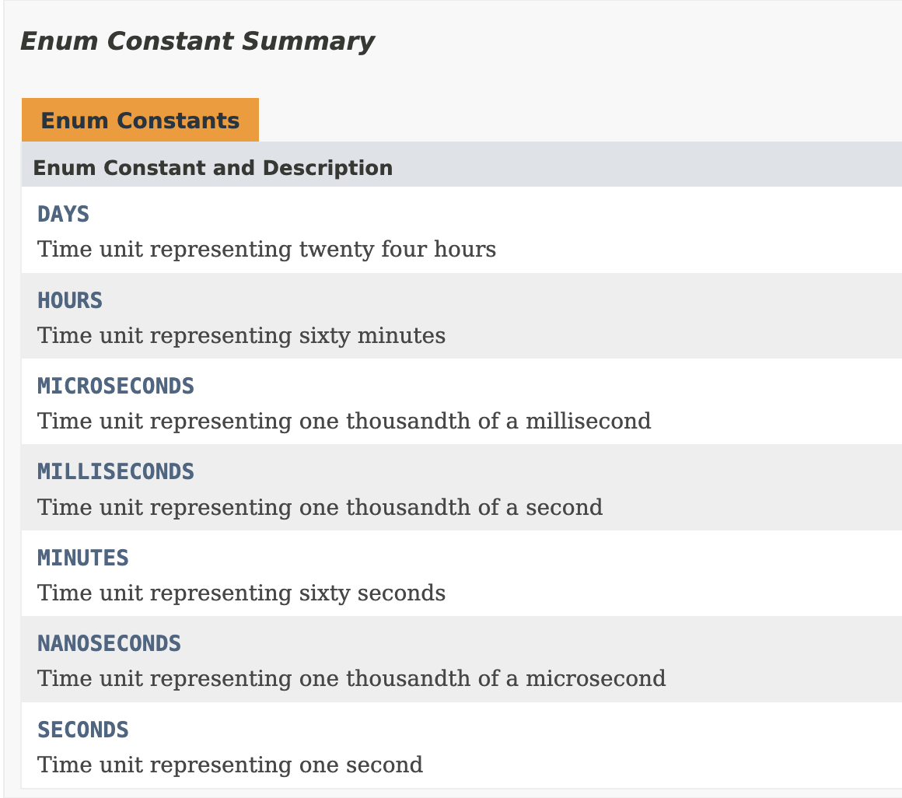
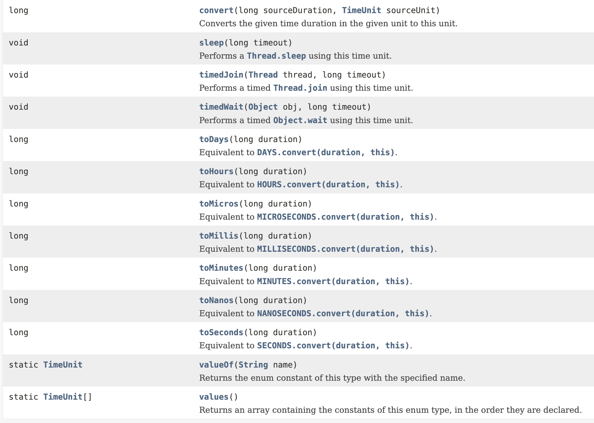

# TimeUnit

​	JUC开发中有一些处理机制，可以看看对于时间的处理问题。


​	早起的Java中时间单位基本都是毫秒

线程休眠方法：

```java
public static void sleep(long millis)
  								throws InterruptedException
```

线程等待方法：

```java
public final void wait(long timeout)
                throws InterruptedException
```


​	尽管有了毫秒和纳秒的线程单位配置，但是现实中还有时、分、秒等等，于是`java.util.concurrent`中的枚举类`TimeUnit`横空出世。

```java
public enum TimeUnit
extends Enum<TimeUnit>
```

​	Java的枚举类，除了常量还能设计接口、方法等等等等

​	TimeUnit里面定义了大量的时间单元：




​	除此之外，还提供了大量的时间转换方法




时间转换方法：

```java
public class Demo {
    public static void main(String[] args) {
        Long hour = 1L;
        Long second = TimeUnit.SECONDS.convert(hour, TimeUnit.HOURS);
        System.out.println(second);
    }
}
```

结果：3600


​	虽然TimeUnit很好用，但是从JDK1.8之后提供了一个`java.time.Duration`的操作类，这个类在实际的开发之中经常会被使用到。比如Spring里配置时间间隔就是这个类

```java
public final class Duration
extends Object
implements TemporalAmount, Comparable<Duration>, Serializable
```

```java
public class Demo {
    public static void main(String[] args) {
        java.time.Duration duration = java.time.Duration.ofHours(2).plusHours(2);
        System.out.println(duration);
        Long second = TimeUnit.SECONDS.convert(duration.toHours(), TimeUnit.HOURS);
        System.out.println(second);
    }
}
```


​	基于TimeUnit做日期的计算，比如计算180天后日期

```java
public class Demo {
    public static void main(String[] args) {
        long current = System.currentTimeMillis();
        long after = current + TimeUnit.MILLISECONDS.convert(180, TimeUnit.DAYS);
        System.out.println(new SimpleDateFormat("yyyy-MM-dd").format(new Date(after)));
    }
}
```


​	TimeUnit的休眠，可以根据当前的时间单元来进行休眠的配置处理。

```java
public void sleep(long timeout)
           throws InterruptedException
```

```java
public class Demo {
    public static void main(String[] args) {
        for (int i = 0; i < 10; i ++ ) {
            try {
                TimeUnit.SECONDS.sleep(2);
            } catch (InterruptedException e) {
                return;
            }
            System.out.println("123");
        }
    }
}
```


