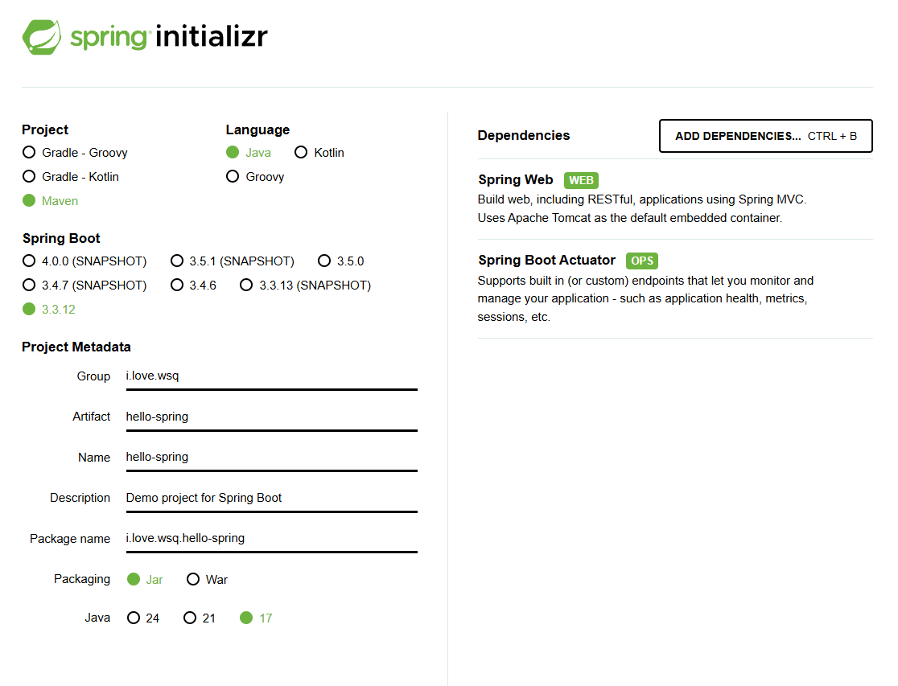

# 编写第一个spring程序

在spring.start.io生成骨架

可以选择生成工具类型、语言、spring-boot版本、元数据、依赖

写一个简单的RequestMapping，只需要启动即可发现Springboot启动了Tomcat，访问对应的url就可以得到返回值了

骨架继承了spring官方的包，定义了版本确保没有冲突

plugin用来打包

此时只需要mvn clean package -Dmaven.test.skip

两个包，原始包很小，实际运行包包括了依赖所以很大，可以直接执行

同一台电脑安装很多版本java的话需要注意，使用terminal的时候的java版本未必和你的IDEA使用的一样，可能就会编译报错

最好还是版本统一一点

spring-boot指定版本有两种方式

一种是生成骨架这种直接继承parent

另一种是设置dependencyManagement，用pom引入（maven知识哦）

