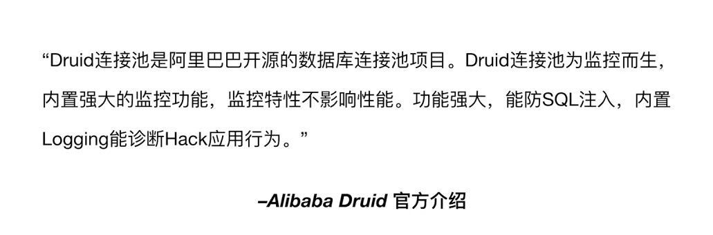
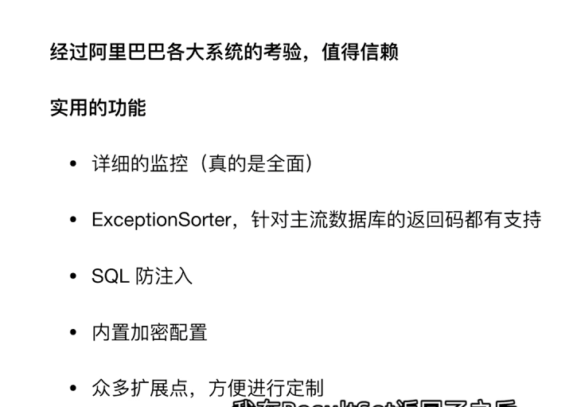
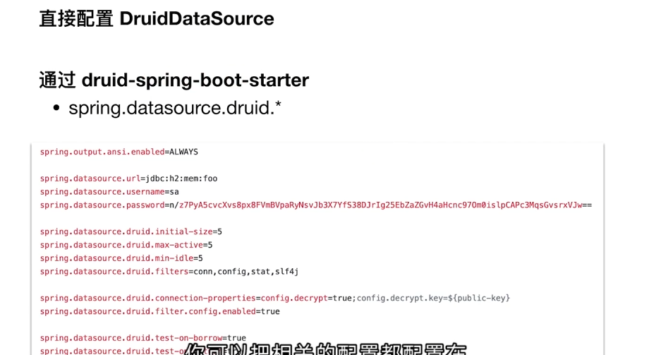
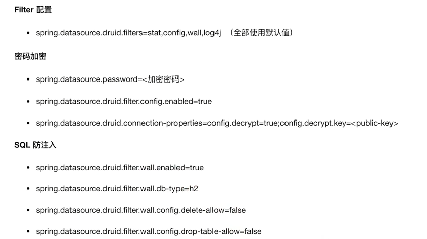
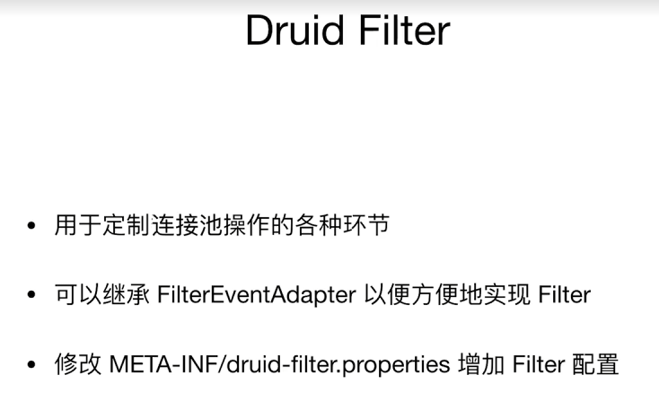
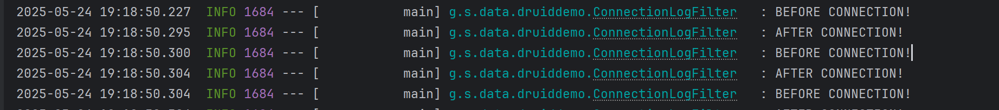
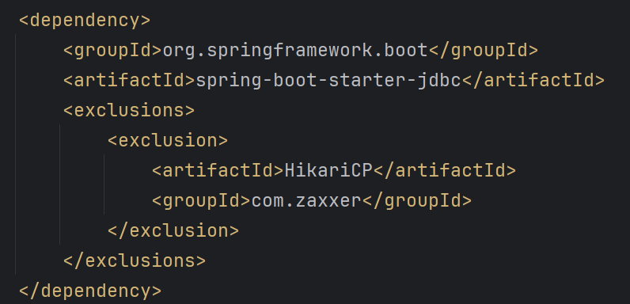
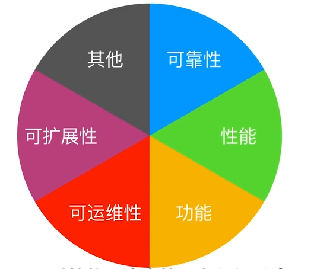

https://github.com/alibaba/druid



功能非常强大







可以控制不允许做某些操作


Druid有很强的扩展功能




比如我们可以定义连接前后打印日志

```java
@Slf4j
public class ConnectionLogFilter extends FilterEventAdapter {

    @Override
    public void connection_connectBefore(FilterChain chain, Properties info) {
        log.info("BEFORE CONNECTION!");
    }

    @Override
    public void connection_connectAfter(ConnectionProxy connection) {
        log.info("AFTER CONNECTION!");
    }
}
```



使用druid数据源需要排除掉spring-boot自带的hikariCP数据源




选择数据库连接池的考量




