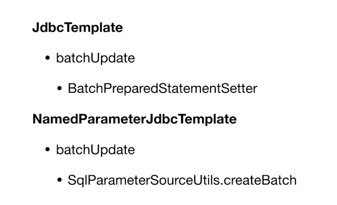

# Spring的JDBC操作

- core, JdbcTemplate等相关核心接口和类
- datasource, 数据源相关的辅助类
- object, 将基本的JDBC操作封装成对象
- support, 错误码等其他辅助工具


我们的数据库操作，建议使用`@Repository`注解Bean

主要还是基于JdbcTemplate的操作，不在此处赘述


## DAO层

数据操作层我们通常称为DAO层（data access object）

我们需要在这一层提供对数据的增删改查的方法。原生的Jdbc提供了preparedStatement执行SQL语句，Spring对其封装于是有了JdbcTemplate，这里我们就是用JdbcTemplate来做

JdbcTemplate包含的操作方法主要有：

- query
- queryForObject
- queryForList
- update
- execute


例如，插入语句实现：

```java
public void insertData() {
    Arrays.asList("b", "c").forEach(bar -> {
        jdbcTemplate.update("INSERT INTO FOO (BAR) VALUES (?)", bar);
    });

    HashMap<String, String> row = new HashMap<>();
    row.put("BAR", "d");
    Number id = simpleJdbcInsert.executeAndReturnKey(row);
    log.info("ID of d: {}", id.longValue());
}
```

查询

```java
public void listData() {
    log.info("Count: {}",
            jdbcTemplate.queryForObject("SELECT COUNT(*) FROM FOO", Long.class));

    List<String> list = jdbcTemplate.queryForList("SELECT BAR FROM FOO", String.class);
    list.forEach(s -> log.info("Bar: {}", s));

    List<Foo> fooList = jdbcTemplate.query("SELECT * FROM FOO", new RowMapper<Foo>() {
        @Override
        public Foo mapRow(ResultSet rs, int rowNum) throws SQLException {
            return Foo.builder()
                    .id(rs.getLong(1))
                    .bar(rs.getString(2))
                    .build();
        }
    });
    fooList.forEach(f -> log.info("Foo: {}", f));
}
```


SimpleJdbcInsert是一个对JdbcTemplate的封装，可以帮助用户更简单地使用

```java
@Bean
@Autowired
public SimpleJdbcInsert simpleJdbcInsert(JdbcTemplate jdbcTemplate) {
    return new SimpleJdbcInsert(jdbcTemplate)
            .withTableName("FOO").usingGeneratedKeyColumns("ID");
}
```

​	在这个Bean中，将jdbcTemplate绑定了表，并使用了自动生成主键，这样在上面的插入里面，就可以使用SimpleJdbcInsert的内置方法获得插入后的生成主键值


## 批处理



```java
public void batchInsert() {
    jdbcTemplate.batchUpdate("INSERT INTO FOO (BAR) VALUES (?)",
            new BatchPreparedStatementSetter() {
                @Override
                public void setValues(PreparedStatement ps, int i) throws SQLException {
                    ps.setString(1, "b-" + i);
                }

                @Override
                public int getBatchSize() {
                    return 2;
                }
            });

    List<Foo> list = new ArrayList<>();
    list.add(Foo.builder().id(100L).bar("b-100").build());
    list.add(Foo.builder().id(101L).bar("b-101").build());
    namedParameterJdbcTemplate
            .batchUpdate("INSERT INTO FOO (ID, BAR) VALUES (:id, :bar)",
                    SqlParameterSourceUtils.createBatch(list));
}
```

两种操作都可以，上面的i循环内置在batchupdate方法里面


