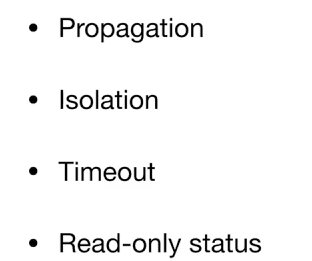
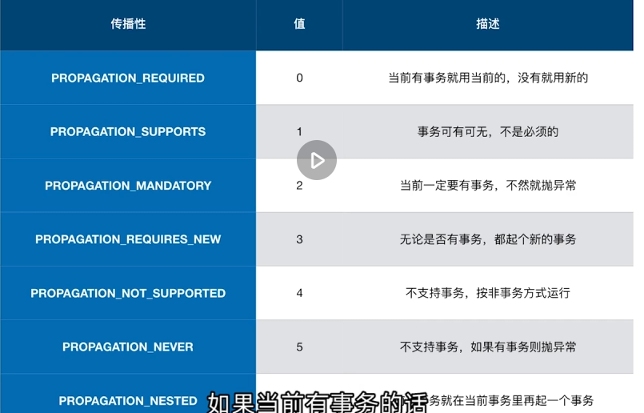
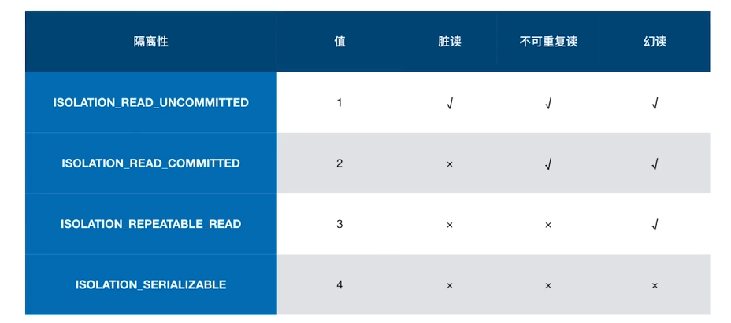
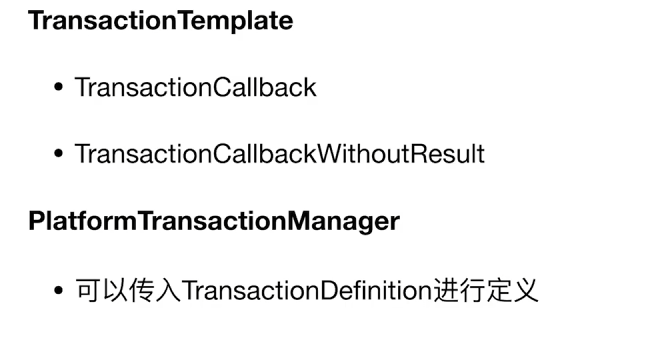
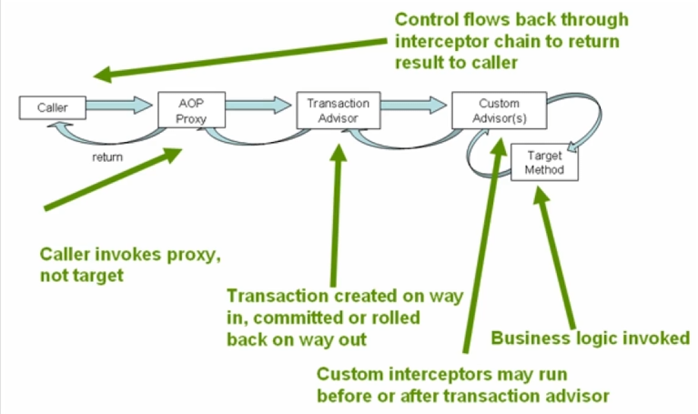
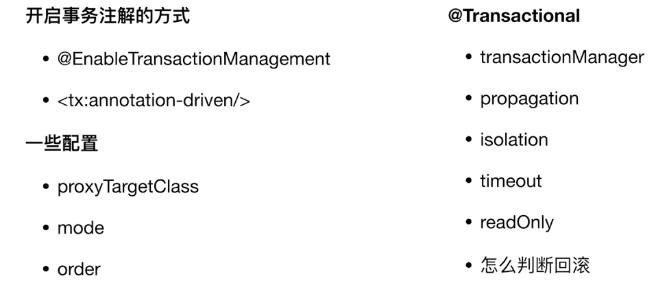

# 事务抽象

事务抽象是不管你使用什么orm框架（JDBC/HIbernate/myBatis），使用DataSource还是JTA事务，都可以统一在一起


## 事务抽象的核心接口

`PlatformTransactionManager`，可以封装各种事务管理器，提供了

- commit
- rollback


`TransactionDefinition`定义了事务传播性




**事务传播特性**




事务隔离特性（默认-1，由数据库决定）




## 编程式事务



```java
@Override
	public void run(String... args) throws Exception {
		log.info("COUNT BEFORE TRANSACTION: {}", getCount());
		transactionTemplate.execute(new TransactionCallbackWithoutResult() {
			@Override
			protected void doInTransactionWithoutResult(TransactionStatus transactionStatus) {
				jdbcTemplate.execute("INSERT INTO FOO (ID, BAR) VALUES (1, 'aaa')");
				log.info("COUNT IN TRANSACTION: {}", getCount());
				transactionStatus.setRollbackOnly();
			}
		});
		log.info("COUNT AFTER TRANSACTION: {}", getCount());
	}

	private long getCount() {
		return (long) jdbcTemplate.queryForList("SELECT COUNT(*) AS CNT FROM FOO")
				.get(0).get("CNT");
	}
```

> 2025-05-24 20:57:00.870  INFO 15680 --- [           main] p.ProgrammaticTransactionDemoApplication : COUNT BEFORE TRANSACTION: 0
> 2025-05-24 20:57:00.875  INFO 15680 --- [           main] p.ProgrammaticTransactionDemoApplication : COUNT IN TRANSACTION: 1
> 2025-05-24 20:57:00.875  INFO 15680 --- [           main] p.ProgrammaticTransactionDemoApplication : COUNT AFTER TRANSACTION: 0

由于设置了强制回滚，所以事务后也是0


## 声明式事务



声明式事务利用AOP做了一层封装，在方法执行前后做切面




