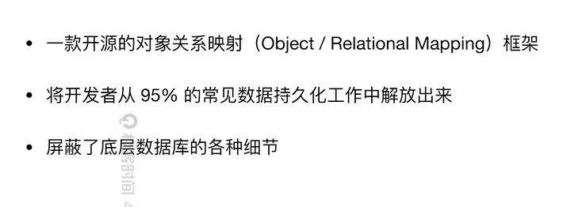
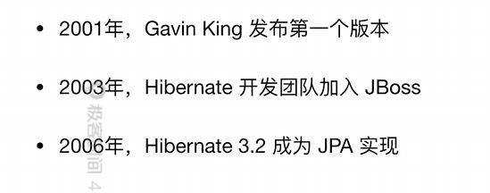

# Spring data JPA

https://zhuanlan.zhihu.com/p/115507328

JPA 与 Hibernate 与 Spring Data JPA

## Hibernate

## JPA

Java Persistence API

JPA为对象关系映射提供了一种基于POJO的持久化模型

- 简化数据持久化代码的开发工作
- 为Java社区屏蔽不同持久化API的差异

POJO就是Plain Ordinary Java Object 就是普通Java类

## Spring Data

在保留底层存储特性的同时，提供相对一致的、基于Spring的编程模型

主要模块：

- Spring Data Commons
- Spring Data JDBC
- Spring Data JPA
- Spring Data Redis

