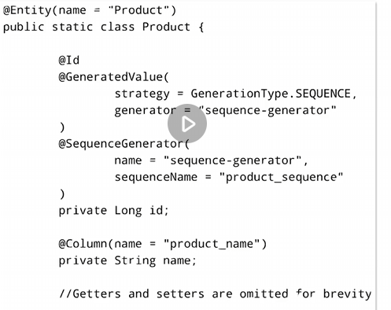
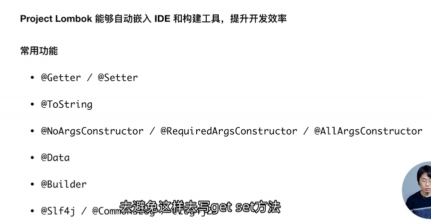

# 定义JPA 实体对象

JPA是一个数据规范，其中包含了很多注解用来定义关系数据库


@Entity: 实体

@MappedSuperclass: 多个实体的父类

@Table(name) 表：标识实体类和数据库表


`@Id` 主键

`@GeneratedValue(strategy, generator)`  生成策略、生成器

`@SequenceGenerator(name, sequenceName)`  指定生成器用的序列


这是一个例子

定义了一个名字是Product的实体

使用的




## 和映射的注解

### `@Column`

​	`@Column`用来指定实体字段与数据库表列的映射，其属性囊括了关系数据库字段的各个属性（列名、唯一性、是否可为空），同时还有一些其他的如是否允许插入、是否允许更新等属性可以指定。

​	一般情况下，Entity中不标注`@Column`的字段会被直接以字段名映射到数据库表中的列。

​	可以使用`@Transient`强制要求属性不被映射到数据库中的列，仅作为属性定义在实体类中


例子：一个状态属性，不允许为空

```java
@Column(nullable = false)
private Integer state;
```


### `@JoinTable(name)`

​	该注解用来表示表之间的关系使用的表，也就是关系数据库实体之间的**关系表**

​	


 @JoinColumn(name)


@OneToOne @OneToMany @ManyToOne @ManyToMany

@OrderBy


## Lombok



@Data就是包含了getter setter toString


