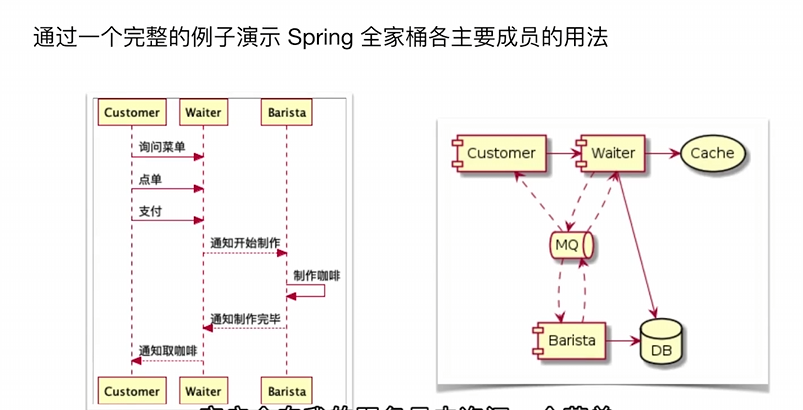
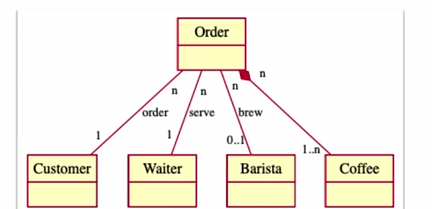
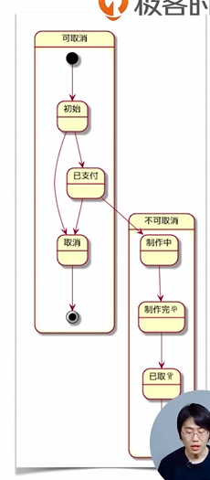
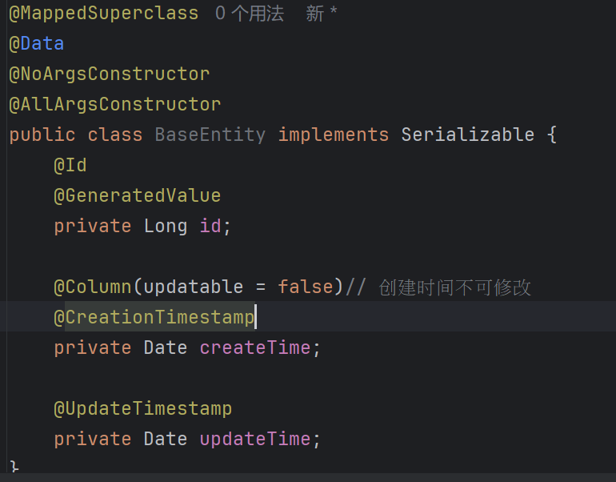
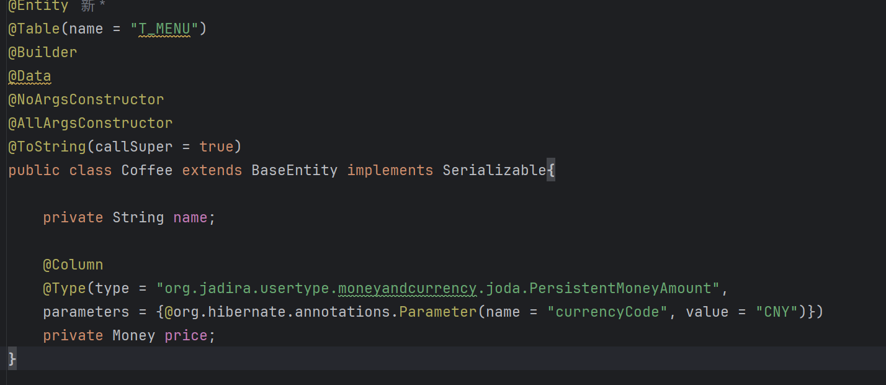
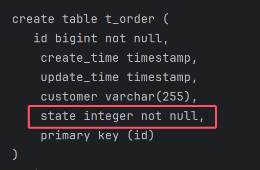

# SpringBucks项目




## 实体关系

咖啡、订单、顾客、服务员、咖啡师




## Hibernate属性配置

```properties
# 自动创建表, 运行结束后删除
spring.jpa.hibernate.ddl-auto=create-drop
# 格式化输出
spring.jpa.properties.hibernate.show_sql=true
spring.jpa.properties.hibernate.format_sql=true
```


启动后分析

```sql
Hibernate: 
    
    drop table if exists t_menu CASCADE # Hibernate会先把存在的表删去
Hibernate: 
    
    drop table if exists t_order CASCADE 
Hibernate: 
    
    drop table if exists t_order_coffee CASCADE 
Hibernate: 
    
    drop sequence if exists hibernate_sequence # 顺序表这玩意是自己定义出来的
Hibernate: create sequence hibernate_sequence start with 1 increment by 1
Hibernate: 
    
    create table t_menu (	# 建表语句
       id varchar(255) not null,
        create_time timestamp,
        name varchar(255),
        price decimal(19,2),
        update_time timestamp,
        primary key (id)
    )
Hibernate: 
    
    create table t_order (
       id bigint not null,
        create_time timestamp,
        customer varchar(255),
        state integer not null,
        update_time timestamp,
        primary key (id)
    )
Hibernate: 
    
    create table t_order_coffee (
       coffee_order_id bigint not null,
        items_id bigint not null
    )
Hibernate: 
    
    alter table t_order_coffee  # 关系表比较特殊，还有外键，关系表是实体表的从表
       add constraint FKj2swxd3y69u2tfvalju7sr07q 
       foreign key (items_id) 
       references t_menu
Hibernate: 
    
    alter table t_order_coffee 
       add constraint FK33ucji9dx64fyog6g17blpx9v 
       foreign key (coffee_order_id) 
       references t_order
```


结束之后还drop了表

```sql
Hibernate: 
    
    drop table if exists t_menu CASCADE 
Hibernate: 
    
    drop table if exists t_order CASCADE 
Hibernate: 
    
    drop table if exists t_order_coffee CASCADE 
Hibernate: 
    
    drop sequence if exists hibernate_sequence

```


---

存储decimal的时候，其实不是很方便

```
org.jadira.usertype.moneyandcurrency.joda.PersistentMoneyAmount
```

可以替换成另一个，用Long存储数字

原理是金额往往只会计算到分，就是小数点后两位，那我们存一个乘了100的数字即可，100.34就存成10034

```
PersistentBigMoneyMinorAmount
```


---

我们可以给主键指定特别的生成策略

这个之后我们慢慢积累吧


----

我们会发现ID，创建时间和最后修改时间这种会出现在所有实体，不妨将他们抽象出来一个BaseEntity



​	之后其他类直接继承就好了，注意ToString需要标注加上父类字段




---

枚举做映射，这在数据库中也是很常见



可以发现虽然是枚举，依然转换成了整型，这其实和Java本身枚举的定义方式类似，在不指定值的情况下也是默认用整型数字


根据我的实验，定义了值为String，也仍然存了integer，应该是逻辑就是按枚举的ordinal存的
