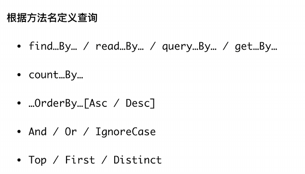
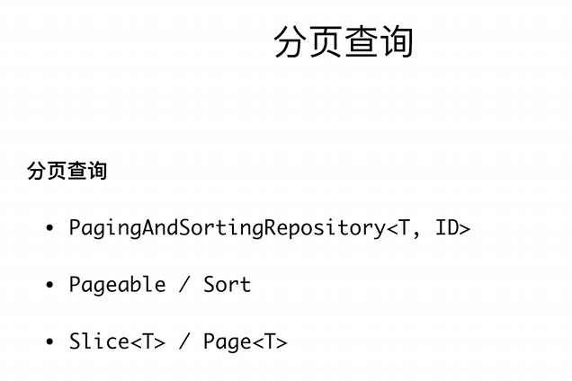

# 通过Spring Data JPA操作数据库

## Repository

@EnableJpaRepositories 在application上标注，启动JPA


Repository<T, ID>接口

包括CrudRepository<T, ID> PagingAndSortingRepository<T, ID> JpaRepository<T,ID>


你可以定义查询

使用下面的格式的话只要定义方法就能自动生成




分页查询




## 保存实体

我们可以定义自己的Repository，需要作为接口继承CrudRepository之类的

```java
Coffee espresso = Coffee.builder()
                .name("espresso")
                .price(Money.of(CurrencyUnit.of("CNY"), 20.0))
                .build();
        coffeeRepository.save(espresso);
        log.info("Coffee: {}", espresso);
```


todo：发现一个问题，如果都是继承BaseEntity的话，不管是Coffee还是Order ID都会从BaseEntity那里往下排，就不太对了


## 查询实体

查询可以按照一定的格式来实现方法，这点是很方便的


```sql
Hibernate: 
    select
        coffee0_.id as id1_0_,
        coffee0_.create_time as create_t2_0_,
        coffee0_.update_time as update_t3_0_,
        coffee0_.name as name4_0_,
        coffee0_.price as price5_0_ 
    from
        t_menu coffee0_ 
    order by
        coffee0_.id desc
2025-06-04 23:11:30.973  INFO 15408 --- [           main] g.s.s.jpademo.JpaDemoApplication         : Loading Coffee(super=BaseEntity(id=2, createTime=Wed Jun 04 23:11:30 CST 2025, updateTime=Wed Jun 04 23:11:30 CST 2025), name=espresso, price=CNY 20.00)
2025-06-04 23:11:30.973  INFO 15408 --- [           main] g.s.s.jpademo.JpaDemoApplication         : Loading Coffee(super=BaseEntity(id=1, createTime=Wed Jun 04 23:11:30 CST 2025, updateTime=Wed Jun 04 23:11:30 CST 2025), name=latte, price=CNY 30.00)
Hibernate: 
    select
        coffeeorde0_.id as id1_1_,
        coffeeorde0_.create_time as create_t2_1_,
        coffeeorde0_.update_time as update_t3_1_,
        coffeeorde0_.customer as customer4_1_,
        coffeeorde0_.state as state5_1_ 
    from
        t_order coffeeorde0_ 
    order by
        coffeeorde0_.update_time desc,
        coffeeorde0_.id asc limit ?
2025-06-04 23:11:30.979  INFO 15408 --- [           main] g.s.s.jpademo.JpaDemoApplication         : findTop3ByOrderByUpdateTimeDescIdAsc: 4,3
Hibernate: 
    select
        coffeeorde0_.id as id1_1_,
        coffeeorde0_.create_time as create_t2_1_,
        coffeeorde0_.update_time as update_t3_1_,
        coffeeorde0_.customer as customer4_1_,
        coffeeorde0_.state as state5_1_ 
    from
        t_order coffeeorde0_ 
    where
        coffeeorde0_.customer=? 
    order by
        coffeeorde0_.id asc
2025-06-04 23:11:30.985  INFO 15408 --- [           main] g.s.s.jpademo.JpaDemoApplication         : findByCustomerOrderById: 3,4
2025-06-04 23:11:30.986  INFO 15408 --- [           main] g.s.s.jpademo.JpaDemoApplication         : Order 3
2025-06-04 23:11:30.986  INFO 15408 --- [           main] g.s.s.jpademo.JpaDemoApplication         :   Item Coffee(super=BaseEntity(id=2, createTime=Wed Jun 04 23:11:30 CST 2025, updateTime=Wed Jun 04 23:11:30 CST 2025), name=espresso, price=CNY 20.00)
2025-06-04 23:11:30.986  INFO 15408 --- [           main] g.s.s.jpademo.JpaDemoApplication         : Order 4
2025-06-04 23:11:30.986  INFO 15408 --- [           main] g.s.s.jpademo.JpaDemoApplication         :   Item Coffee(super=BaseEntity(id=2, createTime=Wed Jun 04 23:11:30 CST 2025, updateTime=Wed Jun 04 23:11:30 CST 2025), name=espresso, price=CNY 20.00)
2025-06-04 23:11:30.986  INFO 15408 --- [           main] g.s.s.jpademo.JpaDemoApplication         :   Item Coffee(super=BaseEntity(id=1, createTime=Wed Jun 04 23:11:30 CST 2025, updateTime=Wed Jun 04 23:11:30 CST 2025), name=latte, price=CNY 30.00)
Hibernate: 
    select
        coffeeorde0_.id as id1_1_,
        coffeeorde0_.create_time as create_t2_1_,
        coffeeorde0_.update_time as update_t3_1_,
        coffeeorde0_.customer as customer4_1_,
        coffeeorde0_.state as state5_1_ 
    from
        t_order coffeeorde0_ 
    left outer join
        t_order_coffee items1_ 
            on coffeeorde0_.id=items1_.coffee_order_id 
    left outer join
        t_menu coffee2_ 
            on items1_.items_id=coffee2_.id 
    where
        coffee2_.name=?
R
```


