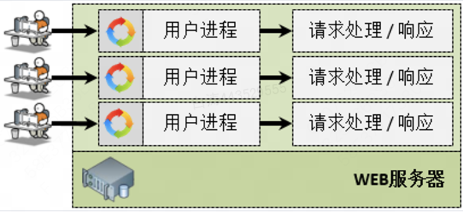
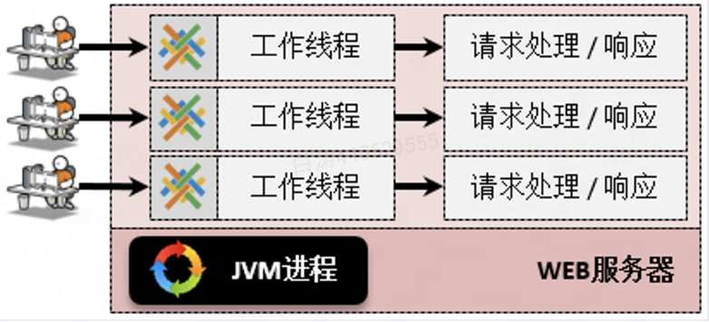
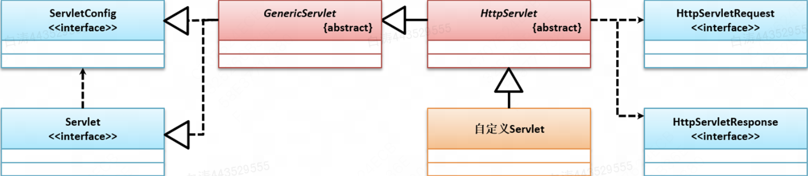
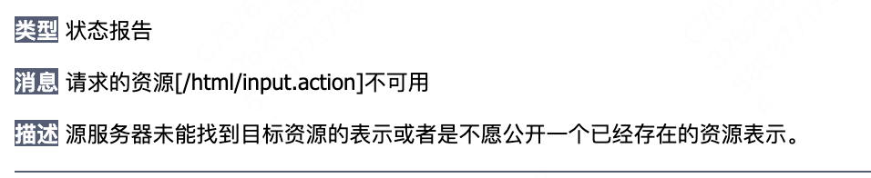

# 5.1 Servlet简介

## 1.Servlet是什么？

​	Servlet是Java实现的[**CGI技术**](###CGI技术)，是Java为实现动态WEB开发在较早时期推出一项技术，同时也是现在项目开发中必不可少的一项技术。

​	CGI仅仅是一个通信标准，受到早期硬件性能与软件技术的限制，大多数采用的都是**多进程**的处理技术，即：每一个用户请求对于操作系统内部都要启动一个相应的进程进行请求处理。



​	通过Java实现的CGI技术，充分的发挥了Java语言中**多线程**的技术特点，采用线程的形式实现了用户的HTTP请求与响应，这样每一个进程的启动速度更快，服务器的处理性能更高。同时JDK1.5中正式提供了“J.U.C”并发编程包，利用线程池技术可以更加有效地管理服务器中的线程资源分配



*备注：当前的CPU处理性能、以及内存的存储大小和接口技术的发展，导致了硬件的技术出现了“**性能过剩**”，主要是由于软件的性能还没有完全追上硬件的性能。（商用软件和游戏产业不同*）


## 2.Servlet编程起步

​	Servlet程序是以Java类对象的形式来处理用户请求的，<u>对于每一个处理HTTP请求的Servlet类都需要明确地继承`javax.servlet.http.HttpServlet`类</u>。

### 2.1 HttpServlet结构



​	`HttpServlet`是一个抽象类，继承自`GenericServlet`抽象类。

​	`GenericServlet`实现了`Servlet`接口与`ServletConfig`接口。前者就是Servlet接口的规范，后者就是**ServletConfig内置对象**（存放初始化参数）。

​	关于该继承结构的详细说明放在[附录](###HttpServlet继承结构说明)部分，有兴趣可以看看。


### 2.2 HttpServlet定义的方法

​	HttpServlet中定义了处理**不同类型请求**的方法：

| **No.** | **方法**                                                     | **类型** | **描述**        |
| ------- | ------------------------------------------------------------ | -------- | --------------- |
| 1       | protected void  **doDelete**(HttpServletRequest req, HttpServletResponse resp) throws  ServletException, IOException | 普通     | 处理DELETE请求  |
| 2       | protected void **doGet**(HttpServletRequest  req, HttpServletResponse resp) throws ServletException, IOException | 普通     | 处理GET请求     |
| 3       | protected void  **doHead**(HttpServletRequest req, HttpServletResponse resp) throws  ServletException, IOException | 普通     | 处理HEAD请求    |
| 4       | protected void  **doOptions**(HttpServletRequest req, HttpServletResponse resp) throws  ServletException, IOException | 普通     | 处理OPTIONS请求 |
| 5       | protected void  **doPost**(HttpServletRequest req, HttpServletResponse resp) throws  ServletException, IOException | 普通     | 处理POST请求    |
| 6       | protected void **doPut**(HttpServletRequest  req, HttpServletResponse resp) throws ServletException, IOException | 普通     | 处理PUT请求     |
| 7       | protected void  **doTrace**(HttpServletRequest req, HttpServletResponse resp) throws  ServletException, IOException | 普通     | 处理TRACE请求   |


### 2.3 一个简单Servlet程序

​	首先我们写一个简单的Servlet程序，以处理GET请求为例。

```java
// 所有的Servlet类中一定会存在有强制性的父类的继承要求
public class HelloServlet extends HttpServlet {
    @Override
    protected void doGet(HttpServletRequest req, HttpServletResponse resp) throws ServletException, IOException {
        //在doGET()方法中已经明确给出了HttpServletRequest和HttpServletResponse接口实例
        //在这个接口实例是在每一次进行请求处理的时候，由容器负责提供的
        //HTML是文本，因此字符流更合适，故选择PrintWriter而非PrintStream
        PrintWriter out = resp.getWriter();
        out.println("<html>");
        out.println("<head>");
        out.println("   <title>hello servlet</title>");
        out.println("</head>");
        out.println("<body>");
        out.println("   <h1>www.baidu.com</h1>");
        out.println("</body>");
        out.println("</html>");
        out.close();    //关闭输出流
    }
}
```


​	接下来，我们需要在配置信息中将我们的Servlet程序添加进去，这样容器在运行时才能<u>匹配路径到对应的Servlet程序</u>：

```xml
		<servlet> <!--定义一个Servlet程序配置类-->
        <servlet-name>HelloServlet</servlet-name>		<!--Servlet名称-->
        <servlet-class>com.yootk.servlet.HelloServlet</servlet-class> <!--指定类-->
    </servlet>
    <servlet-mapping>
        <servlet-name>HelloServlet</servlet-name>		<!--Servlet名称捆绑路径-->
        <url-pattern>/hello.action</url-pattern> <!--映射路径必须使用“/”开头-->
    </servlet-mapping>
```

​	其中的`<url-pattern>`标签就是映射路径，该路径可以用通配符`*`来匹配，例如

```xml
<url-pattern>/hello/*</url-pattern>	<!--匹配所有/hello下的路径-->
```


​	除此之外，一个Servlet可以对应多个映射路径，例如

```xml
  <!--下面的两个路径都可以匹配到HelloServlet-->
	<servlet-mapping>
        <servlet-name>HelloServlet</servlet-name>
        <url-pattern>/hello.action</url-pattern>
    </servlet-mapping>
    <servlet-mapping>
        <servlet-name>HelloServlet</servlet-name>
        <url-pattern>/hello/action/*</url-pattern>
    </servlet-mapping>
```


## 3.表单提交到Servlet

​	Servlet作为服务器端可以处理前端传来的数据。

​	表单就是一种典型可以传输数据过来的的结构。

​	定义一个简单的表单，可以传输一个message参数到后端

```html
<!DOCTYPE html>
<html lang="en">
<head>
    <meta charset="UTF-8">
    <title>Title</title>
</head>
<body>
<form action="input.action" method="post">
    请输入信息：<input type="text" name="message" value="www.baidu.com">
    <button type="submit">提交</button>
</form>

</body>
</html>
```


​	接下来我们写一个Servlet接收并打印一下提交的内容

```java
public class InputServlet extends HttpServlet {
    @Override
    protected void doGet(HttpServletRequest req, HttpServletResponse resp) throws ServletException, IOException {
        //属性配置都需要自己设定
        req.setCharacterEncoding("UTF-8");
        resp.setCharacterEncoding("UTF-8");
        resp.setContentType("text/html;charset=UTF-8");
        String msg = req.getParameter("message"); //获取表单参数
        PrintWriter out = resp.getWriter();
        out.println("<html>");
        out.println("<head>");
        out.println("   <title>hello servlet</title>");
        out.println("</head>");
        out.println("<body>");
        out.println("   <h1>" + msg + "</h1>");//输出请求参数
        out.println("</body>");
        out.println("</html>");
        out.close();
    }

    @Override
    protected void doPost(HttpServletRequest req, HttpServletResponse resp) throws ServletException, IOException {
        this.doGet(req, resp);
    }
}
```


​	同理我们到web.xml配置一下路径绑定

```xml
		<servlet>
        <servlet-name>InputServlet</servlet-name>
        <servlet-class>com.yootk.servlet.InputServlet</servlet-class>
    </servlet>
    <servlet-mapping>
        <servlet-name>InputServlet</servlet-name>
        <url-pattern>/input.action</url-pattern>
    </servlet-mapping>
```


---

​	需要注意的是，这里把input.html放到了根目录下，所以配置没有问题。

​	如果把input.html放到子目录下，会出现如下的报错



​	原因是我们在表单配置的路径是当前目录下的，也就是说一旦不在根目录下，表单请求的路径就变成`/子目录/input.action`了。通常一个项目的HTML文件都在一个目录下，所以我们最好把请求的Servlet都配置成对应的路径

```xml
<url-pattern>/html/input.action</url-pattern>
```


## 4.@WebServlet注解

​	Servlet刚诞生的时候没有Annotation，后来Annotation诞生之后，Servlet（3.0）也开始支持注解`@WebServlet`了。

​	其属性包含如下内容：

| No.  | 属性名称       | 类型               | 描述                                                         |
| ---- | -------------- | ------------------ | ------------------------------------------------------------ |
| 01   | name           | java.lang.String   | Servlet名称，等价于`<servlet-name>`元素定义，如果没有设置名称则会使用类名称自动配置 |
| 02   | urlPatterns    | java.lang.String[] | Servlet映射路径，等价于`<url-pattern>`元素定义               |
| 03   | value          | java.lang.String[] | 等价于“urlPatterns”属性配置，两个属性不可同时出现            |
| 04   | loadOnStartup  | int                | Servlet加载顺序，等价于`<load-on-startup>`元素定义           |
| 05   | initParams     | WebInitParam []    | Servlet 初始化参数，等价于“<init-param>”元素定义这个需要使用@WebInitParam注解`initParams = {@WebInitParam(name="info", value="www.baidu.com")}` |
| 06   | asyncSupported | boolean            | Servlet是否支持异步处理模式，等价于`<async-supported>`元素定义 |
| 07   | description    | java.lang.String   | Servlet描述信息，等价于`<description>`元素定义               |
| 08   | displayName    | java.lang.String   | Servlet显示名称，等价于`<display-name>`元素定义              |


​	当最简化的情况下，注解的内容默认是`<url-pattern>`

```java
@WebServlet("/hello.action")
public class HelloServlet extends HttpServlet {}
```


​	但是，如果想要实现一个Servlet对应多个映射路径，就只能完整写注解了

```java
@WebServlet(description = "servlet3.0之后可以使用", 
            urlPatterns = {"/hello.action", "/hello/action/*"})
```


​	


## 附录

### a.CGI技术

CGI（Common Gateway Interface）：是一种用于 web 服务器与外部程序（如脚本或应用程序）之间进行交互的标准。CGI 允许 web 服务器将请求传递给外部程序，这些程序可以生成动态内容并将其返回给客户端。CGI 通过定义一组标准的协议，允许不同的服务器和程序以一致的方式进行交互。


### b.Servlet和JSP的关系

​	既然Servlet的设计性能如此之高，为什么又要准备一个JSP呢？在整个的WEB开发技术中，除了核心的请求处理之外，最重要的就是颜值。页面的美观不属于程序开发人员需要完成的工作，属于前端美工的任务，而如果直接使用Servlet技术，那么程序页面就会有如下代码：

```java
out.println("<html>");
out.println("<head>...</head>");
out.println("</html>");
```

​	如果所有的前端页面依然保持着如此的开发，那么最终也就不会有当前如此丰富的APP应用了，因为整个的界面一定是很难看，为了改进这种开发模式，才有了JSP，而Servlet最重要的设计缺陷就是没考虑页面输出响应的繁琐程度。

​	实际上早起JavaWEB开发阶段，开发者为了解决页面显示的问题，自己尝试做一个显示的模版页面，而后最重要生成的时候，利用I/O流的形式进行文件读取，随后整合成一个完整的HTML界面。


### c.HttpServlet继承结构说明

​	HttpServlet的继承结构实际上有别的用意。

​	Servlet作为接口，是Servlet程序实现的规范，其要求一个Servlet程序能实现以下这些功能：

```java
public interface Servlet {
  	// 初始化
    void init(ServletConfig var1) throws ServletException;
		// 得到初始化参数
    ServletConfig getServletConfig();
		// 提供服务，注意参数是ServletRequest和ServletResponse，不是HttpServletRequest和HttpServletResponse
    void service(ServletRequest var1, ServletResponse var2) throws ServletException, IOException;
		// 销毁
    void destroy();
}
```


​	最初设计的时候，大家都认为除了Http协议之外，也会有别的协议使用Servlet程序，于是Java EE先设计了一层GenericServlet抽象类作为Servlet接口的一般实现：

```java
public abstract class GenericServlet implements Servlet, ServletConfig, Serializable {
    private static final long serialVersionUID = 1L;
    private transient ServletConfig config;

    public GenericServlet() {
    }

    public void destroy() {
    }

    public String getInitParameter(String name) {
        return this.getServletConfig().getInitParameter(name);
    }

    public Enumeration<String> getInitParameterNames() {
        return this.getServletConfig().getInitParameterNames();
    }

    public ServletConfig getServletConfig() {
        return this.config;
    }

    public ServletContext getServletContext() {
        return this.getServletConfig().getServletContext();
    }

    public String getServletInfo() {
        return "";
    }

    public void init(ServletConfig config) throws ServletException {
        this.config = config;
        this.init();
    }

    public void init() throws ServletException {
    }

    public void log(String message) {
        this.getServletContext().log(this.getServletName() + ": " + message);
    }

    public void log(String message, Throwable t) {
        this.getServletContext().log(this.getServletName() + ": " + message, t);
    }

  	// 具体的业务逻辑，这里依然是ServletRequest和ServletResponse，保证其通用型
    public abstract void service(ServletRequest var1, ServletResponse var2) throws ServletException, IOException;

    public String getServletName() {
        return this.config.getServletName();
    }
}
```

​	其内部的方法大多都是获取Servlet的各种参数，不用太过在意。

​	重要的一点是，GenericServlet中保有了ServletConfig内置对象，可以说除了具体的业务逻辑之外，GenericServlet已经把其他步骤都实现好了。


​	于是，最后就到了HttpServlet，在GenericServlet的基础上，将Servlet接口中的Service直接拓展成依照请求类型来执行对应方法处理

```java
protected void service(HttpServletRequest req, HttpServletResponse resp) throws ServletException, IOException {
        String method = req.getMethod();
        long lastModified;
        if (method.equals("GET")) {
            lastModified = this.getLastModified(req);
            if (lastModified == -1L) {
                this.doGet(req, resp);
            } else {
                long ifModifiedSince;
                try {
                    ifModifiedSince = req.getDateHeader("If-Modified-Since");
                } catch (IllegalArgumentException var9) {
                    ifModifiedSince = -1L;
                }

                if (ifModifiedSince < lastModified / 1000L * 1000L) {
                    this.maybeSetLastModified(resp, lastModified);
                    this.doGet(req, resp);
                } else {
                    resp.setStatus(304);
                }
            }
        } else if (method.equals("HEAD")) {
            lastModified = this.getLastModified(req);
            this.maybeSetLastModified(resp, lastModified);
            this.doHead(req, resp);
        } else if (method.equals("POST")) {
            this.doPost(req, resp);
        } else if (method.equals("PUT")) {
            this.doPut(req, resp);
        } else if (method.equals("DELETE")) {
            this.doDelete(req, resp);
        } else if (method.equals("OPTIONS")) {
            this.doOptions(req, resp);
        } else if (method.equals("TRACE")) {
            this.doTrace(req, resp);
        } else {
            String errMsg = lStrings.getString("http.method_not_implemented");
            Object[] errArgs = new Object[]{method};
            errMsg = MessageFormat.format(errMsg, errArgs);
            resp.sendError(501, errMsg);
        }

    }
```

​	大致一看就能理解，service就是按照不同的请求类型分配给不同的处理方法，这也就是定义HttpServlet的我们需要做的部分啦。


