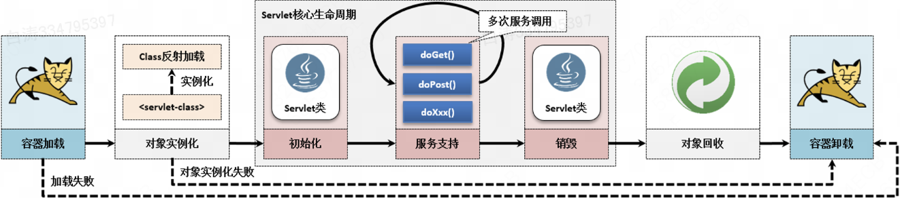

# 5.2 Servlet生命周期

​	Servlet程序是一个运行在WEB容器中的Java类，所有的Java类在执行时都需要通过实例化对象来进行类中功能调用，在WEB容器中会自动进行Servlet实例的管理，并且规定了一套完整的Servlet生命周期。

​	Tomcat的运行需要JVM的支持，而所有的服务组件又运行在Tomcat之中，于是在对象实例化前后就有容器需要完成的部分了。

> Cleaner类时重点分析过JVM每一个对象的生命周期




## 1.具体流程

### (1) 容器加载（不可控）

​        Servlet运行在特定的Web应用之中，当Tomcat启动后首先需要进行Servlet上下文初始化，随后会依据配置的Servlet进行类加载，如果加载失败，则容器启动失败。

（用户无法控制）

### (2) 对象实例化（不可控）

​        所有的Servlet程序都通过反射机制将类名称加载到Web容器里，当Servlet类被加载后会自动实例化唯一的Servlet对象。如果对象实例化失败，则容器启动失败。

（Servlet程序需要无参构造方法）（用户无法控制）

### (3) 初始化（可控）

​        Servlet初始化的工作处理，此操作是在构造方法执行之后进行的，可以利用此方式获取初始化的配置信息（例如：初始化参数）。正常情况下，一个Servlet只会初始化一次

### (4) 服务支持（可控）

​        对用户所发送来的请求进行服务的请求与响应处理，服务操作部分会被重复执行。

### (5) 销毁（可控）

​        一个Servlet如果不再使用则进行销毁处理，销毁的时候可以对Servlet所占用的资源进行释放。

### (6) 对象回收（不可控）

​        Servlet实例化对象不再使用后，会由JVM进行对象回收与内存空间释放。

### (7) 容器卸载（不可控）

​        关闭Web容器，停止当前服务


> 提示：重复初始化问题        如果一个Servlet在整个Web容器中长期存在并且持续使用，则只会初始化一次，并且销毁一次。但是如果某一个Servlet长时间不使用，就有可能被Web容器自动销毁，而在下一次使用前会重复进行对象实例化与初始化的处理


## 2.Servlet基础生命周期

​        对于Servlet生命周期的每一个部分都是有相应的处理方法支持的，开发者只需要根据自己的需要在指定的方法中进行方法的覆写，就可以观察到这些生命周期的控制环境。

| No.  | 方法                                                         | 类型 | 所属类型         | 描述                 |
| ---- | ------------------------------------------------------------ | ---- | ---------------- | -------------------- |
| 1    | public void **init**() throws ServletException               | 方法 | GenericServlet类 | Servlet初始化        |
| 2    | protected void **doGet**(HttpServletRequest  req, HttpServletResponse resp) <br />throws ServletException, IOException | 方法 | HttpServlet类    | HTTP服务处理GET请求  |
| 3    | protected void **doPost**(HttpServletRequest req, HttpServletResponse resp) <br />throws  ServletException, IOException | 方法 | HttpServlet类    | HTTP服务处理POST请求 |
| 4    | public void **destroy**()                                    | 方法 | Servlet接口      | Servlet服务销毁      |


​	用一个例子来观察生命周期

```java
package com.yootk.servlet;

import java.io.IOException;
import javax.servlet.ServletException;
import javax.servlet.annotation.WebServlet;
import javax.servlet.http.HttpServlet;
import javax.servlet.http.HttpServletRequest;
import javax.servlet.http.HttpServletResponse;

@WebServlet("/life")
public class LifeCycleServlet extends HttpServlet {
    public LifeCycleServlet() {
        System.out.println("【LifeCycleServlet】调用构造方法，实例化Servlet对象");
    }
    @Override
    public void init() throws ServletException {
        System.out.println("【LifeCycleServlet】初始化");
    }
    @Override
    protected void doGet(HttpServletRequest req, HttpServletResponse resp) throws ServletException, IOException {
        System.out.println("【LifeCycleServlet】处理Get请求");
    }

    @Override
    protected void doPost(HttpServletRequest req, HttpServletResponse resp) throws ServletException, IOException {
        System.out.println("【LifeCycleServlet】处理Post请求");
    }

    @Override
    public void destroy() {
        System.out.println("【LifeCycleServlet】释放Servlet占用资源");
    }
}
```

>**【LifeCycleServlet】调用构造方法，实例化Servlet对象**
>**【LifeCycleServlet】初始化**
>**【LifeCycleServlet】处理Get请求**
>15-Oct-2024 14:45:32.131 信息 [Catalina-utility-1] org.apache.catalina.startup.HostConfig.deployDirectory 把web 应用程序部署到目录 [/Library/apache-tomcat-9.0.93/webapps/manager]
>15-Oct-2024 14:45:32.254 信息 [Catalina-utility-1] org.apache.jasper.servlet.TldScanner.scanJars 至少有一个JAR被扫描用于TLD但尚未包含TLD。 为此记录器启用调试日志记录，以获取已扫描但未在其中找到TLD的完整JAR列表。 在扫描期间跳过不需要的JAR可以缩短启动时间和JSP编译时间。
>15-Oct-2024 14:45:32.257 信息 [Catalina-utility-1] org.apache.catalina.startup.HostConfig.deployDirectory Web应用程序目录[/Library/apache-tomcat-9.0.93/webapps/manager]的部署已在[126]毫秒内完成
>/Library/apache-tomcat-9.0.93/bin/catalina.sh stop
>15-Oct-2024 14:45:45.521 信息 [main] org.apache.catalina.core.StandardServer.await 通过关闭端口接收到有效的关闭命令。正在停止服务器实例。
>15-Oct-2024 14:45:45.522 信息 [main] org.apache.coyote.AbstractProtocol.pause 暂停ProtocolHandler["http-nio-8080"]
>15-Oct-2024 14:45:45.529 信息 [main] org.apache.catalina.core.StandardService.stopInternal 正在停止服务[Catalina]
>15-Oct-2024 14:45:45.535 警告 [main] org.apache.catalina.loader.WebappClassLoaderBase.clearReferencesThreads Web应用程序[ROOT]似乎启动了一个名为[mysql-cj-abandoned-connection-cleanup]的线程，但未能停止它。这很可能会造成内存泄漏。线程的堆栈跟踪：[
> java.lang.Object.wait(Native Method)
> java.lang.ref.ReferenceQueue.remove(ReferenceQueue.java:150)
> com.mysql.cj.jdbc.AbandonedConnectionCleanupThread.run(AbandonedConnectionCleanupThread.java:84)
> java.util.concurrent.ThreadPoolExecutor.runWorker(ThreadPoolExecutor.java:1149)
> java.util.concurrent.ThreadPoolExecutor$Worker.run(ThreadPoolExecutor.java:624)
> java.lang.Thread.run(Thread.java:750)]
>15-Oct-2024 14:45:45.539 信息 [main] org.apache.coyote.AbstractProtocol.stop 正在停止ProtocolHandler ["http-nio-8080"]
>15-Oct-2024 14:45:45.541 信息 [main] org.apache.coyote.AbstractProtocol.destroy 正在摧毁协议处理器 ["http-nio-8080"]
>**【LifeCycleServlet】释放Servlet占用资源**


​        默认情况下每一个Servlet部署完成之后，实际上其不会立即执行，也就是说默认情况下Servlet是不会随着容器的启动而自动地进行对象实例化处理的，但是在第一次访问的时候就会出现自动的对象实例化以及初始化的操作。

​        第一次请求会出现实例化、init()、get

​        第二次请求只有get


​        关闭时候会出现销毁操作。 


### *Servlet初始化控制

​        在正常情况下每一个Servlet都在其第一次使用时才会进行对象的实例化处理，如果用户有需要也可以**通过配置使其在容器启动时进行初始化**。

```java
@WebServlet(value = "/life", loadOnStartup = 1)
public class LifeCycleServlet extends HttpServlet { }
```

​        在程序中追加了`loadOnStartup = 1`属性后，此Servlet会在容器启动时进行初始化配置。需要注意的是，如果此时有多个Servlet配置了`loadOnStartup`属性，那么取值最小的会优先执行。


​        需要注意的是，这个属性最小值是0，小于0则不使用。但是后续学习到Spring开发框架的时候，就会发现，在Spring里面经常是会通过负数来进行优先执行。 

​        在未来进行Servlet程序开发的过程之中，实际上使用最多的生命周期的控制方法就是`init()`和`doGet()`/`doPost()`。


## 3.Servlet扩展生命周期

​        Servlet生命周期控制方法全部都在`GenericServlet`类以及其`Servlet`父接口中进行了定义，在实际的Servlet开发中，往往都采用如图所示的继承结构图：

| No.  | 方法                                                         | 类型 | 所属类型      | 描述          |
| ---- | ------------------------------------------------------------ | ---- | ------------- | ------------- |
| 1    | public void **init**(ServletConfig config)  <br />throws ServletException | 方法 | Servlet接口   | Servlet初始化 |
| 2    | public void **service**(ServletRequest req,  ServletResponse res) <br />throws ServletException, IOException | 方法 | Servlet接口   | 服务请求处理  |
| 3    | protected void **service**(HttpServletRequest req, HttpServletResponse resp) <br />throws ServletException, IOException | 方法 | HttpServlet类 | HTTP请求处理  |


​	实现Servlet扩展生命周期方法

```java
package com.yootk.servlet;

import java.io.IOException;
import java.util.stream.StreamSupport;
import javax.servlet.ServletConfig;
import javax.servlet.ServletException;
import javax.servlet.annotation.WebInitParam;
import javax.servlet.annotation.WebServlet;
import javax.servlet.http.HttpServlet;
import javax.servlet.http.HttpServletRequest;
import javax.servlet.http.HttpServletResponse;

@WebServlet(value = "/life", loadOnStartup = 1, initParams = {@WebInitParam(name = "message", value = "www.baidu.com")})
public class LifeCycleServlet extends HttpServlet {
    public LifeCycleServlet() {
        System.out.println("【LifeCycleServlet】调用构造方法，实例化Servlet对象");
    }

    @Override
    public void init(ServletConfig config) throws ServletException {
        // 此时要通过Servlet的配置获取指定名称的初始化参数内容
        System.out.println("【LifeCycleServlet.init(ServletConfig config)】Servlet初始化，message = " + config.getInitParameter("message"));
    }

    @Override
    protected void service(HttpServletRequest req, HttpServletResponse resp) throws ServletException, IOException {
        System.out.println("【LifeCycleServlet.service】处理用户HTTP请求");
    }

    @Override
    protected void doGet(HttpServletRequest req, HttpServletResponse resp) throws ServletException, IOException {
        System.out.println("【LifeCycleServlet】处理Get请求");
    }

    @Override
    protected void doPost(HttpServletRequest req, HttpServletResponse resp) throws ServletException, IOException {
        System.out.println("【LifeCycleServlet】处理Post请求");
    }

    @Override
    public void destroy() {
        System.out.println("【LifeCycleServlet】释放Servlet占用资源");
    }
}
```

>LifeCycleServlet】调用构造方法，实例化Servlet对象
>【LifeCycleServlet.init(ServletConfig config)】Servlet初始化，message = www.baidu.com
>[2024-10-15 03:39:03,785] Artifact yootk:war exploded: Artifact is deployed successfully
>[2024-10-15 03:39:03,785] Artifact yootk:war exploded: Deploy took 661 milliseconds
>【LifeCycleServlet.service】处理用户HTTP请求

​        在程序中覆写了父类提供的扩展生命周期方法，但是在执行时可以发现有如下特点

​        1.如果Servlet类中有了`init(ServletConfig config)`，无参初始化方法`init()`将不会被调用，同时可以通过其内部提供的`ServletConfig`实例化对象调用配置的初始化参数。

​        2.当子类覆写了`service()`方法后，不会再根据不同的HTTP请求类型去调用不同的`doXxx()`方法，而是直接实现了用户的请求处理与响应。


### *HttpServlet类属于模版设计模式

​        在所有的`HttpServlet`实现类中，如果想进行不同请求模式的处理，则一定要覆写相应的`doXxx()`处理方法，而这些方法是通过HttpServlet类中的`service()`方法实现调用的

```java
public void service(ServletRequest req, ServletResponse res) throws ServletException, IOException {
  HttpServletRequest request;
  HttpServletResponse response;
  try {
    request = (HttpServletRequest)req;
    response = (HttpServletResponse)res;
  } catch (ClassCastException var6) {
    throw new ServletException(lStrings.getString("http.non_http"));
  }

  this.service(request, response);
}
protected void service(HttpServletRequest req, HttpServletResponse resp) throws ServletException, IOException {
  String method = req.getMethod();	//获取提交类型
  long lastModified;
  if (method.equals("GET")) {//如果是GET类型
    lastModified = this.getLastModified(req);
    if (lastModified == -1L) {
      this.doGet(req, resp);//调用doGet请求
    } else {
      long ifModifiedSince;
      try {
        ifModifiedSince = req.getDateHeader("If-Modified-Since");
      } catch (IllegalArgumentException var9) {
        ifModifiedSince = -1L;
      }

      if (ifModifiedSince < lastModified / 1000L * 1000L) {
        this.maybeSetLastModified(resp, lastModified);
        this.doGet(req, resp);
      } else {
        resp.setStatus(304);
      }
    }
  } else if (method.equals("HEAD")) {
    lastModified = this.getLastModified(req);
    this.maybeSetLastModified(resp, lastModified);
    this.doHead(req, resp);
  } else if (method.equals("POST")) {
    this.doPost(req, resp);
  } else if (method.equals("PUT")) {
    this.doPut(req, resp);
  } else if (method.equals("DELETE")) {
    this.doDelete(req, resp);
  } else if (method.equals("OPTIONS")) {
    this.doOptions(req, resp);
  } else if (method.equals("TRACE")) {
    this.doTrace(req, resp);
  } else {
    String errMsg = lStrings.getString("http.method_not_implemented");
    Object[] errArgs = new Object[]{method};
    errMsg = MessageFormat.format(errMsg, errArgs);
    resp.sendError(501, errMsg);
  }

}
```

​         源代码表示，所有的请求会先交到GenericServlet.service()方法，而后执行HttpServlet.service()方法。在HttpServlet.service()方法中会首先获取当前的HTTP请求模式，而后根据此模式来决定最终的处理方法。


​        而模版设计模式要求子类必须按照父类特定的模版方法进行覆写才可以进行调用，所以用户自定义的Servlet类被覆写了，但是又没有明确地在子类通过super.service()调用父类的service()方法时，所有的doXxx()方法是不会被调用的。（原本默认的service()方法会调用doXxx方法，但是自己写的没有）

​        最终的结论是，在实际的项目开发中，不建议用户覆写service()方法，对于具体的请求业务要覆写doXxx()方法进行处理


​        init也是同理，原本的有参init调用了无参init，覆写之后没有调用了