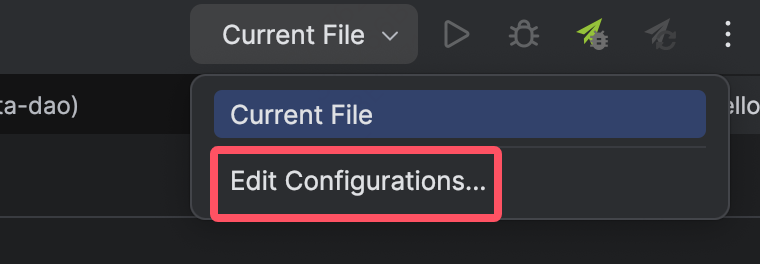
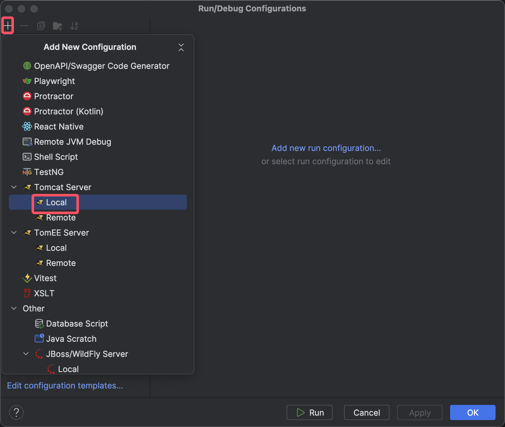
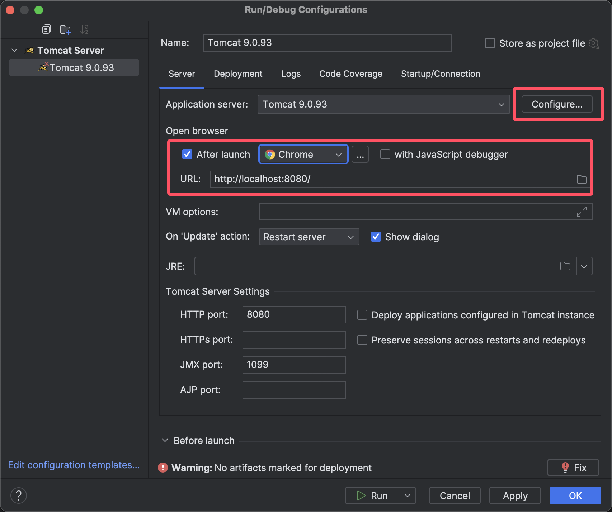
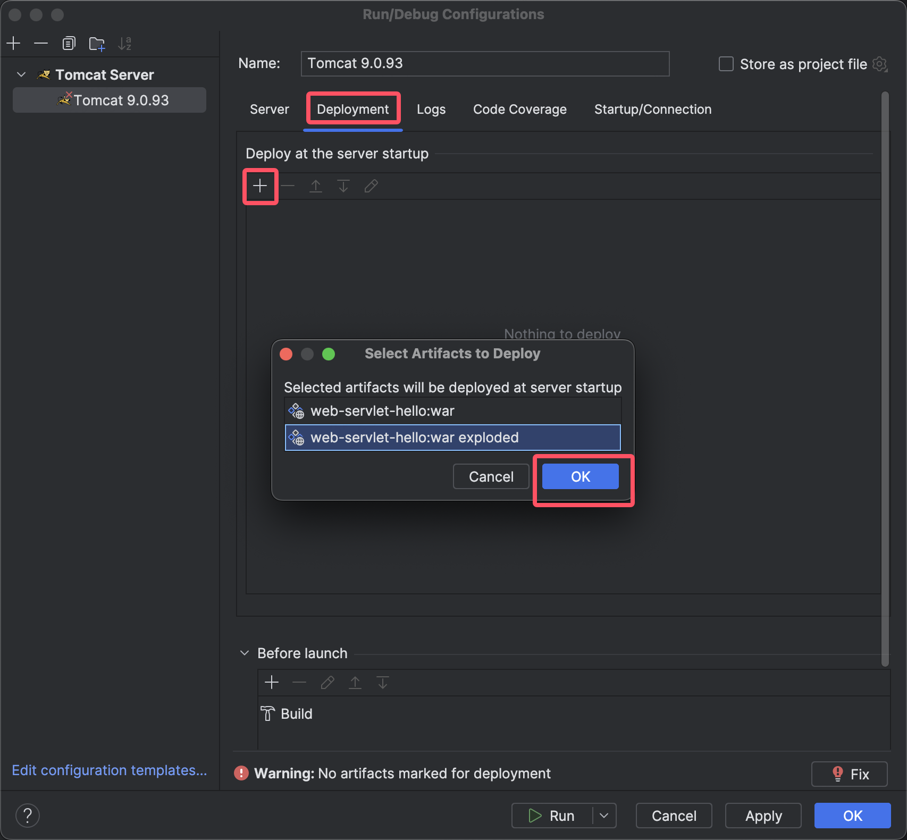
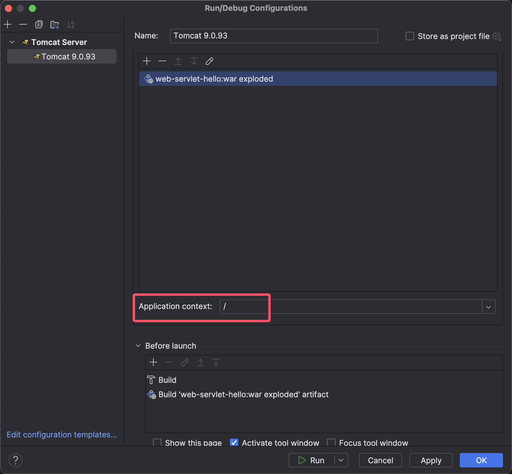

# 在IDEA中配置Tomcat服务器

1.找到配置，创建新的配置

2.新建Tomcat服务器配置

3.配置内容

- 服务器：找到你下载的Tomcat放置的目录；
- 设定浏览器和地址，URL是根目录

4.补充模块的部署，IDEA虽然配置了Tomcat应用环境，但是我们生成的组件不再环境内，需要我们自己添加进去。

5.配置项目应用路径，就根目录就行

6.点击试着启动Tomcat吧，不需要再./startup.sh啦。