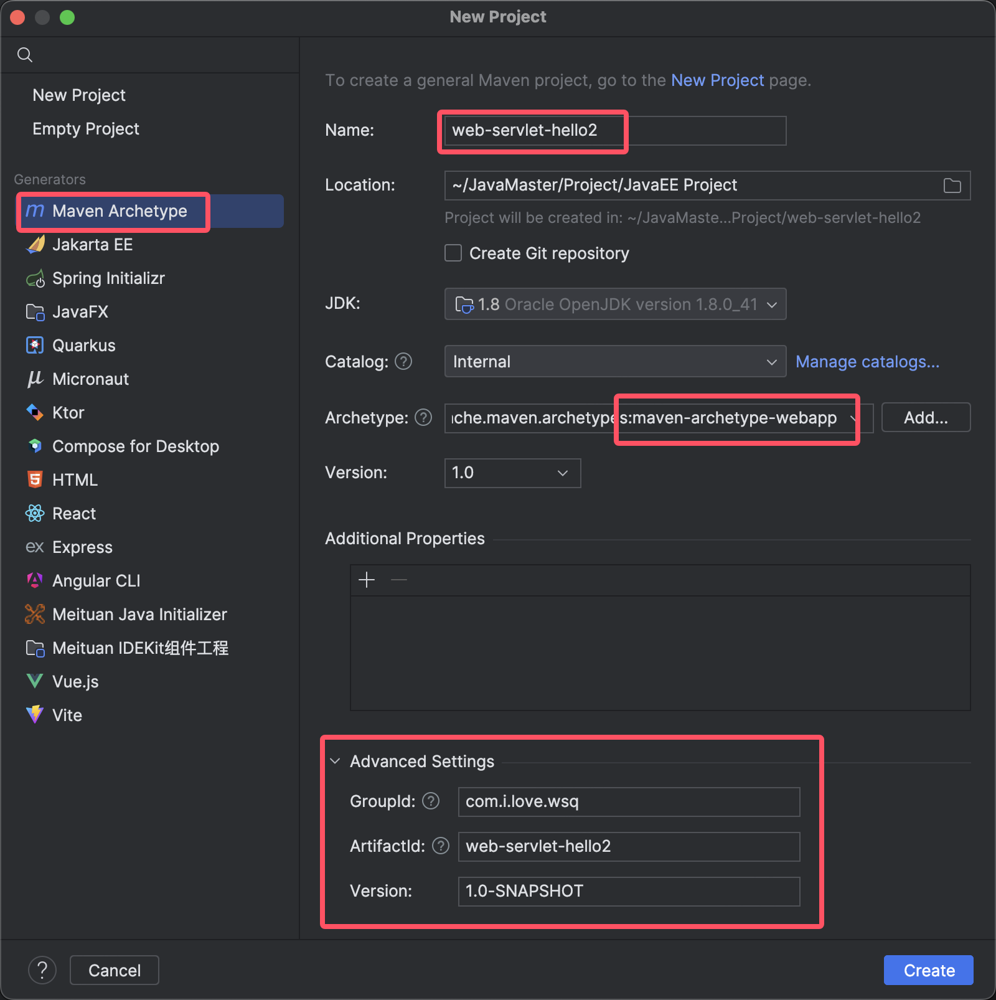
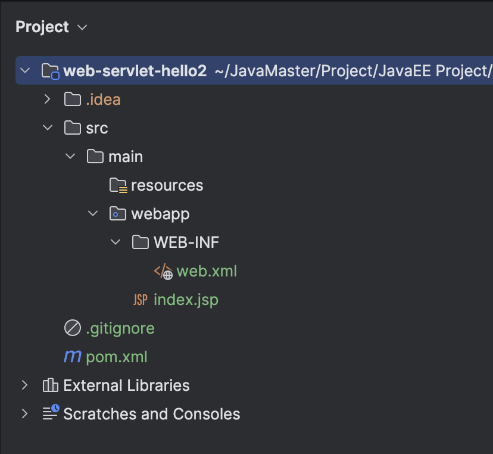
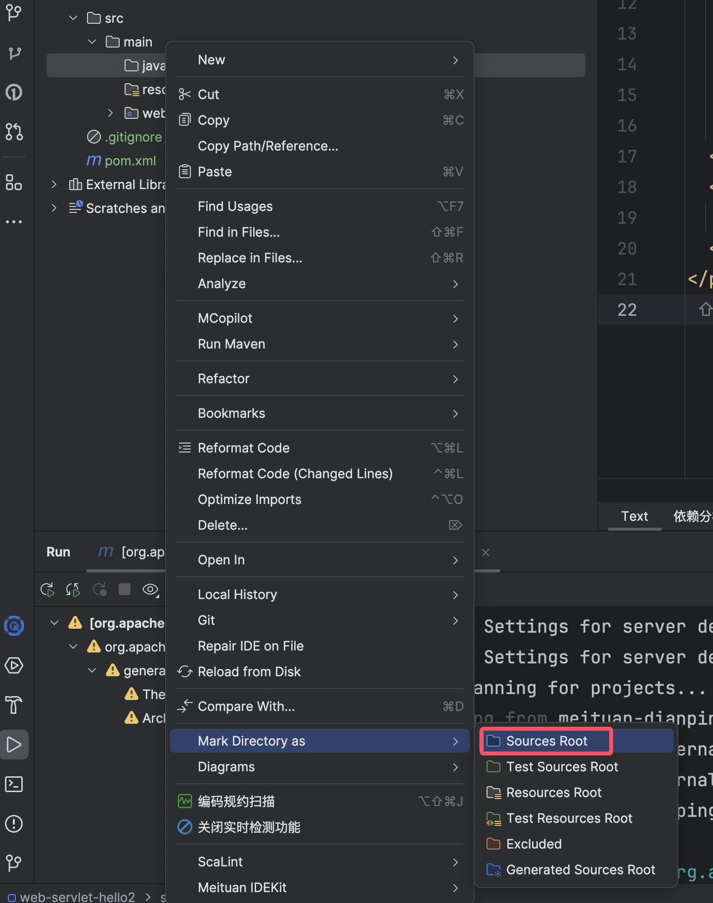

# IDEA创建Web项目

​	Web项目的目录结构一般都是下面这样子的：

```
web-project/
├── pom.xml
└── src/
    └── main/
        ├── java/
        ├── resources/
        └── webapp/
```

​	使用IDEA创建Web项目有两种方法：

- 使用maven archetype生成
- 普通项目添加webapp

## 方法A：用Maven archetype生成

1.完成配置



2.缺点就是这样生成的web模块是没有java文件的，需要手动添加



​	一般来说你创建名为java的文件会自动帮你变成maven source，如果没有的话需要自己手动Mark Directory As




## 方法B：创建普通项目，插入web板块

创建一个普通模块system-web2


修改web应用路径


修改web.xml文件路径


这样我们也创建了一个web模块

