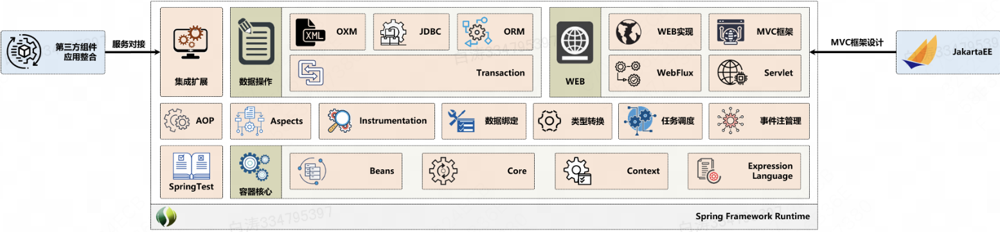

1.4 Spring设计架构

​        由于Spring技术非常的多，而且包含的整合组建也非常的多，那么本系列的图书设计的时候将Spring设计为本图书内容，包含的图书：

- 《Spring开发实战》
  - Spring的基础知识（IoC&DI、AOP）、核心源代码解读、JPA、事务、Cache；
- 《SSM开发实战》
  - SpringMVC、Spring Security、WebFlux、MyBatis/MyBatisPlus、Shiro；
- 《SpringBoot开发实战》
- 《SpringCloud开发实战》

​        Spring6的最大的特点实际上就是对于整个JDK17之后的支持，本系列的图书都是基于JDK11以上的版本编写的，你现在将JDK更换到JDK17也是没有任何问题的，同时JakartaEE已经更换了包名称了。

（我们公司是Java8，SpringBoot2.0.7.RELEASE，Spring是5.0.11.RELEASE）

​        Spring之中的所有配置的程序项都会被Spring容器所管理（SpringContext、Spring上下文也可以简单的理解为是容器），容器一般会提供有一些基础的支持。Bean管理、核心组件模块、上下文环境、表达式语言。可以登陆Spring官方站点查看这些相应的文档。

​        为了保证知识不脱节，我们就接着用Java8 + Spring5.0.11.RELEASE吧～

# 一、核心容器

- **Beans模块：**Spring最大的特点是内置的工厂设计模式，当然这个工厂设计的非常的细致，包括：Bean的信息、反射的处理步骤、工厂的设计模式、容器的注册；
- **Core模块：**Spring之中的核心组件，是工作在后台的，在进行源代码解读的时候需要观察它；
- **Context模块：**描述的是整个Spring上下文环境，例如。你上下文当前可以获取到的信息等等；
- **Expression Language（ EL）模块：**Spring将字符串的使用发挥到了极致，SpEL就是其代表；

# 二、切面编程模块（动态代理机制）

- **AOP（Aspect Oriented Programming）模块：**基于字符串表达式来定义切面，所以不再采用硬编码的方式实现代理模型的搭建了，并且支持JDK原生代理和CGLIB代理（这些操作在使用时感受不到）；
- **Aspects模块：**提供了AspectJ的集成，利用**AspectJ表达式**可以更加方便的实现切面管理；
- **Instrumentation模块：**是 Java 5 提供的新特性。使用 Instrumentation，开发者可以构建一个代理，用来监测运行在 JVM 上的程序。监测一般是通过在执行某个类文件之前，对该类文件的字节码进行适当修改进行的。

# 三、数据访问模块：整合数据库组件  

- **事务管理模块：**该模块用于Spring事务管理操作，只要是Spring管理的对象都可以利用此事务模块进行控制，支持编程和声明式两类方式的事务管理；

- **JDBC模块：**提供了一个JDBC的操作模板，利用这些模板可以消除传统冗长的JDBC编码还有必须的事务控制，同时可以使用Spring事务管理，无需额外控制事务；

- **ORM模块：**提供实体层框架的无缝集成，包括Hibernate、JPA、MyBatis等，同时可以使用Spring实现事务管理，无需额外控制事务；

- **OXM模块：**提供有一个“Object / XML”映射实现，可以将Java对象映射成XML数据，或者将XML数据映射成Java对象，Object/XML映射实现包括JAXB、Castor、XMLBeans和XStream。

- **JMS模块：**用于JMS（Java Messaging Service）组件整合，提供一套消息“生产者-消费者”处理模型，JMS可以用于在两个应用程序之间，或分布式系统中实现消息处理与异步通信。

# 四、WEB模块

- **Web模块：**提供了基础WEB功能。例如：多文件上传、集成IOC容器、远程过程访问（RMI、Hessian、Burlap）以及Web Service支持，并提供有RestTemplate类来提供方便的Restful Services访问。

- **Servlet模块：**提供了一个Spring MVC WEB框架实现。Spring MVC框家提供了基于注解的请求资源注入、可以更简单的进行数据绑定、数据验证和一套非常易用的JSP标签，完全无缝的与Spring其它技术协作；

- **MVC框架模块：**提供了与常用MVC开发框架的整合，例如：Struts、WebWork、JSF等；

- **WebFlux模块：**提供了异步编程的模型实现，提高了项目的处理性能；

# 五、测试支持：

​        因为Spring是基于容器的方式管理的，那么在整个的Spring里面进行测试的时候就要有容器的支持环境。