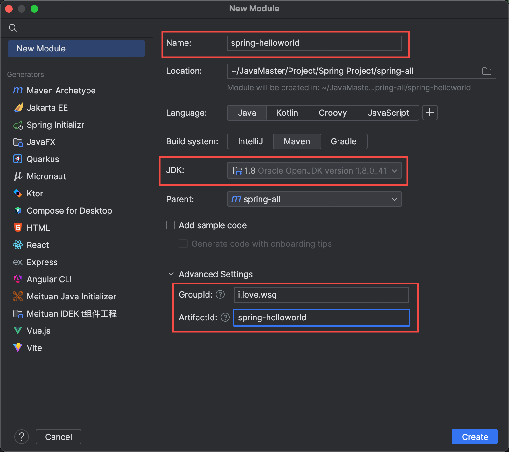
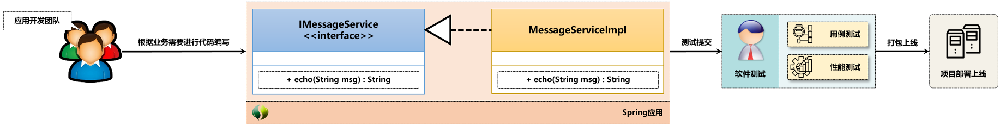
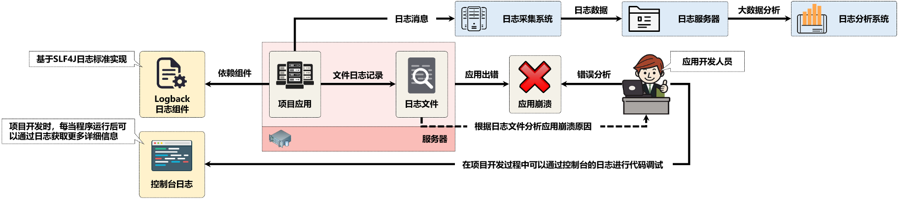

# Spring项目配置

​	对于初学者来说，项目配置往往就是很大的麻烦；对于老东西，自己没准到新环境配置项目也得抓耳挠腮一下，于是我决定把自己的配置过程记录下来，省的自己又经历麻烦，以后又抓耳挠腮。

## 使用工具

​	IDE：IDEA

​	JDK：oracle 1.8

​	构建工具：maven 3.9.5


## 1.创建项目/模块

​	创建项目/模块其实很简单，直接IDEA左上角创建就可以。

​	稍微注意一下JDK版本是不是自己想要的，以及组件ID和工件ID

​	点击Create即可创建啦。



​	

## 2.项目结构

​	如果正确无误，你的项目结构应该如下：

```
spring-helloworld
├── pom.xml
└── src
    ├── main
    │   ├── java
    │   └── resources
    └── test
```


## 3.pom文件配置

​	Spring通常需要的


## x.Spring容器的依赖

​	Spring在运行的过程中会提供一个完整的容器实例，这个实例内部可以有效地进行对象的统一管理。如果想在项目的开发之中使用这个容器，就可以通过Maven引入所需要的依赖库：

​	这里spring的版本自己可以找合适的，我是Java 8所以用了5.0.11.RELEASE

```xml
<dependencies>
        <dependency>
            <groupId>org.springframework</groupId>
            <artifactId>spring-context</artifactId>
          	<version>5.0.11.RELEASE</version>
        </dependency>
        <dependency>
            <groupId>org.springframework</groupId>
            <artifactId>spring-core</artifactId>
          	<version>5.0.11.RELEASE</version>
        </dependency>
        <dependency>
            <groupId>org.springframework</groupId>
            <artifactId>spring-context-support</artifactId>
          	<version>5.0.11.RELEASE</version>
        </dependency>
        <dependency>
            <groupId>org.springframework</groupId>
            <artifactId>spring-beans</artifactId>
          	<version>5.0.11.RELEASE</version>
        </dependency>
</dependencies>
```


## x.Spring Test测试

​	Spring除了容器，还提供了代码测试的支持。完整的服务代码除了要保证最基础的功能，也需要保证功能的稳定性。在现实的开发中，项目开发完毕后会交由测试人员进行用例测试，以保证程序的业务功能处理的正确性。



​	在Java开发领域中最为常见的用例测试工具就是JUnit，同时Spring也提供了“spring-test”依赖库，开发者只要在项目中配置JUnit的相关引用，就可以实现Spring容器的启动和配置Bean的注入操作

```xml
<!--Test-->
        <dependency>
            <groupId>org.junit.jupiter</groupId>
            <artifactId>junit-jupiter-api</artifactId>
        </dependency>
        <dependency>
            <groupId>org.junit.jupiter</groupId>
            <artifactId>junit-jupiter-engine</artifactId>
        </dependency>
        <dependency>
            <groupId>org.junit.vintage</groupId>
            <artifactId>junit-vintage-engine</artifactId>
        </dependency>
        <dependency>
            <groupId>org.junit.platform</groupId>
            <artifactId>junit-platform-launcher</artifactId>
        </dependency>
        <dependency>
            <groupId>org.springframework</groupId>
            <artifactId>spring-test</artifactId>
        </dependency>
```


## x.日志

​	每一个完善的项目应用都需要进行大量的日志记录，这样一旦应用出现了问题，应用开发人员就可以根据日志的内容排查问题啦




