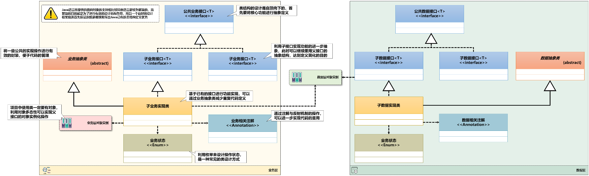
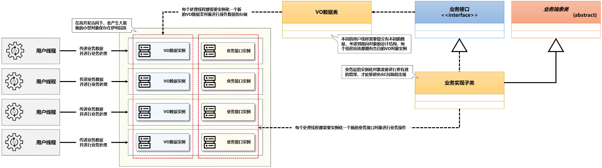
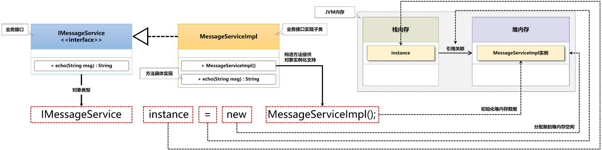
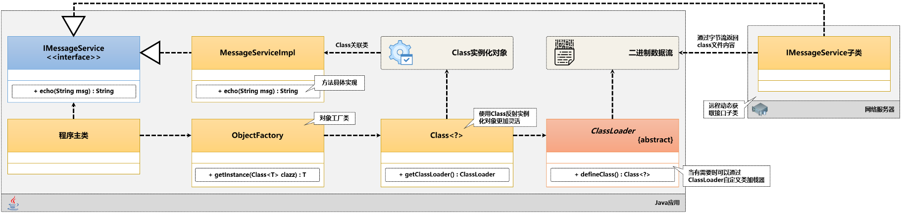
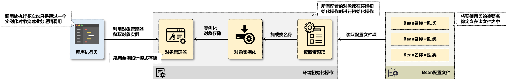

# 2.1 Java原生控制反转

## 阅前声明

​	为了避免浪费你宝贵的阅读时间，在开头作出如下声明。

​	本文章是学习了李兴华老师的课程后做的笔记与思考，项目内容不是原创而是站在巨人的肩膀上。

​	本文章的内容主要是关于使用原生Java实现控制反转，目的是从原生Java开发过度到Spring框架开发的预备理解。

​	项目使用 **JDK 1.8**，构建工具为**Maven**，需要对**泛型**，**工厂设计模式**，**反射**，**配置类**，**多线程**等知识有一定了解。

---

> 项目：origin-java-example

​	Spring的出现一定有其背景原因：原生的Java在语言的设计方面出现了不足。

## 1.原生Java系统的问题分析

### 1.1 原始开发

​	Java面向对象编程是以**类和对象**为基础展开的，而Java的语法是围绕着**类结构代码的可重用设计**展开的。为了更好地表达出不同层次，开发中往往会引入接口与抽象类，所以一个完整的系统开发往往如下图




​	对于最原始的Java开发的系统，每一个用户请求都会对应一个线程，每一个线程都会导致业务处理相关类的实例化，导致对象数量暴涨，影响程序的执行性能。



​	造成这种问题的原因就是代码中频繁地使用关键字`new`来实例化对象。`new`调用类的构造方法，随后在堆栈中进行内存分配。但是这造成了两个问题：

1. 正是由于其逻辑的简单，导致了大量创建业务实现类对象。
2. 实例化接口时需要绑定对应的实现子类，这样的话抽象出接口的意义就没有了。

> 抽象出接口的意义是避免耦合，可以简单理解为想让代码的使用范围更广。如果绑定了接口的实现子类，意味着这段代码一定与这个子类耦合了，这段代码就失去了泛用性。



---

### 1.2 工厂设计模式

​	如果接口在实例化时可以根据输入动态返回实现子类，那么代码的泛用性就会极大的提高。这段代码从针对实现子类的维度变成了针对接口的维度。

​	于是在聪明的前辈们的思考下，**==工厂设计模式==**解决了这个问题。它根据字符串提供的类名动态提供实现子类，极大提高了泛用性。



----

### 1.3 Bean模式管理

​	现在还有一个问题：对于不同用户提交的VO数据类，每个线程都肯定要有自己的VO对象实例。但是，业务接口的实现类实际上并不需要每个线程都实例化一个新的出来，因为不管是哪个用户，执行的逻辑都是相同的。

​	如果我们能够在系统在启动的初始化阶段，把系统中所有用到的业务实现类都实例化出来，并且使用一个`Map`将其记录下来。之后当系统中代码需要调用某个类时，由工厂将该唯一实例返回给它。这样，就保证了不会出现频繁创建出新的实例，保证了性能。

> 需要区分开VO数据类和业务接口实现类。举个例子，大家都去打印个人信息，每个人的信息肯定都不一样，所以个人信息类一定会有很多个对象，但是打印机只需要一台不就够了吗，所以打印机类完全可以只实例化一次。




## 2.原生Java简单案例

​	创建项目（或模块）: *origin-java-example*

```
origin-java-example
├── pom.xml
└── src
    ├── main
    │   ├── java
    │   │   └── i
    │   │       └── love
    │   │           └── wsq
    │   │               ├── Main.java
    │   │               ├── factory
    │   │               │   └── ObjectFactory.java
    │   │               └── service
    │   │                   ├── IMessageService.java
    │   │                   └── impl
    │   │                       ├── QQMessageServiceImpl.java
    │   │                       └── WechatMessageServiceImpl.java
    │   └── resources
    │       └── application.properties
    └── test
        └── java
```

### 1.消息服务接口

​	目标不是写很复杂的接口，因此一切从简，就只是一个打印接收到的信息的接口就行啦

```java
package i.love.wsq.service;

public interface IMessageService {
    public void echo(String message);
}
```


### 2.消息服务实现

​	为了演示多态，我们写两个实现类，QQ消息和微信消息

```java
package i.love.wsq.service.impl;

import i.love.wsq.service.IMessageService;

public class QQMessageServiceImpl implements IMessageService {
    @Override
    public void echo(String message) {
        System.out.println("【QQ服务】" + message);
    }
}
```

```java
package i.love.wsq.service.impl;

import i.love.wsq.service.IMessageService;

public class WechatMessageServiceImpl implements IMessageService {
    @Override
    public void echo(String message) {
        System.out.println("【微信服务】" + message);
    }
}
```


### 3.测试类

​	测试类就可以理解为客户端了，为了简单我们直接把Main当测试类，不单独写测试了

```java
package i.love.wsq;

import i.love.wsq.service.IMessageService;
import i.love.wsq.service.impl.QQMessageServiceImpl;

public class Main {
    public static void main(String[] args) {
        IMessageService messageService = new QQMessageServiceImpl();
        messageService.echo("灵感菇🐧🌹");
    }
}
```

​	现在我们可以开始分析这个测试类了。

​	它使用了关键字new直接实例化了`QQMessageServiceImpl`子类，这就是耦合了子类。


## 3.反射工厂

​	我们想要可以动态地实例化接口的实现子类，那么就需要用工厂设计模式，把实例化的过程封装。

​	1、并且为了能实现各种接口的获取，我们不妨设计为泛型工厂

```java
package i.love.wsq.factory;

public class ObjectFactory {
    private ObjectFactory() {}
    
    public static <T> T getInstance(String className, Class<T> returnType) {
        Object instance =  null;
        // 获取Class对象实例
        try {
            Class<?> clazz = Class.forName(className);
            instance = clazz.getConstructor().newInstance();
        } catch (Exception e) {
            throw new RuntimeException("实例化对象失败");
        }
        return (T) instance;
    }
}
```

​	2、修改测试类

```java
public class Main {
    public static void main(String[] args) {
        IMessageService messageService = ObjectFactory.getInstance("i.love.wsq.service.impl.QQMessageServiceImpl", IMessageService.class);
        messageService.echo("灵感菇🐧🌹");
    }
}
```

​	可以发现，现在我们已经不需要在代码中明确指定实现类的类型了，而是通过字符串去实现，这样测试类久不再与某一实现子类耦合，可以随意使用任意的实现子类了。


## 4.配置文件

​	首先在resource中定义配置文件

```properties
QQMessageService=i.love.wsq.service.impl.QQMessageServiceImpl
WechatMessageService=i.love.wsq.service.impl.WechatMessageServiceImpl
```

​	在测试类中手写字符串指定实现子类其实还是比较麻烦，我们不妨使用配置类`properties`来解决掉

```java
package i.love.wsq;

import i.love.wsq.factory.ObjectFactory;
import i.love.wsq.service.IMessageService;
import java.io.IOException;
import java.util.Properties;

public class Main {
    public static void main(String[] args) throws IOException {
        Properties properties = new Properties();
      	// 这里使用的是原生java，所以从resource加载需要用指定的方法
        properties.load(Main.class.getResourceAsStream("/application.properties"));
        IMessageService messageService = ObjectFactory.getInstance(properties.getProperty("QQMessageService"), IMessageService.class);
        messageService.echo("灵感菇🐧🌹");
    }
}
```


## 5.Bean模式管理

​	现在我们到了最后一个问题，如果有多个用户（多个线程）调用系统的接口，系统会实例化出多个实现子类。这里不妨我们用多线程来模拟这个情况：

```java
package i.love.wsq;

import i.love.wsq.factory.ObjectFactory;
import i.love.wsq.service.IMessageService;
import java.io.IOException;
import java.util.Properties;

public class Main {
    public static void main(String[] args) throws IOException {
        Properties properties = new Properties();
        properties.load(Main.class.getResourceAsStream("/application.properties"));

        for (int i = 0; i < 10; i ++ ) {
            int finalI = i;
            Thread thread = new Thread(new Runnable() {
                @Override
                public void run() {
                    IMessageService messageService = ObjectFactory.getInstance(properties.getProperty(finalI % 2 == 0 ? "QQMessageService" : "WechatMessageService"), IMessageService.class);
                    messageService.echo(Thread.currentThread() + " " + messageService.toString() + " " + (finalI % 2 == 0 ? "灵感菇🐧🌹" : "兔刀乐🐧🌹"));
                }
            });
            thread.start();
        }
    }
}
```


​	运行后结果中可以看到，每一个线程的实现子类都是不同实例，也就是说系统创建了十个对象，这显然带来了性能问题。

>【QQ服务】Thread[Thread-2,5,main] i.love.wsq.service.impl.QQMessageServiceImpl@6e268567 灵感菇🐧🌹
>【微信服务】Thread[Thread-7,5,main] i.love.wsq.service.impl.WechatMessageServiceImpl@2a3c142c 兔刀乐🐧🌹
>【QQ服务】Thread[Thread-0,5,main] i.love.wsq.service.impl.QQMessageServiceImpl@6fa76e7 灵感菇🐧🌹
>【微信服务】Thread[Thread-3,5,main] i.love.wsq.service.impl.WechatMessageServiceImpl@1789e283 兔刀乐🐧🌹
>【微信服务】Thread[Thread-9,5,main] i.love.wsq.service.impl.WechatMessageServiceImpl@234c0f50 兔刀乐🐧🌹
>【微信服务】Thread[Thread-1,5,main] i.love.wsq.service.impl.WechatMessageServiceImpl@d156cd4 兔刀乐🐧🌹
>【QQ服务】Thread[Thread-8,5,main] i.love.wsq.service.impl.QQMessageServiceImpl@3936576e 灵感菇🐧🌹
>【微信服务】Thread[Thread-5,5,main] i.love.wsq.service.impl.WechatMessageServiceImpl@51cb8d13 兔刀乐🐧🌹
>【QQ服务】Thread[Thread-4,5,main] i.love.wsq.service.impl.QQMessageServiceImpl@26049099 灵感菇🐧🌹
>【QQ服务】Thread[Thread-6,5,main] i.love.wsq.service.impl.QQMessageServiceImpl@f3f9f4b 灵感菇🐧🌹


​	解决的方案是我们改进我们的工厂，在jvm初始化时直接加载所有会用到的实现类，并存放到一个Map里。当测试类（客户端）想要获得某一个实现类的时候，我们直接从Map中找到那个类返回给它，整个系统从始至终每个实现类都只有唯一一个。

```java
package i.love.wsq.factory;

import i.love.wsq.Main;
import java.io.IOException;
import java.util.HashMap;
import java.util.Map;
import java.util.Properties;

public class ObjectFactory {
    //业务接口实例池
    private static final Map<String, Object> INSTANCE_POOL_MAP = new HashMap<>();
    // static代码块做初始化
    static {
        Properties properties = new Properties();
        try {
            properties.load(Main.class.getResourceAsStream("/application.properties"));
        } catch (IOException e) {
            throw new RuntimeException("初始化配置失败");
        }
        //加载配置类中写明的实现类
        for (Map.Entry<Object, Object> entry: properties.entrySet()) {
            String beanName = entry.getKey().toString();
            try {
                Class<?> clazz = Class.forName(entry.getValue().toString());
                Object instance = clazz.getConstructor().newInstance();
                INSTANCE_POOL_MAP.put(beanName, instance);
            } catch (Exception e) {
                throw new RuntimeException("实现类的实例化失败");
            }
        }
    }

    // 私有化构造方法
    private ObjectFactory() {}
    
    public static <T> T getInstance(String className, Class<T> returnType) {
        return (T) INSTANCE_POOL_MAP.get(className);
    }
}

```


​	接下来我们微调下测试类，把加载配置类的地方去掉

```java
package i.love.wsq;

import i.love.wsq.factory.ObjectFactory;
import i.love.wsq.service.IMessageService;
import java.io.IOException;

public class Main {
    public static void main(String[] args) throws IOException {
        for (int i = 0; i < 10; i ++ ) {
            int finalI = i;
            Thread thread = new Thread(new Runnable() {
                @Override
                public void run() {
                    IMessageService messageService = ObjectFactory.getInstance(finalI % 2 == 0 ? "QQMessageService" : "WechatMessageService", IMessageService.class);
                    messageService.echo(Thread.currentThread() + " " + messageService.toString() + " " + (finalI % 2 == 0 ? "灵感菇🐧🌹" : "兔刀乐🐧🌹"));
                }
            });
            thread.start();
        }
    }
}
```

​	这次我们看到结果，显然系统中一共就两个实现类，没有再重复地实例化实现类了

>【QQ服务】Thread[Thread-0,5,main] i.love.wsq.service.impl.QQMessageServiceImpl@6dc05ce3 灵感菇🐧🌹
>【QQ服务】Thread[Thread-6,5,main] i.love.wsq.service.impl.QQMessageServiceImpl@6dc05ce3 灵感菇🐧🌹
>【QQ服务】Thread[Thread-8,5,main] i.love.wsq.service.impl.QQMessageServiceImpl@6dc05ce3 灵感菇🐧🌹
>【微信服务】Thread[Thread-3,5,main] i.love.wsq.service.impl.WechatMessageServiceImpl@7f1b8298 兔刀乐🐧🌹
>【微信服务】Thread[Thread-7,5,main] i.love.wsq.service.impl.WechatMessageServiceImpl@7f1b8298 兔刀乐🐧🌹
>【微信服务】Thread[Thread-9,5,main] i.love.wsq.service.impl.WechatMessageServiceImpl@7f1b8298 兔刀乐🐧🌹
>【微信服务】Thread[Thread-1,5,main] i.love.wsq.service.impl.WechatMessageServiceImpl@7f1b8298 兔刀乐🐧🌹
>【微信服务】Thread[Thread-5,5,main] i.love.wsq.service.impl.WechatMessageServiceImpl@7f1b8298 兔刀乐🐧🌹
>【QQ服务】Thread[Thread-4,5,main] i.love.wsq.service.impl.QQMessageServiceImpl@6dc05ce3 灵感菇🐧🌹
>【QQ服务】Thread[Thread-2,5,main] i.love.wsq.service.impl.QQMessageServiceImpl@6dc05ce3 灵感菇🐧🌹

​	

​	到此为止，我们就实现了所谓的控制反转模式，即实例化由系统（框架）实现，而使用者


