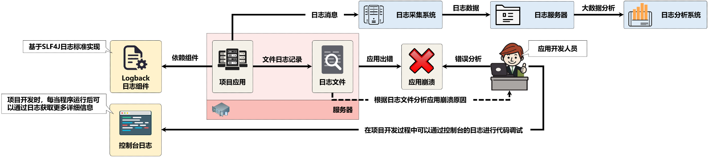

# 2.2 Spring的控制反转

​	这一章应该叫Spring入门更合适


​	IoC，为了避免关键字new的使用，采用统一的容器进行对象管理。IoC的设计重点关注组件的依赖性、配置以及生命周期。使用IoC能够降低组件之间的耦合度，最终提高类的重用性，也更利于项目测试，最重要的是便于整个产品或者系统的集成和配置。

​	注意，如果没有配置Spring的话，请先看Spring项目配置。

## 1.配置文件实现控制反转

​	Spring最开始就是通过xml配置文件来管理代码中的类对象。

### 1.1 消息服务接口

​	首先我们创建一个消息服务接口和它的实现类（如果你有看上一篇原生实现的文章的话可以直接粘贴过来）

​	目标不是写很复杂的接口，因此一切从简，就只是一个打印接收到的信息的接口就行啦

```java
package i.love.wsq.service;

public interface IMessageService {
    public void echo(String message);
}
```

​	

​	实现类也从简，写个QQ消息服务就好。

```java
package i.love.wsq.service.impl;

import i.love.wsq.service.IMessageService;

public class QQMessageServiceImpl implements IMessageService {
    @Override
    public void echo(String message) {
        System.out.println("【QQ服务】" + message);
    }
}
```


### 1.2 xml配置文件	

​	在resources目录下创建`spring/spring-ioc.xml`文件

```xml
<?xml version="1.0" encoding="UTF-8" ?>
<beans xmlns="http://www.springframework.org/schema/beans"
       xmlns:xsi="http://www.w3.org/2001/XMLSchema-instance"
       xsi:schemaLocation="http://www.springframework.org/schema/beans
            http://www.springframework.org/schema/beans/spring-beans.xsd">
       <!--配置文件中定义名称为"messageService"的Bean对象，并设置该对象的类型-->
       <bean id="messageService" class="i.love.wsq.service.impl.QQMessageServiceImpl"/>
</beans>
```

​	文件中我们配置一个Bean对象，Spring容器会根据配置将其加载，随后我们获取这个Bean就不需要再去实例化了


### 1.3 启动类

​	接下来我们可以观察Bean的获取

​	我们加载容器，并从容器中获取实例即可。

```java
package i.love.wsq;

import i.love.wsq.service.IMessageService;
import org.springframework.context.support.ClassPathXmlApplicationContext;
import org.springframework.context.ApplicationContext;

public class Main {
    public static void main(String[] args) {
        // 加载项目中的配置文件
        ApplicationContext context = new ClassPathXmlApplicationContext("spring/spring-ioc.xml");
        IMessageService messageService = context.getBean(IMessageService.class);
        messageService.echo("完成了Spring的控制反转");
    }
}
```


​	以上就是非常简单地实现了Spring的控制反转的小案例，当然看完肯定会有很多疑惑，因为并没有做原理上的解析。想要了解背后究竟是如何实现的，还是需要慢慢学习的。


## 2.测试类编写

​	在test目录下编写测试类

```java
package i.love.wsq.service;

import org.junit.Test;
import org.junit.runner.RunWith;
import org.springframework.beans.factory.annotation.Autowired;
import org.springframework.test.context.ContextConfiguration;
import org.springframework.test.context.junit4.SpringRunner;

/**
 * @author baitao05
 */

@ContextConfiguration(locations = {"classpath:spring/spring-ioc.xml"})
@RunWith(SpringRunner.class)
public class IMessageServiceTest {
    @Autowired
    private IMessageService messageService;

    @Test
    public void echoTest() {
        messageService.echo("测试消息服务接口成功");
    }
}

```


## 3.日志配置

​	每一个完善的项目应用都需要进行大量的日志记录，这样一旦应用出现了问题，应用开发人员就可以根据日志的内容排查问题啦



​	关于日志组件，应该会有专门的文章去介绍，这里就不过多解释

​	这里我们选择SLF4J门面，Logback日志组件

​	Logback组件需要配置文件控制日志输出的信息，直接在src/main/resources目录下创建logbook.xml

```xml
<?xml version="1.0" encoding="UTF-8"?>
<configuration scan="true" scanPeriod="60 seconds" debug="false">
    <property name="LOG_HOME" value="logs" />	<!-- 日志目录 -->
    <!-- 日志记录时需要有一个明确的日志记录格式，本次将日志数据的格式定义为一个配置属性 -->
    <!--  %d{yyyy-MM-dd HH:mm:ss.SSS}   -->
    <property name="logging.pattern"
              value=" [%thread] %-5level %logger{50} - %msg%n"/>
    <!-- 为便于代码调试，在每次应用程序启动时，可以将日志信息显示在控制台中 -->
    <appender name="console" class="ch.qos.logback.core.ConsoleAppender">
        <layout class="ch.qos.logback.classic.PatternLayout">
            <pattern>${logging.pattern}</pattern> 		<!-- 格式引用 -->
        </layout>
    </appender>
    <!-- 将每天的日志保存在一个文件之中 -->
    <appender name="file" class="ch.qos.logback.core.rolling.RollingFileAppender">
        <Prudent>true</Prudent>
        <rollingPolicy class="ch.qos.logback.core.rolling.TimeBasedRollingPolicy">
            <FileNamePattern>
                ${LOG_HOME}/%d{yyyy-MM}/yootk_%d{yyyy-MM-dd}.log
            </FileNamePattern>
            <MaxHistory>365</MaxHistory>			<!-- 删除超过365天的日志 -->
        </rollingPolicy>
        <filter class="ch.qos.logback.classic.filter.ThresholdFilter">
            <level>ERROR</level> 				<!-- ERROR及以上级别日志 -->
        </filter>
        <encoder>
            <Pattern>${logging.pattern}</Pattern>  		<!-- 格式引用 -->
        </encoder>
    </appender>
    <root level="DEBUG"> 					<!-- 全局日志级别 -->
        <appender-ref ref="console"/> 			<!-- 控制台日志 -->
        <appender-ref ref="file"/> 				<!-- 文件日志 -->
    </root>
</configuration>
```

​	之后只需要在使用的地方创建日志对象，输出日志即可

```java
package i.love.wsq.service;

import org.junit.Test;
import org.junit.runner.RunWith;
import org.slf4j.Logger;
import org.slf4j.LoggerFactory;
import org.springframework.beans.factory.annotation.Autowired;
import org.springframework.test.context.ContextConfiguration;
import org.springframework.test.context.junit4.SpringRunner;

/**
 * @author baitao05
 */

@ContextConfiguration(locations = {"classpath:spring/spring-ioc.xml"})
@RunWith(SpringRunner.class)
public class IMessageServiceTest {
    public static Logger LOGGER = LoggerFactory.getLogger(IMessageServiceTest.class);

    @Autowired
    private IMessageService messageService;

    @Test
    public void echoTest() {
        LOGGER.info("测试IMessageService.echo()");
        messageService.echo("测试消息服务接口成功");
    }
}
```


