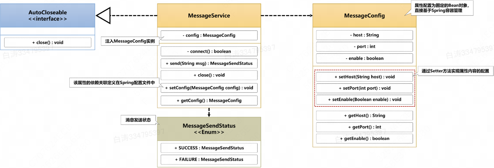

# 3.1 使用xml配置文件注入依赖

## 阅前声明

​	为了避免浪费你宝贵的时间，请注意以下说明：

​	本文章讲解的xml配置方式是2001年就有的最古老的配置方式，这种配置方式由于会带来巨大的xml文件已经逐步被Annotation自动装配取代。不过，在少数情况下，项目中依然会用到xml文件配置。

​	本文章主要讲解的内容是xml配置方式依赖注入，以及xml配置时一些用到的属性。

---

> 项目：spring-di

​	IoC（控制反转），在这种将整个对象的实例化的处理操作全部交给Spring容器完成的设计思想指导下，用户只需要通过容器获取一个对象的Bean就可以了，而在IoC的基础上还存在有一个DI（依赖注入）的处理支持。

​	DI，指的是不同的Bean实例之间可以依靠引用来实现关联，而在原生Java中只能使用`setter方法`实现。在Spring框架支持下，Spring容器除了能控制Bean实例的创建，也可以控制这种不同Bean之间引用关系。

## 1.Bean的依赖注入

​	下面是一个消息服务类的例子，具体来说就是`MessageService类`提供消息服务，其内部包含`MessageConfig类`作为配置信息，接下来我们用xml的方式注入一个`MessageConfig类`的Bean到`MessageService类`中。

​	具体的类结构可以见下面的结构图



工程目录如下：（非常抱歉的是，因为我公司是Mac家里是Windows，所以可能在不同的地方生成树形图长得不太一样）

```
│  pom.xml
│
└─src
    ├─main
    │  ├─java
    │  │  └─i
    │  │      └─love
    │  │          └─wsq
    │  │              │  Main.java
    │  │              │
    │  │              ├─config
    │  │              │      MessageConfig.java
    │  │              │
    │  │              ├─service
    │  │              │      MessageService.java
    │  │              │
    │  │              └─status
    │  │                      MessageSendStatus.java
    │  │
    │  └─resources
    │      └─spring
    │              spring-bean.xml
    │
    └─test
        └─java
            └─i
                └─love
                    └─wsq
                            MessageServiceTest.java

```

### 1.1 相关类的创建

​	消息配置类，包含了主机、端口、启用状态

```java
package i.love.wsq.config;

public class MessageConfig {
    private String host;
    
    private int port;
    
    private boolean enable;
    
    @Override
    public String toString() {
        return  "host='" + host + '\'' +
                ", port=" + port +
                ", enable=" + enable +
                '}';
    }
    
    // getter setter方法略
}
```


​	消息服务类，主要包括连接，服务，断开三部分

```java
package i.love.wsq.service;

import i.love.wsq.config.MessageConfig;
import i.love.wsq.status.MessageSendStatus;
import org.slf4j.Logger;
import org.slf4j.LoggerFactory;

public class MessageService implements AutoCloseable{
    private static final Logger LOGGER = LoggerFactory.getLogger(MessageService.class);
    private MessageConfig messageConfig;

    public boolean connect() {
        LOGGER.info("消息服务连接成功");
        return true;
    }

    public MessageSendStatus sendMessage(String message) {
        try {
            if (this.connect()) {
                LOGGER.info("发送消息内容: {}", messageConfig + " " + message);
                return MessageSendStatus.SUCCESS;
            }
        } catch (Exception e) {
            LOGGER.error("发送消息失败");
            return MessageSendStatus.FAILURE;
        }
        return null;
    }

    @Override
    public void close() throws Exception {
        LOGGER.info("断开连接");
    }

    public MessageConfig getMessageConfig() {
        return messageConfig;
    }

    public void setMessageConfig(MessageConfig messageConfig) {
        this.messageConfig = messageConfig;
    }
}
```


​	消息服务状态，成功和失败两个结果

```java
package i.love.wsq.status;

public enum MessageSendStatus {
    SUCCESS, FAILURE
}
```


### 1.2 xml配置

​	Bean的配置格式如下：

```xml
<?xml version="1.0" encoding="UTF-8" ?>
<beans xmlns="http://www.springframework.org/schema/beans"
       xmlns:xsi="http://www.w3.org/2001/XMLSchema-instance"
       xsi:schemaLocation="http://www.springframework.org/schema/beans
            http://www.springframework.org/schema/beans/spring-beans.xsd">
    <!--定义消息通道的配置Bean，这个Bean需要进行属性的配置-->
    <bean id="config" class="i.love.wsq.config.MessageConfig">
        <!--配置Bean的属性-->
        <property name="host" value="bt.com"/>
        <property name="port" value="8859"/>
        <!--比较特殊的是，对于Boolean属性，Spring扩展了很多组合-->
        <!--0和1, false和true, off和on都可以-->
        <property name="enable" value="on"/>
    </bean>

    <bean id="messageService" class="i.love.wsq.service.MessageService">
        <!--注意，config是引用数据类型，它不能用value，而是用ref了-->
        <property name="messageConfig" ref="config"/>
    </bean>
</beans>
```

​	可以看到，我们在这里通过控制反转的方式创建了messageService类，这和控制反转那里是一样的。

​	不同的是，我们自己手动去配置了作为实例的Bean，配置Bean需要注意这些：

- 使用\<property\>定义属性，基本数据类型的值就用value表示，引用数据类型就用ref表示
- 依赖注入就是通过ref来做到的，对应值的内容是bean的id
- xml文件实际上用的还是反射机制去注入bean，因此必须要==**MessageService方法中包含有setter方法**==。


### 1.3 测试类检测

```java
package i.love.wsq;

import i.love.wsq.service.MessageService;
import org.junit.Test;
import org.junit.runner.RunWith;
import org.slf4j.Logger;
import org.slf4j.LoggerFactory;
import org.springframework.beans.factory.annotation.Autowired;
import org.springframework.test.context.ContextConfiguration;
import org.springframework.test.context.junit4.SpringRunner;

@ContextConfiguration(locations = {"classpath:spring/spring-bean.xml"})
@RunWith(SpringRunner.class)
public class MessageServiceTest {
    private static Logger LOGGER = LoggerFactory.getLogger(MessageServiceTest.class);
    @Autowired
    private MessageService messageService;

    @Test
    public void SendMessageTest() {
        LOGGER.debug("测试消息服务");
        messageService.sendMessage("Hello DI");
    }
}
```


​	至此，我们就实现了一个简单的DI案例。


## 2.使用p命名空间

​	这是一个历史上用来简化xml配置文件的方法，如今已经几乎不再使用了。

​	简单来说就是从下面变成更下面

```xml
<?xml version="1.0" encoding="UTF-8" ?>
<beans xmlns="http://www.springframework.org/schema/beans"
       xmlns:xsi="http://www.w3.org/2001/XMLSchema-instance"
       xsi:schemaLocation="http://www.springframework.org/schema/beans
            http://www.springframework.org/schema/beans/spring-beans.xsd">
    <bean id="config" class="i.love.wsq.config.MessageConfig">
        <property name="host" value="bt.com"/>
        <property name="port" value="8859"/>
        <property name="enable" value="on"/>
    </bean>

    <bean id="messageService" class="i.love.wsq.service.MessageService">
        <property name="messageConfig" ref="config"/>
    </bean>
</beans>
```

​	变化在于多了一行`xmlns:p="http://www.springframework.org/schema/p"`， 以及配置可以换种格式

```xml
<?xml version="1.0" encoding="UTF-8"?>
<beans xmlns="http://www.springframework.org/schema/beans"
       xmlns:xsi="http://www.w3.org/2001/XMLSchema-instance"
       xmlns:p="http://www.springframework.org/schema/p"
       xsi:schemaLocation="http://www.springframework.org/schema/beans 		http://www.springframework.org/schema/beans/spring-beans.xsd">

    <bean id="config" class="i.love.wsq.config.MessageConfig" p:host="bt.com" p:port="8859" p:enable="true"/>
    <bean id="messageService" class="i.love.wsq.service.MessageService" p:messageConfig-ref="config"/>
</beans>
```


​	实话实说，只是个表面功夫，其实根本没实际上改变什么。


## 3.构造方法注入

​	之前我们强调过，注入靠的是setter。这是因为Spring依然保持着


## 4.自动装配


## 5.原型模式


## 6.Bean延迟初始化
