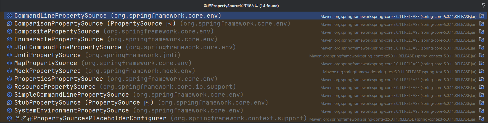
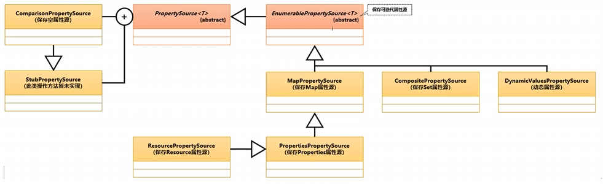
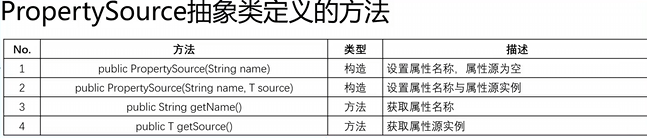
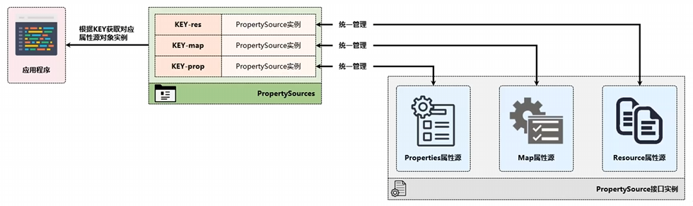

# Spring属性管理

​	我们会使用properties文件来引入一些外部可配置的内容，这样在一些场景下只需要修改配置而不用修改代码就可以更新程序的功能。

​	例如：程序中批量查询数据库时可能需要分片，而分片的大小需要随着数据库负载灵活调整，这种就适合写在配置文件中，如果需要修改了直接改一下配置文件就能调整分片大小，不需要重新发布代码。


​	Spring框架设计时考虑到了属性管理，提供了`PropertySource`.


## 1. `PropertySource`属性源

```java
public abstract class PropertySource<T> {
    protected final String name;
    protected final T source;
}
```

​	`PropertySource`是一个抽象类，其主要包含了两个字段

- `name`：资源的名称
- `source`：资源的类型，可以是任意的结合实例

---

​	`PropertySource`的实现类用IDEA查看会发现非常非常多，其实就是各种各样的属性都有。

​	比较好认的时`PropertiesPropertySource`和`MapPropertySource`，也就是用.properties文件和用map的属性源





---

范例：使用`MapPropertySource`资源管理

```java
@Slf4j
public class SpringSourceDemo {
    public static void main(String[] args) {
        Map<String, Object> data = new HashMap<String, Object>(){{
            put("aaa", "啊啊啊");
            put("bbb", "崩崩崩");
        }};
        PropertySource propertySource = new MapPropertySource("url", data);
        log.info("属性资源获取 aaa={}", propertySource.getProperty("aaa"));
    }
}
```

> [main] INFO  i.love.wsq.SpringSourceDemo - 属性资源获取 aaa=啊啊啊

​	没有使用Map，而是使用了过渡的中间层`PropertySource`获得了资源

---

​	PropertySource定义的方法如下




## 2. `PropertySources`属性源管理

​	一个项目中会有多个不同的属性源（也就是多个`PropertySource`对象）。

​	为了便于统一管理，Spring提供了`PropertySources`接口，所有的`PropertySource`对象向此接口注册。之后用户就可以在`PropertySources`接口通过注册时的key获取到想要的`PropertySource`对象



---

