# Web开发与MVC设计模式

​	Web开发是现在程序开发之中较为常用的处理形式。不管是单机Web运行模式还是前后端分离开发模式，都需要提供完善的**Web服务端**。Web客户端基于HTTP协议通过Web服务端获取所需要的数据，最后在PC端或者移动端展示出来。

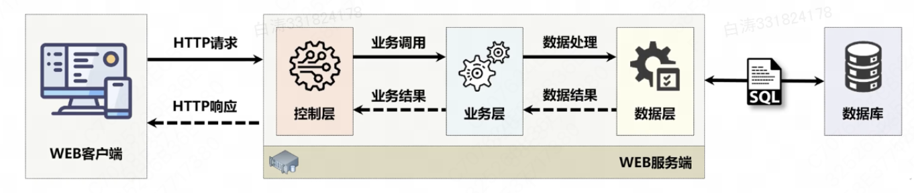


​	考虑到项目的设计和维护，进行服务端应用开发时，基本会采用MVC设计模式。实际的项目中，为了便利会使用MVC框架进行项目的实现。

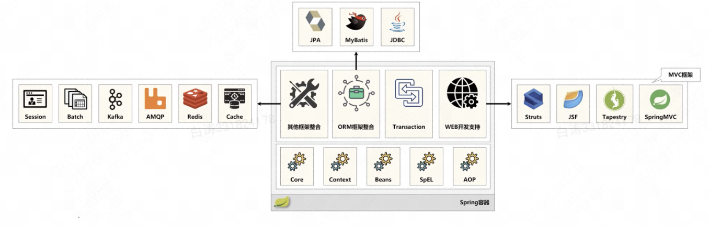


## 1.搭建Spring MVC项目

​	搭建环境往往是项目的第一大难关，因此这里详细记录项目搭建的步骤。

​	JDK 1.8, Maven 3.9.5

1.创建新项目 *spring-mvc*

2.pom文件

```xml
<?xml version="1.0" encoding="UTF-8"?>
<project xmlns="http://maven.apache.org/POM/4.0.0"
         xmlns:xsi="http://www.w3.org/2001/XMLSchema-instance"
         xsi:schemaLocation="http://maven.apache.org/POM/4.0.0 http://maven.apache.org/xsd/maven-4.0.0.xsd">
    <modelVersion>4.0.0</modelVersion>

    <groupId>i.love.wsq</groupId>
    <artifactId>spring-mvc</artifactId>
    <version>1.0-SNAPSHOT</version>

    <properties>
        <maven.compiler.source>8</maven.compiler.source>
        <maven.compiler.target>8</maven.compiler.target>
        <project.build.sourceEncoding>UTF-8</project.build.sourceEncoding>
        <env>dev</env>
    
        <spring.version>5.0.11.RELEASE</spring.version>
    
        <!--Log-->
        <slf4j-api.version>1.7.36</slf4j-api.version>
        <logback-classic.version>1.2.11</logback-classic.version>
    
        <!--Test-->
        <junit.version>5.8.2</junit.version>
        <junit-platform.version>1.8.2</junit-platform.version>
    </properties>


    <dependencyManagement>
        <dependencies>
            <!-- 公共依赖库管理 -->
            <dependency>
                <groupId>org.springframework</groupId>
                <artifactId>spring-context</artifactId>
                <version>${spring.version}</version>
            </dependency>
            <dependency>
                <groupId>org.springframework</groupId>
                <artifactId>spring-core</artifactId>
                <version>${spring.version}</version>
            </dependency>
            <dependency>
                <groupId>org.springframework</groupId>
                <artifactId>spring-context-support</artifactId>
                <version>${spring.version}</version>
            </dependency>
            <dependency>
                <groupId>org.springframework</groupId>
                <artifactId>spring-beans</artifactId>
                <version>${spring.version}</version>
            </dependency>
    
            <!--Log-->
            <dependency>
                <groupId>org.slf4j</groupId>
                <artifactId>slf4j-api</artifactId>
                <version>${slf4j-api.version}</version>
            </dependency>
            <dependency>
                <groupId>ch.qos.logback</groupId>
                <artifactId>logback-classic</artifactId>
                <version>${logback-classic.version}</version>
            </dependency>
    
            <!--Test-->
            <dependency>
                <groupId>org.junit</groupId>
                <artifactId>junit-bom</artifactId>
                <version>${junit.version}</version>
                <scope>import</scope>
            </dependency>
            <dependency>
                <groupId>org.junit.jupiter</groupId>
                <artifactId>junit-jupiter-api</artifactId>
                <version>${junit.version}</version>
            </dependency>
            <dependency>
                <groupId>org.junit.jupiter</groupId>
                <artifactId>junit-jupiter-engine</artifactId>
                <version>${junit.version}</version>
            </dependency>
            <dependency>
                <groupId>org.junit.vintage</groupId>
                <artifactId>junit-vintage-engine</artifactId>
                <version>${junit.version}</version>
            </dependency>
            <dependency>
                <groupId>org.junit.platform</groupId>
                <artifactId>junit-platform-launcher</artifactId>
                <version>${junit-platform.version}</version>
            </dependency>
            <dependency>
                <groupId>org.springframework</groupId>
                <artifactId>spring-test</artifactId>
                <version>${spring.version}</version>
            </dependency>
        </dependencies>
    </dependencyManagement>
    
    
    <repositories>
        <repository>
            <id>maven-local</id>
            <url>file://${user.home}/.m2/repository</url>
        </repository>
        <repository>
            <id>aliyun</id>
            <url>http://maven/aliyun.com/nexus/content/groups/public/</url>
            <releases>
                <enabled>true</enabled>
                <updatePolicy>always</updatePolicy>
            </releases>
            <snapshots>
                <enabled>true</enabled>
                <updatePolicy>always</updatePolicy>
            </snapshots>
        </repository>
        <repository>
            <id>spring-milestone</id>
            <url>https://repo.spring.io/libs-milestone</url>
            <releases>
                <enabled>true</enabled>
                <updatePolicy>always</updatePolicy>
            </releases>
            <snapshots>
                <enabled>true</enabled>
                <updatePolicy>always</updatePolicy>
            </snapshots>
        </repository>
        <repository>
            <id>maven-central</id>
            <url>https://repo.maven.apache.org/maven2</url>
        </repository>
    </repositories>
    
    <build>
        <plugins>
            <plugin>
                <groupId>org.apache.maven.plugins</groupId>
                <artifactId>maven-compiler-plugin</artifactId>
                <version>3.8.1</version>
                <configuration>
                    <source>${maven.compiler.source}</source>
                    <target>${maven.compiler.target}</target>
                    <encoding>${project.build.sourceEncoding}</encoding>
                </configuration>
            </plugin>
            <plugin>
                <groupId>org.apache.maven.plugins</groupId>
                <artifactId>maven-source-plugin</artifactId>
                <version>3.2.1</version>
                <executions>
                    <execution>
                        <id>attach-sources</id>
                        <goals>
                            <goal>jar</goal>
                        </goals>
                    </execution>
                </executions>
            </plugin>
            <plugin>
                <groupId>org.apache.maven.plugins</groupId>
                <artifactId>maven-javadoc-plugin</artifactId>
                <version>3.2.0</version>
                <executions>
                    <execution>
                        <id>attach-javadocs</id>
                        <goals>
                            <goal>jar</goal>
                        </goals>
                    </execution>
                </executions>
                <configuration>
                    <encoding>${project.build.sourceEncoding}</encoding>
                </configuration>
            </plugin>
            <plugin>
                <groupId>org.apache.maven.plugins</groupId>
                <artifactId>maven-surefire-plugin</artifactId>
                <version>2.22.2</version>
                <configuration>
                    <includes>
                        <include>**/Test*.java</include>
                        <include>**/*Test.java</include>
                        <include>**/*Tests.java</include>
                        <include>**/*TestCase.java</include>
                    </includes>
                </configuration>
            </plugin>
        </plugins>
    </build>
    
    <profiles>
        <profile>
            <id>dev</id>
            <activation>
                <property>
                    <name>env</name>
                    <value>dev</value>
                </property>
            </activation>
            <build>
                <resources>
                    <resource>
                        <directory>src/main/resources</directory>
                    </resource>
                    <resource>
                        <directory>src/main/profiles/dev</directory>
                    </resource>
                </resources>
            </build>
        </profile>
        <profile>
            <id>test</id>
            <activation>
                <property>
                    <name>env</name>
                    <value>test</value>
                </property>
            </activation>
            <build>
                <resources>
                    <resource>
                        <directory>src/main/resources</directory>
                    </resource>
                    <resource>
                        <directory>src/main/profiles/test</directory>
                    </resource>
                </resources>
            </build>
        </profile>
        <profile>
            <id>prod</id>
            <activation>
                <property>
                    <name>env</name>
                    <value>prod</value>
                </property>
            </activation>
            <build>
                <resources>
                    <resource>
                        <directory>src/main/resources</directory>
                    </resource>
                    <resource>
                        <directory>src/main/profiles/prod</directory>
                    </resource>
                </resources>
            </build>
        </profile>
    </profiles>
</project>
```


3.创建子模块mvc，并标记为Web模块

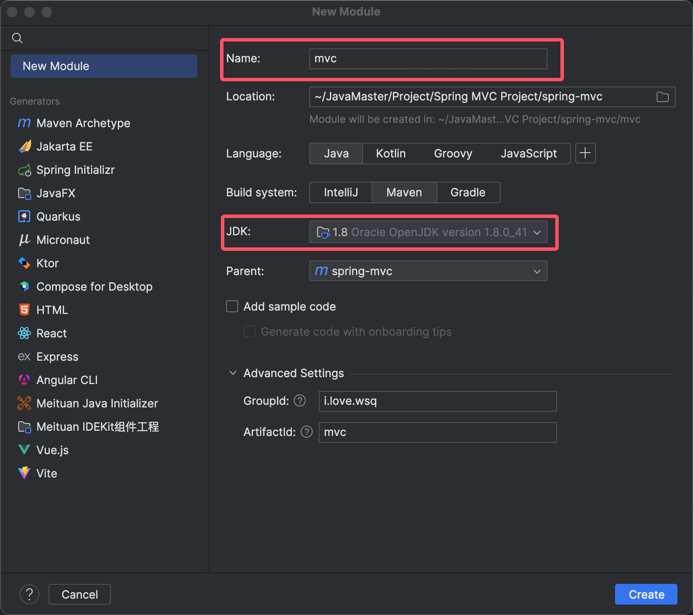

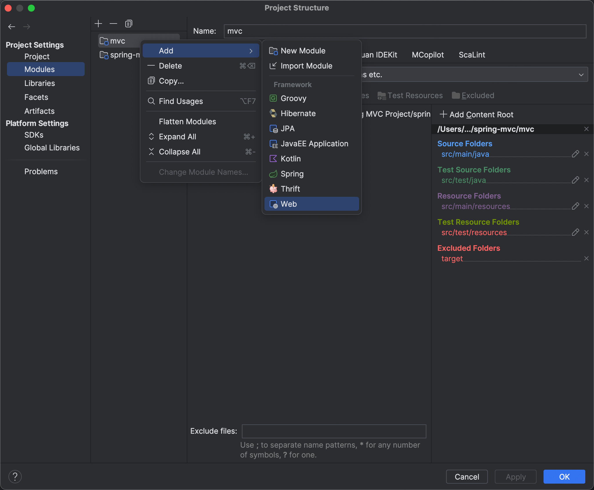


4.配置子模块的pom文件

```xml
<?xml version="1.0" encoding="UTF-8"?>
<project xmlns="http://maven.apache.org/POM/4.0.0"
         xmlns:xsi="http://www.w3.org/2001/XMLSchema-instance"
         xsi:schemaLocation="http://maven.apache.org/POM/4.0.0 http://maven.apache.org/xsd/maven-4.0.0.xsd">
    <modelVersion>4.0.0</modelVersion>
    <parent>
        <groupId>i.love.wsq</groupId>
        <artifactId>spring-mvc</artifactId>
        <version>1.0-SNAPSHOT</version>
    </parent>

    <artifactId>mvc</artifactId>

    <properties>
        <maven.compiler.source>8</maven.compiler.source>
        <maven.compiler.target>8</maven.compiler.target>
        <project.build.sourceEncoding>UTF-8</project.build.sourceEncoding>
    </properties>
    


    <dependencies>
        <!--spring-->
        <dependency>
            <groupId>org.springframework</groupId>
            <artifactId>spring-context</artifactId>
        </dependency>
        <dependency>
            <groupId>org.springframework</groupId>
            <artifactId>spring-core</artifactId>
        </dependency>
        <dependency>
            <groupId>org.springframework</groupId>
            <artifactId>spring-context-support</artifactId>
        </dependency>
        <dependency>
            <groupId>org.springframework</groupId>
            <artifactId>spring-beans</artifactId>
        </dependency>
        <dependency>
            <groupId>org.springframework</groupId>
            <artifactId>spring-aop</artifactId>
            <version>${spring.version}</version>
        </dependency>
        <dependency>
            <groupId>org.springframework</groupId>
            <artifactId>spring-web</artifactId>
            <version>${spring.version}</version>
        </dependency>
        <dependency>
            <groupId>org.springframework</groupId>
            <artifactId>spring-webmvc</artifactId>
            <version>${spring.version}</version>
        </dependency>
    
        <dependency>
            <groupId>javax.annotation</groupId>
            <artifactId>javax.annotation-api</artifactId>
            <version>1.3.2</version>
        </dependency>
    
    
    
    
        <!--Log-->
        <dependency>
            <groupId>org.slf4j</groupId>
            <artifactId>slf4j-api</artifactId>
        </dependency>
        <dependency>
            <groupId>ch.qos.logback</groupId>
            <artifactId>logback-classic</artifactId>
        </dependency>
    
    
        <!--Test-->
        <dependency>
            <groupId>org.junit.jupiter</groupId>
            <artifactId>junit-jupiter-api</artifactId>
        </dependency>
        <dependency>
            <groupId>org.junit.jupiter</groupId>
            <artifactId>junit-jupiter-engine</artifactId>
        </dependency>
        <dependency>
            <groupId>org.junit.vintage</groupId>
            <artifactId>junit-vintage-engine</artifactId>
        </dependency>
        <dependency>
            <groupId>org.junit.platform</groupId>
            <artifactId>junit-platform-launcher</artifactId>
        </dependency>
        <dependency>
            <groupId>org.springframework</groupId>
            <artifactId>spring-test</artifactId>
        </dependency>
    
        <dependency>
            <groupId>javax.servlet</groupId>
            <artifactId>jstl</artifactId>
            <version>1.2</version>
        </dependency>
        <dependency>
            <groupId>org.apache.taglibs</groupId>
            <artifactId>taglibs-standard-impl</artifactId>
            <version>1.2.5</version>
        </dependency>
        <dependency>
            <groupId>javax.servlet.jsp</groupId>
            <artifactId>javax.servlet.jsp-api</artifactId>
            <version>2.3.3</version>
        </dependency>
        <dependency>
            <groupId>javax.servlet</groupId>
            <artifactId>javax.servlet-api</artifactId>
            <version>4.0.1</version>
        </dependency>
    </dependencies>

    
    <build>
        <finalName>mvc</finalName>
    </build>
</project>

```


5.整合Tomcat

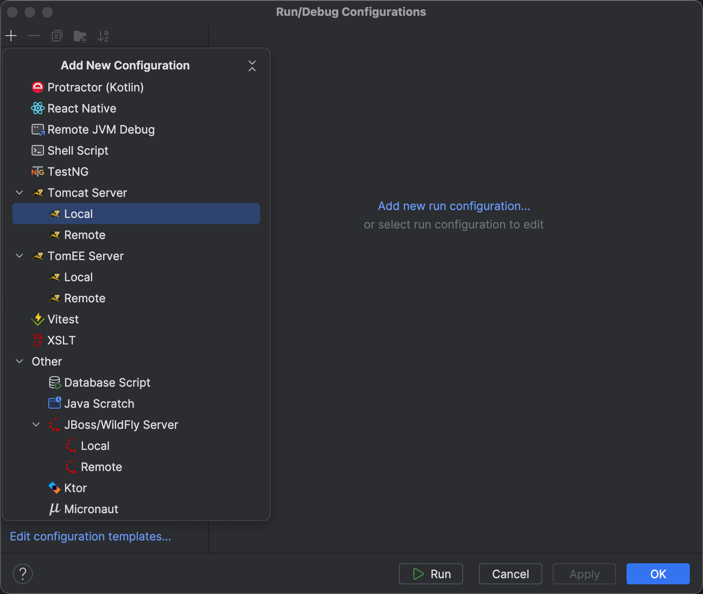


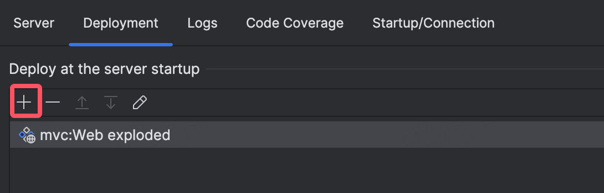


## 2.配置Spring MVC开发环境

​	Spring的核心机制在于Spring容器的启动。

​	在非web开发项目时，我们可以使用**xml文件配置**或者**注解配置**来提供上下文。

​	对于Web项目，其本身就运行在Web容器中，因此就需要通过Web容器组件的支持来实现Spring容器的启动（Spring容器运行在Web容器中）。并且同样可以使用xml文件或者注解配置，这里使用更为简单的xml文件配置。

*注：实际项目开发肯定会用Bean配置方式*

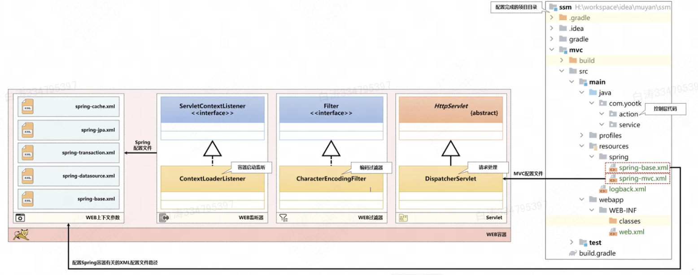

​	Spring MVC依赖库中提供了ContextLoaderListener监听器，它可以根据加载的XML配置文件在Web容器中启动Spring容器，具体的操作是由DispatcherServlet类实现的。


1.【mvc子模块】resources目录下创建spring/spring-base.xml配置文件

spring-base.xml配置的事是与Spring mvc无关联的部分，也可以理解为传统Java项目的内容

```xml
<?xml version="1.0" encoding="UTF-8"?>
<beans xmlns= "http://www.springframework.org/schema/beans"
       xmlns:xsi="http://www.w3.org/2001/XMLSchema-instance"
       xmlns:context= "http://www.springframework.org/schema/context"
       xsi:schemaLocation="http://www.springframework.org/schema/beans
       http://www.springframework.org/schema/beans/spring-beans.xsd
       http://www.springframework.org/schema/context
       http://www.springframework.org/schema/context/spring-context-4.3.xsd">
    <context:annotation-config/>
    <!-- 注解配置支持-->
    <context:component-scan base-package="i.love.wsq.service"/> <!-- 扫描包 -->
</beans>
```


2.【mvc子模块】resources目录下创建spring/spring-mvc.xml配置文件

spring-mvc.xml配置Spring MVC有关的配置项，以及mvc命名空间

```xml
<?xml version="1.0" encoding="UTF-8"?>
<beans xmlns="http://www.springframework.org/schema/beans"
       xmlns:xsi="http://www.w3.org/2001/XMLSchema-instance"
       xmlns:context= "http://www.springframework.org/schema/context"
       xmlns:mvc= "http://www.springframework.org/schema/mvc"
       xsi:schemaLocation="
            http://www.springframework.org/schema/beans
            http://www.springframework.org/schema/beans/spring-beans.xsd
            http://www.springframework.org/schema/context
            https://www.springframework.org/schema/context/spring-context.xsd
            http://www.springframework.org/schema/mvc
            https://www.springframework.org/schema/mvc/spring-mvc.xsd">
    <context:component-scan base-package="i.love.wsq.action"/> <!-- 扫描包-->
    <mvc:annotation-driven/>    <!--注解配置-->
    <mvc:default-servlet-handler/>  <!--请求分发处理-->
</beans>
```


3.【mvc子模块】在Spring MVC运行时需要通过Web程序启动Spring容器，因此我们要在web.xml文件中添加Spring容器相关的配置文件

```xml
<?xml version="1.0" encoding="UTF-8"?>
<web-app xmlns="http://xmlns.jcp.org/xml/ns/javaee"
         xmlns:xsi="http://www.w3.org/2001/XMLSchema-instance"
         xsi:schemaLocation="http://xmlns.jcp.org/xml/ns/javaee http://xmlns.jcp.org/xml/ns/javaee/web-app_4_0.xsd"
         version="4.0">
  <welcome-file-list>
    <welcome-file>hello.jsp</welcome-file>
  </welcome-file-list>

  <!-- SpringMVC本身运行在Spring容器中，所以需要定义一个Spring容器的基本配置文件路径 -->
  <!-- 配置全局的初始化参数，这个参数依靠ServletContext.getInitParameter()获取 -->
  <context-param>
    <param-name>contextConfigLocation</param-name>  <!-- 设置配置文件路径 -->
    <!-- 项目之中每一个Spring配置文件只允许加载一次，不要重复加载，否则可能出现未知错误 -->
    <param-value>classpath:spring/spring-base.xml</param-value>
  </context-param>
</web-app>
```


4.【mvc子模块】在web.xml添加Spring容器启动监听配置

```xml
  <!-- 配置Spring上下文启动监听器，这样就表示可以加载Spring中的核心配置文件 -->
  <listener>
    <listener-class>org.springframework.web.context.ContextLoaderListener</listener-class>
  </listener>
```


5.【mvc子模块】在web.xml文件中定义分发处理器DispathcerServlet

```xml
  <!-- 配置Spring MVC的分发处理器Servlet，利用Servlet找到所有的Action -->
  <servlet>
    <servlet-name>SpringMVCServlet</servlet-name>
    <servlet-class>
      org.springframework.web.servlet.DispatcherServlet
    </servlet-class>
    <init-param>
      <param-name>contextConfigLocation</param-name>
      <param-value>classpath:spring/spring-mvc.xml</param-value>
    </init-param>
  </servlet>
  <servlet-mapping>
    <servlet-name>SpringMVCServlet</servlet-name>
    <url-pattern>/</url-pattern>
  </servlet-mapping>
```


6.【mvc子模块】在web.xml文件中定义编码过滤器

Web开发时必须要做的编码过滤，使用UTF-8编码

```xml
 <filter>
    <filter-name>EncodingFilter</filter-name>
    <filter-class>
      org.springframework.web.filter.CharacterEncodingFilter
    </filter-class>
    <init-param>
      <param-name>encoding</param-name>
      <param-value>UTF-8</param-value>
    </init-param>
  </filter>
  <filter-mapping>
    <filter-name>EncodingFilter</filter-name>
    <url-pattern>/*</url-pattern>
  </filter-mapping>
```


7.【mvc子模块】做一个日志的配置

```xml
<?xml version="1.0" encoding="UTF-8"?>
<configuration scan="true" scanPeriod="60 seconds" debug="false">
    <property name="LOG_HOME" value="logs" />	<!-- 日志目录 -->
    <!-- 日志记录时需要有一个明确的日志记录格式，本次将日志数据的格式定义为一个配置属性 -->
    <!--  %d{yyyy-MM-dd HH:mm:ss.SSS}   -->
    <property name="logging.pattern"
              value=" [%thread] %-5level %logger{50} - %msg%n"/>
    <!-- 为便于代码调试，在每次应用程序启动时，可以将日志信息显示在控制台中 -->
    <appender name="console" class="ch.qos.logback.core.ConsoleAppender">
        <layout class="ch.qos.logback.classic.PatternLayout">
            <pattern>${logging.pattern}</pattern> 		<!-- 格式引用 -->
        </layout>
    </appender>
    <!-- 将每天的日志保存在一个文件之中 -->
    <appender name="file" class="ch.qos.logback.core.rolling.RollingFileAppender">
        <Prudent>true</Prudent>
        <rollingPolicy class="ch.qos.logback.core.rolling.TimeBasedRollingPolicy">
            <FileNamePattern>
                ${LOG_HOME}/%d{yyyy-MM}/yootk_%d{yyyy-MM-dd}.log
            </FileNamePattern>
            <MaxHistory>365</MaxHistory>			<!-- 删除超过365天的日志 -->
        </rollingPolicy>
        <filter class="ch.qos.logback.classic.filter.ThresholdFilter">
            <level>ERROR</level> 				<!-- ERROR及以上级别日志 -->
        </filter>
        <encoder>
            <Pattern>${logging.pattern}</Pattern>  		<!-- 格式引用 -->
        </encoder>
    </appender>
    <root level="DEBUG"> 					<!-- 全局日志级别 -->
        <appender-ref ref="console"/> 			<!-- 控制台日志 -->
        <appender-ref ref="file"/> 				<!-- 文件日志 -->
    </root>
</configuration>
```


## 3.Spring MVC编程入门

​	Spring MVC项目运行的逻辑如下：

1. 接收请求，将请求提交到 `DispatcherServlet`类 中
1. 在 `DispatcherServlet`类 中根据请求路径，将请求分发到不同的 `Action`类（可以理解为控制器）
1. `Action`类 中调用业务方法处理，并返回到视图层显示。业务方法就是纯Java项目。

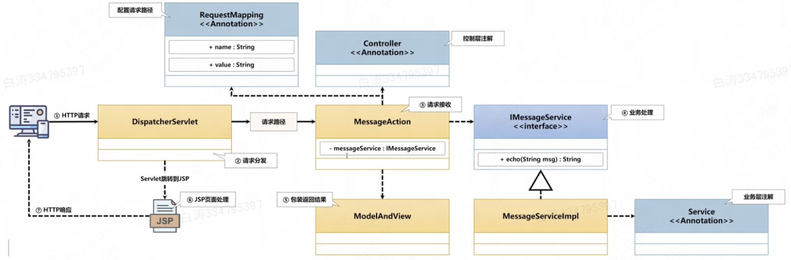


​	我们在web.xml配置文件中配置了DispatcherServlet，这部分就不需要再去手动写了。我们需要实现一个控制器，并为其实现一个对应的业务方法。


1.【mvc子模块】创建IMessageService业务接口

```java
package i.love.wsq.service;

public interface IMessageService {
    public String echo(String str);
}
```


2.【mvc子模块】实现业务接口，注意要使用`@Service`注册为Bean

```java
package i.love.wsq.service.impl;

// import略去

@Service
public class MessageService implements IMessageService {
    @Override
    public String echo(String str) {
        return "[echo]" + str;
    }
}
```


3.【mvc子模块】创建MessageAction控制器类

```java
package i.love.wsq.action;

import i.love.wsq.service.IMessageService;
import org.slf4j.Logger;
import org.slf4j.LoggerFactory;
import org.springframework.beans.factory.annotation.Autowired;
import org.springframework.stereotype.Controller;
import org.springframework.web.bind.annotation.RequestMapping;
import org.springframework.web.servlet.ModelAndView;

@Controller
public class MessageAction {
    private static final Logger LOGGER = LoggerFactory.getLogger(MessageAction.class);

    @Autowired
    private IMessageService messageService;

    @RequestMapping("/pages/message/echo")
    public ModelAndView echo(String msg) {
        LOGGER.info("消息回应处理 msg = {}", msg);
        // 控制器跳转到显示层进行数据展示，跳转路径及属性传递通过ModelAndView封装
        ModelAndView modelAndView = new ModelAndView("/pages/message/show.jsp");
        // 调用业务层处理方法，并将结果通过request属性范围传递到JSP页面上
        modelAndView.addObject("echoMessage", this.messageService.echo(msg)); // 业务处理
        return modelAndView;
    }
}
```

使用`@Controller`注册为控制器

使用了`@RequestMapping`来做路径匹配

结果命名为`echoMessage`，传给web页面

内部的具体逻辑之后会有细致说明


4.【mvc子模块】webapp目录下创建/pages/message/show.jsp文件

简单展示msg就行了

```jsp
<html>
<head>
    <title>Title</title>
</head>
<body>
    <h1>${echoMessage}</h1>
</body>
</html>
```


​	接下来启动容器，并在链接上加上GET参数 即可得到输出

```
http://localhost:8080/pages/message/echo?msg=I%20Love%20Wsq
```

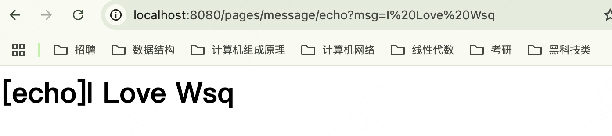

​	


## 4.ModelAndView

​	前面说到了，控制器调用业务方法得到结果后返回到视图层进行显示。为了便于视图路径和传递属性的存储，Spring MVC提供了**`ModelAndView`响应配置类**。

​	**`ModelAndView`响应配置类**，主要依靠Map（ModelMap）存储所有传递到视图页面的属性内容。

​	有两种方法，第一种是使用ModelAndView类，其内部记录了Model和View两部分；第二种是使用外部引入的Model类，直接返回View

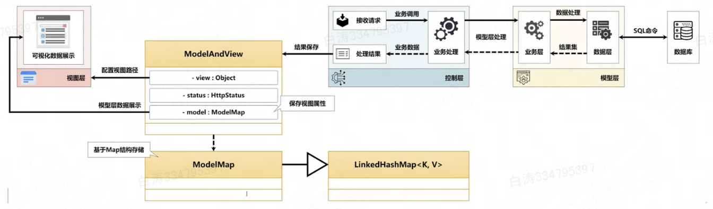

### 4.1 使用ModelAndView类

```java
package i.love.wsq.action;

import i.love.wsq.service.IMessageService;
import java.util.HashMap;
import java.util.Map;
import org.slf4j.Logger;
import org.slf4j.LoggerFactory;
import org.springframework.beans.factory.annotation.Autowired;
import org.springframework.stereotype.Controller;
import org.springframework.web.bind.annotation.RequestMapping;
import org.springframework.web.servlet.ModelAndView;

/**
 * @author baitao05
 */
@Controller // 控制层注解
public class MessageAction {
    private static Logger LOGGER = LoggerFactory.getLogger(MessageAction.class);

    @Autowired
    private IMessageService messageService;     // 注入实例

    @RequestMapping("/pages/message/echo")
    public ModelAndView echo(String msg) {
        LOGGER.info("消息回应处理 msg = {}", msg);
        ModelAndView modelAndView = new ModelAndView();
        modelAndView.setViewName("/pages/message/show.jsp");	// 跳转视图包装

        //构建信息
        Map<String, Object> result = new HashMap<>();
        result.put("echoMessage", this.messageService.echo(msg));
        result.put("id", "baitao05");
        result.put("edu", "bupt");

        // 保存信息
        modelAndView.addAllObjects(result);
        return modelAndView;
    }

}
```


### 4.2 使用Model类（不推荐）

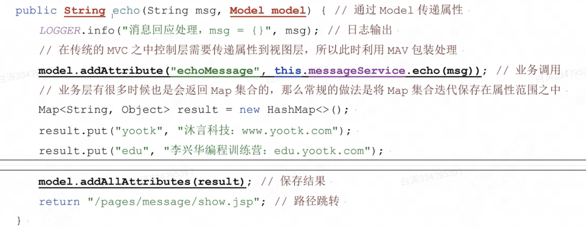


