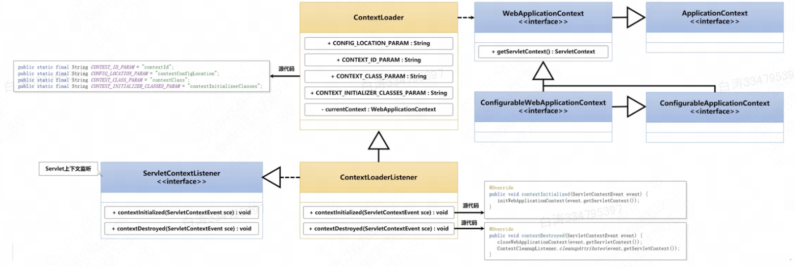
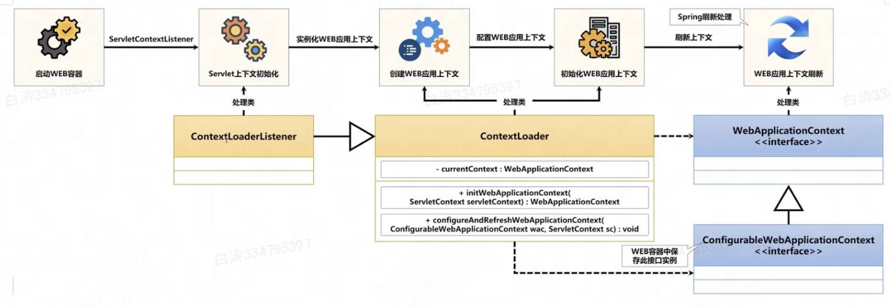
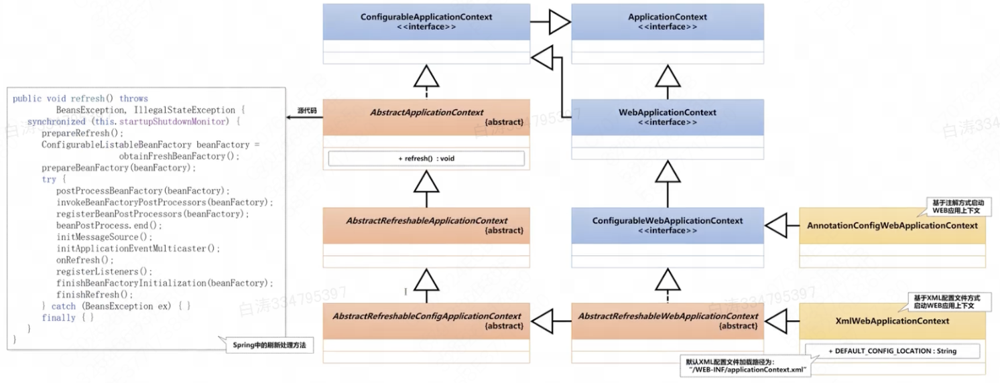

# WebApplicationContext

​	在Spring之中，容器的应用上下文是通过 `ApplicationContext`接口 表示的。Spring Web需要运行在Spring容器中，因此Spring提供了 `WebApplicationContext`子接口 应用上下文。

​	`ContextLoaderListener`监听器 实际上就是根据XML配置文件创建一个`XmlWebApplicationContext`实例 实现Spring容器的启动。




Spring启动过程



## 1.ContextLoaderListener

其源代码如下

```java
public class ContextLoaderListener extends ContextLoader implements ServletContextListener {
    public ContextLoaderListener() {
    }

    public ContextLoaderListener(WebApplicationContext context) {
        super(context);
    }

    public void contextInitialized(ServletContextEvent event) {
        this.initWebApplicationContext(event.getServletContext());
    }

    public void contextDestroyed(ServletContextEvent event) {
        this.closeWebApplicationContext(event.getServletContext());
        ContextCleanupListener.cleanupAttributes(event.getServletContext());
    }
}
```


1.它实现了 `ServletContextListener`接口，这个接口中定义了上下文的初始化和销毁方法

Web容器启动时通过上下文初始化方法实现Spring容器的启动

```java
public interface ServletContextListener extends EventListener {
    default void contextInitialized(ServletContextEvent sce) {
    }

    default void contextDestroyed(ServletContextEvent sce) {
    }
}
```


2.它继承了 `ContextLoader`类

其中维护了`WebApplicationContext` 也就是上下文实例

其中提供了容器启动的处理方法`initWebApplicationContext()`，我们具体分析这个方法


## 2.`initWebApplicationContext()`

方法根据**web应用上下文环境**来初始化Spring的`WebApplicationContext`

```java
public WebApplicationContext initWebApplicationContext(ServletContext servletContext) {}
```


首先检查Web上下文是否已经存在某个属性，如果存在则说明容器已经启动过了，抛出异常

```java
if (servletContext.getAttribute(WebApplicationContext.ROOT_WEB_APPLICATION_CONTEXT_ATTRIBUTE) != null) {
            throw new IllegalStateException("Cannot initialize context because there is already a root application context present - check whether you have multiple ContextLoader* definitions in your web.xml!");
        }
```


没有启动过则进入下面的流程：

创建WebApplicationContext实例，并且保存到本地变量表之中

```java
if (this.context == null) {
    this.context = this.createWebApplicationContext(servletContext);
}
```


调用方法`configureAndRefreshWebApplicationContext()`刷新Spring容器

```java
if (this.context instanceof ConfigurableWebApplicationContext) {
    ConfigurableWebApplicationContext cwac = (ConfigurableWebApplicationContext)this.context;
    if (!cwac.isActive()) {
        if (cwac.getParent() == null) {	// 没有父容器则获取并设置父容器
            ApplicationContext parent = this.loadParentContext(servletContext);
            cwac.setParent(parent);
        }

        this.configureAndRefreshWebApplicationContext(cwac, servletContext);	// 刷新处理
    }
}
```


保存Web属性

```java
servletContext.setAttribute(WebApplicationContext.ROOT_WEB_APPLICATION_CONTEXT_ATTRIBUTE, this.context);
```


获取当前线程的类加载器，如果当前类加载器就是Loader的加载器，那么把初始化完的上下文设置为`currentContext`；如果不是，则将类加载器和初始化完的上下文存储到currentContextPerThread，线程隔离。

```java
ClassLoader ccl = Thread.currentThread().getContextClassLoader();
if (ccl == ContextLoader.class.getClassLoader()) {
    currentContext = this.context;
} else if (ccl != null) {
    currentContextPerThread.put(ccl, this.context);
}
```


## 3.`configureAndRefreshWebApplicationContext()`

配置并刷新WebApplicationContext

wac为可配置的Web应用上下文，sc为当前Web应用上下文环境

```java
protected void configureAndRefreshWebApplicationContext(ConfigurableWebApplicationContext wac, ServletContext sc) {
```


configLocationParam是sc的上下文ID，若不为空，则设置其为wac的ID；若为空，则系统生成一个新的应用ID给wac

```java
String configLocationParam;
if (ObjectUtils.identityToString(wac).equals(wac.getId())) {
    configLocationParam = sc.getInitParameter("contextId");
    if (configLocationParam != null) {
        wac.setId(configLocationParam);
    } else {
        wac.setId(ConfigurableWebApplicationContext.APPLICATION_CONTEXT_ID_PREFIX + ObjectUtils.getDisplayString(sc.getContextPath()));
    }
}
```


在Web应用上下文中保存sc

```java
wac.setServletContext(sc);
```


从sc中读取**XML配置文件的路径**，并保存到wac中

```java
configLocationParam = sc.getInitParameter("contextConfigLocation");
if (configLocationParam != null) {
    wac.setConfigLocation(configLocationParam);
}
```


初始化属性源

```java
ConfigurableEnvironment env = wac.getEnvironment();
if (env instanceof ConfigurableWebEnvironment) {
    ((ConfigurableWebEnvironment)env).initPropertySources(sc, (ServletConfig)null);
}
```


初始化WebApplicationContext，刷新上下文

```java
this.customizeContext(sc, wac);
wac.refresh();
```


## 4.注解方式配置

​	从上面我们可以得知，Web中启动Spring容器的核心在于WebApplicationContext接口。SpringWeb在设计时考虑到了不同配置环境的需要，于是提供了XML配置和注解两种配置类：



​	XML文件配置的方式我们实际上前面做的就是，为了削弱XML配置文件的依赖，我们接下来用注解启动WEb应用上下文。这个操作主要依靠了Servlet之中的组件动态注册机制


